# Non-employment dynamics: GKOS model vs EPUF, born 1932

**Model.** The GKOS (2021) process with re-estimated, EPUF-levelled g(t). Its nonemployment logit is GKOS's single
1978–2013 male estimate, `p(t, z) = logistic(a + b·t + c·z + d·t·z)`, the same for both sexes and every cohort.
**Mortality is included in the model:**
- uniform, i.e. not related to earnings, from age 20;
- q(x) read off the TR2023 historical period life tables, taking age x from the year 1932+x table;
- the dead have zero earnings from the year after death.

This removes 25% of men and 15% of women before 65 (13% and 7% by 55).

**Data.** The EPUF 1% file, zero-filled. "Employed" means positive covered earnings in the year. The base, in both
sources, is everyone with positive earnings at least once at ages 20–65. Grey = EPUF, orange = model.

**Code.** `code/dynamics/transition_rates.py` computes the statistics and writes `transition_rates_yob1932.csv`;
`--no-mortality` writes the model run without deaths to `_nomort.csv`. `code/dynamics/plots/plot_transition_rates.py`
draws the figures; `code/dynamics/plots/plot_perm_exit_dec.py` draws section 3. The modified model's code is
listed in Part II.

**Structure.** Part I compares the GKOS model with EPUF on fifteen figures. Part II introduces the modified model,
what each of its additions bought, and the alternatives that were tried and not adopted. Part III redraws every
Part I figure with the GKOS model, the modified model and EPUF.

**EPUF zeros the model still does not generate:**
- non-covered work (federal civil service hired before 1984, uncovered state and local government jobs,
  railroads);
- military service before 1957, which covers ages 20–24 of this cohort, including the Korean War.

---

## Part I. GKOS model vs EPUF

### Overview

#### 1. Lifetime: share of ages 20–65 employed, by lifetime earnings

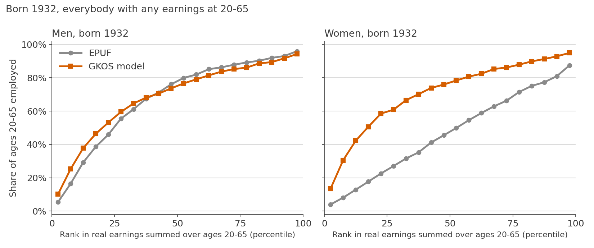

**x:** rank in real (2013$) earnings summed over ages 20–65.

**y:** share of the 46 years with positive earnings.

Share of person-years 20–65 employed:

|        | EPUF  | Model, with mortality | Model, no mortality |
|--------|-------|-----------------------|---------------------|
| Men    | 67.4% | 68.3%                 | 73.8%               |
| Women  | 46.5% | 70.6%                 | 73.6%               |
| Pooled | 57.4% | 69.5%                 | 73.7%               |

**Observation.** With mortality, the model matches men's aggregate. Women's model employment is 24 points too high.

| Rank | Men: EPUF | Men: Model | Women: EPUF | Women: Model |
|------|-----------|------------|-------------|--------------|
| 2.5th percentile | 5%  | 10% | 4%  | 14% |
| 7.5th            | 16% | 25% | 8%  | 31% |
| 17.5th           | 39% | 46% | 18% | 51% |
| Median           | 78% | 75% | 50% | 78% |
| 97.5th           | 96% | 94% | 87% | 95% |

- **Men: the model has too much employment below about the 40th percentile, and slightly too little above it.**
- **Women: the model has too much employment at every rank.**

**Distribution of years worked, 20–65:**

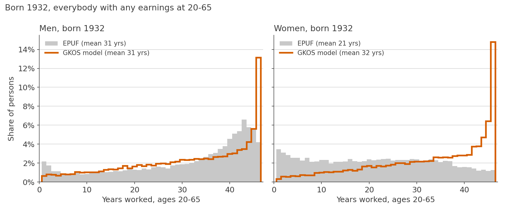

**x:** number of the 46 years with positive earnings.

**y:** share of people.

| | Mean | Median | ≤ 10 years | 11–30 | ≥ 40 | All 46 |
|---|---|---|---|---|---|---|
| Men, EPUF    | 31.0 | 36 | 11% | 27% | 37% | 4.2%  |
| Men, model   | 31.4 | 34 | 9%  | 33% | 36% | 13.2% |
| Women, EPUF  | 21.4 | 21 | 26% | 46% | 9%  | 1.3%  |
| Women, model | 32.5 | 35 | 7%  | 31% | 39% | 14.8% |

- **Men: the means match, but the shapes differ.**
  - EPUF peaks at 41–45 years and few work all 46. Almost everyone misses some of 20–24 (military, schooling) or
    62–65 (retirement).
  - The model has a spike of 13% at a full 46 years. It also has too much mass at 11–30 years, the churners.
- **Women: EPUF is almost flat from 1 to 37 years (about 2–3.5% each), with its mode at 1 year.** The model is
  shaped like the men's, with 15% working all 46 years.

#### 2. Share employed by age

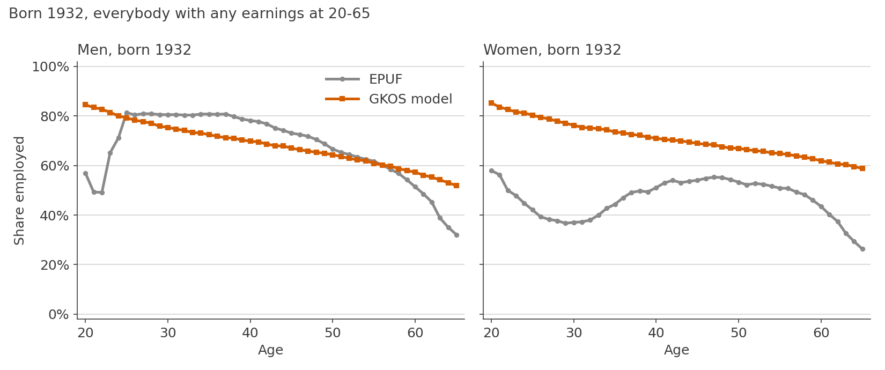

**x:** age.

**y:** share with positive earnings at that age, everybody in the base.

Share employed by age:

| Sex | Source | 22 | 25 | 30 | 40 | 50 | 55 | 60 | 62 | 65 |
|-----|--------|----|----|----|----|----|----|----|----|----|
| Men   | EPUF  | 49% | 81% | 81% | 78% | 67% | 62% | 51% | 45% | 32% |
|       | Model | 83% | 79% | 75% | 70% | 64% | 61% | 57% | 55% | 52% |
| Women | EPUF  | 50% | 42% | 37% | 51% | 53% | 51% | 44% | 37% | 26% |
|       | Model | 83% | 80% | 76% | 71% | 67% | 65% | 62% | 61% | 59% |

**Observation.** The model's profile is a smooth decline for both sexes, much of it mortality.

- **Men:**
  - The model overstates employment at 20–24 (the military and schooling years).
  - It understates it at 25–50.
  - It matches at 50–58.
  - It overstates it from 59 on, with no retirement drop: 52% at 65 against 32%.
- **Women:** EPUF is U-shaped, with a trough of 37% at 29–31 (child rearing), a recovery to about 55% at 45–48, and
  then retirement. The model has none of this. From age 25 on it is too high: by 13–15 points at 45–48 and by up to 39
points around 30.

#### 3. Permanent exits by age, decomposed

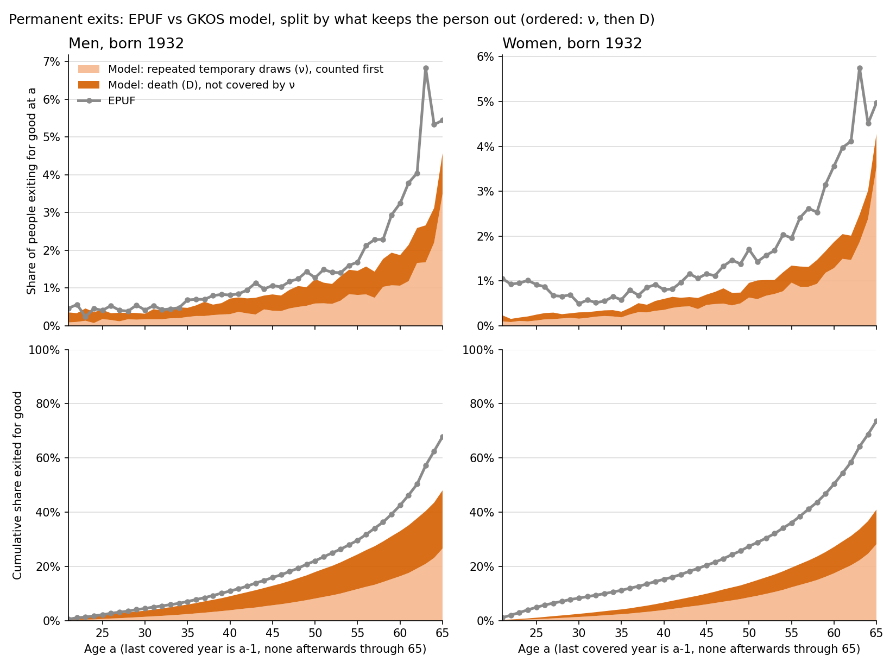

**x:** age a. A permanent exit at a means the last covered year is a−1, with none afterwards through 65.

**y:** top, share of the base exiting for good at a; bottom, cumulative.

**Model decomposition.** The model's permanent exits are split by what keeps the person out. The causes overlap, so
the split is ordered:
- **ν first:** the temporary nonemployment draws alone keep the person out (ν = 1 in every remaining year);
- **D second:** death, among the rest.

The two parts sum to the model's total. The model is simulated with `estimate_nonemp.py`'s draws (same process,
different random numbers from the CSV behind the other figures).

Cumulative share exited for good, EPUF / model (ν + D):

| Sex | by 45 | by 55 | by 62 | by 65 |
|-----|-------|-------|-------|-------|
| Men | 15.9 / 12.8 (5.6 + 7.2) | 29.6 / 24.4 (11.6 + 12.8) | 50.3 / 37.7 (19.2 + 18.5) | 67.9 / 48.1 (26.6 + 21.5) |
| Women | 20.4 / 9.9 (6.0 + 3.9) | 36.1 / 19.5 (12.3 + 7.2) | 58.4 / 31.2 (20.4 + 10.8) | 73.7 / 41.0 (28.2 + 12.8) |

**Observation.**
- **Men: the model tracks EPUF up to about 35, then falls behind.** By 65 it has 48% exited for good against 68%.
  - Death accounts for 21.5 of the model's 48 points.
  - Repeated ν draws account for 26.6.
- **Women: the model is too low from the start.** EPUF has about 1% of women leaving for good every year in their
  20s; the model 0.2–0.4%. By 65: 41% against 74%.
- **EPUF has a spike at 62–63:** last covered year 62, 6.8% of men and 5.7% of women. The model has none.
  - Its exits rise smoothly and lag EPUF's by 2–5 years after 55.
- **Without mortality, GKOS has 31% of both sexes exiting for good by 65.** That is all ν. Mortality adds 17 points
  for men and 10 for women. The ν part falls slightly because some ν exits now die first and are counted as D.

---

### (a) Employment and non-employment transitions across the income distribution

#### 4. Exit: share not employed at a+h by current-earnings rank

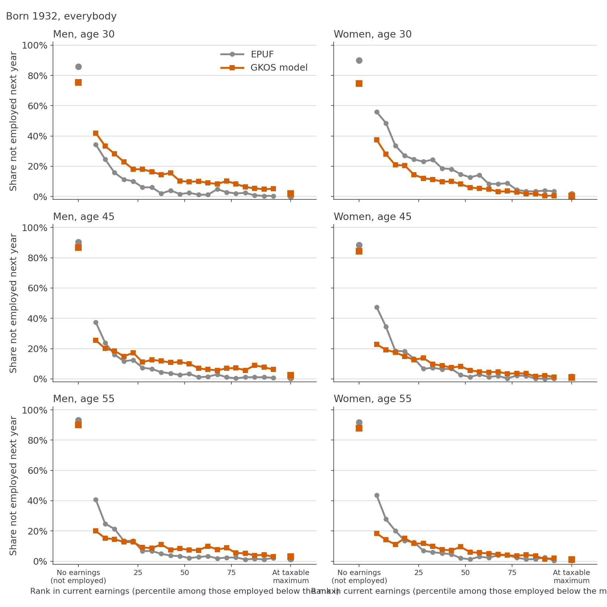
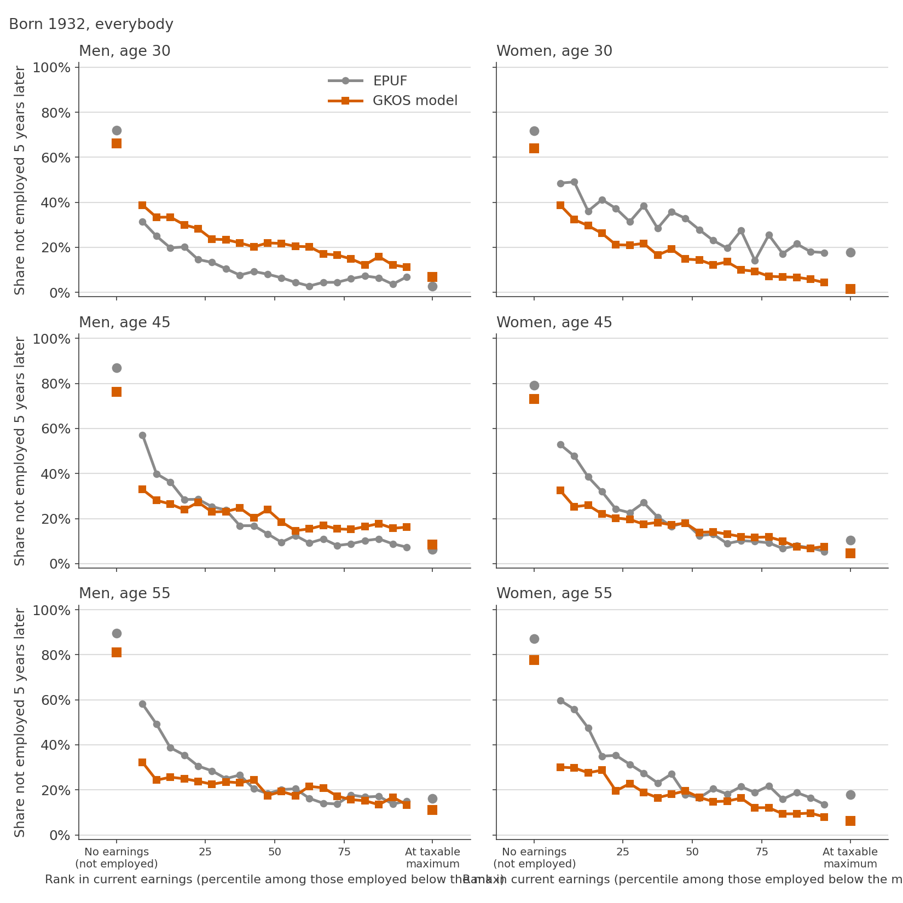

**x:** two separate points plus a line.
- Left point: people with zero earnings at age a.
- Right point: people at the taxable maximum at age a.
- Line: 20 equal-count bins of current-earnings rank among people employed below the maximum.

**y:** share with zero earnings at a+h.

**Observation.**
- **For men, the model has too many exits from employment.** Employed men who are out the next year:

  | Age | EPUF | Model |
  |-----|------|-------|
  | 30  | 6.7% | 14.8% |
  | 45  | 7.0% | 11.3% |
  | 55  | 8.0% | 9.1%  |

- **For young women it has too few:** at 30, EPUF 18%, model 10%. At 45 the two match (8.7% vs 8.5%).
- **At older ages the earnings gradient is not steep enough, for both sexes.** At 55, the share out the next year
  in the bottom 20% of current earners vs the top 20%:
  - men: EPUF 25% vs 1.5%, model 16% vs 4%;
  - women: EPUF 26% vs 1.5%, model 15% vs 3%.

  Five years ahead the bottom 20% are EPUF 45–50% out, model 27–29%. This already holds at 45.
- **The not employed (left point) stay out less in the model:** a year later EPUF 86–93% are still out, model
  75–90%.

#### 5. Cumulative rank: everybody, by cumulative-earnings rank to date

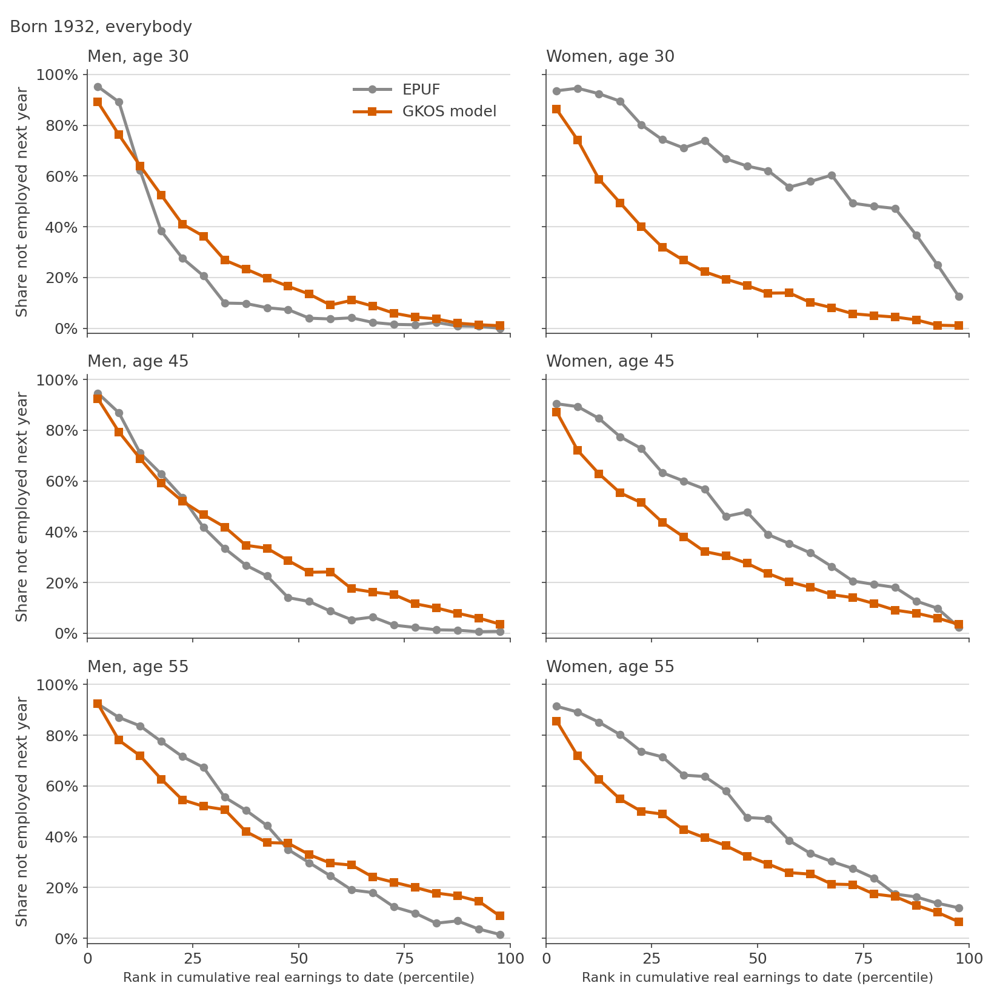
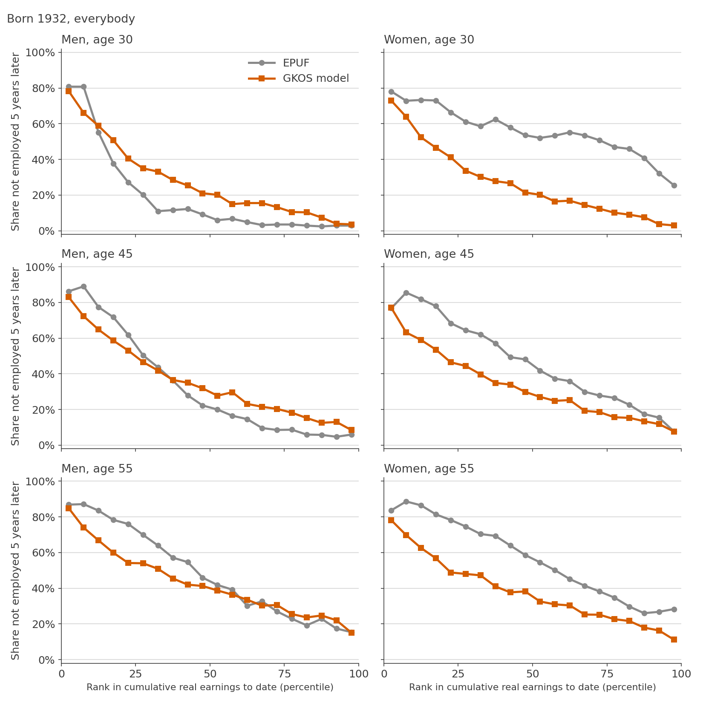

**x:** rank in cumulative real earnings over ages 20 to a (inclusive), everybody.

**y:** share with zero earnings at a+h.

**Observation.**
- **Female labour-force participation is consistently too high in the model:** at every age and rank, women's
  non-employment is below EPUF's. Averages one year ahead:

  | Women, age | EPUF | Model |
  |------------|------|-------|
  | 30         | 63%  | 25%   |
  | 45         | 45%  | 32%   |
  | 55         | 49%  | 36%   |

- **The gradient from cumulative earnings to non-employment is not quite steep enough.** Share out a year later,
  bottom 20% vs top 20% of cumulative earners:
  - men at 45: EPUF 79% vs 1%, model 75% vs 7%;
  - men at 55: EPUF 85% vs 4.5%, model 76% vs 14.5%.
- **Men at 30 match** (71% vs 1% in both).

**Why women at 45 match in plot 4 but not here.**
- Both plots cover the same people with the same y, so their overall averages are identical: EPUF 45.2%, model
  31.5%.
- Plot 4 shows that the currently employed match.
- So the whole gap is the stock of non-employed women. EPUF has 46% not employed at 45, the model 31%, and they
  stay out more (88.5% vs 84%).
- Every cumulative-earnings bin here mixes both groups, so the gap appears at every rank.

---

### (b) Non-employment dynamics

#### 6. Persistence: the not employed at a, by cumulative-earnings rank

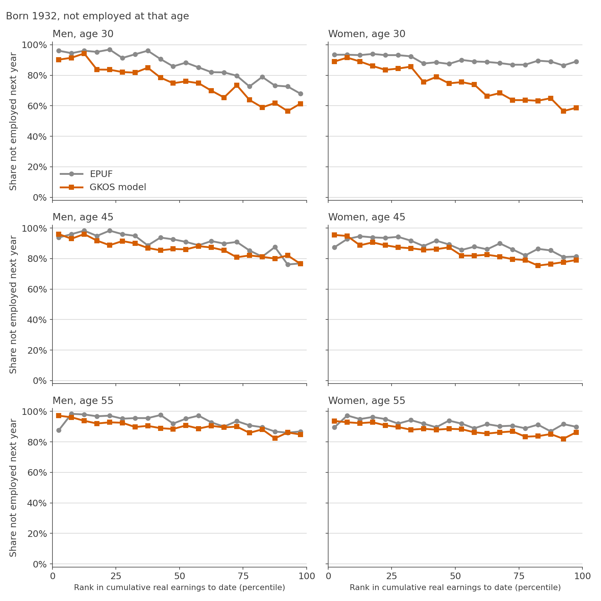
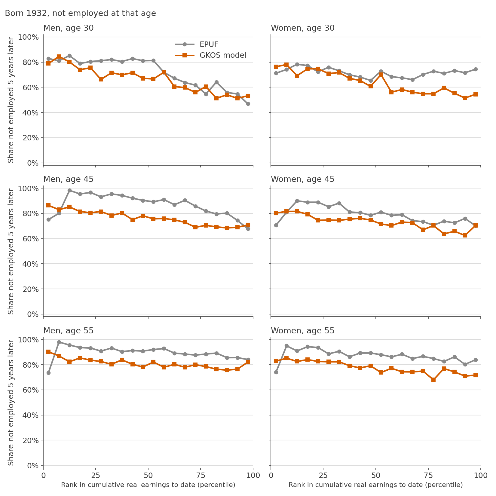

**x:** rank in cumulative real earnings over ages 20 to a−1, among people with zero earnings at a.

**y:** share with zero earnings at a+h.

**Observation.** Non-employment persistence is too low in the model at every age, even with mortality.

Share still not employed, among those not employed at a:

|           | Men, 1 yr: EPUF | Men, 1 yr: Model | Men, 5 yrs: EPUF | Men, 5 yrs: Model | Women, 1 yr: EPUF | Women, 1 yr: Model | Women, 5 yrs: EPUF | Women, 5 yrs: Model |
|-----------|------|-------|------|-------|------|-------|------|-------|
| Age 30    | 86%  | 75%   | 72%  | 66%   | 90%  | 75%   | 72%  | 64%   |
| Age 45    | 90%  | 87%   | 87%  | 76%   | 89%  | 84%   | 79%  | 73%   |
| Age 55    | 93%  | 90%   | 90%  | 81%   | 92%  | 88%   | 87%  | 78%   |

Without mortality the model's men at 55, five years ahead, were at 70%.

**Coding check.** I recomputed the EPUF side in plain SQL, independently of the Python pipeline, and it reproduces
the CSV exactly: men 55 → 56 93.2%, 55 → 60 89.7%, 45 → 46 90.3%, 45 → 50 86.9%.

#### 7. Earnings changes, arc-percent

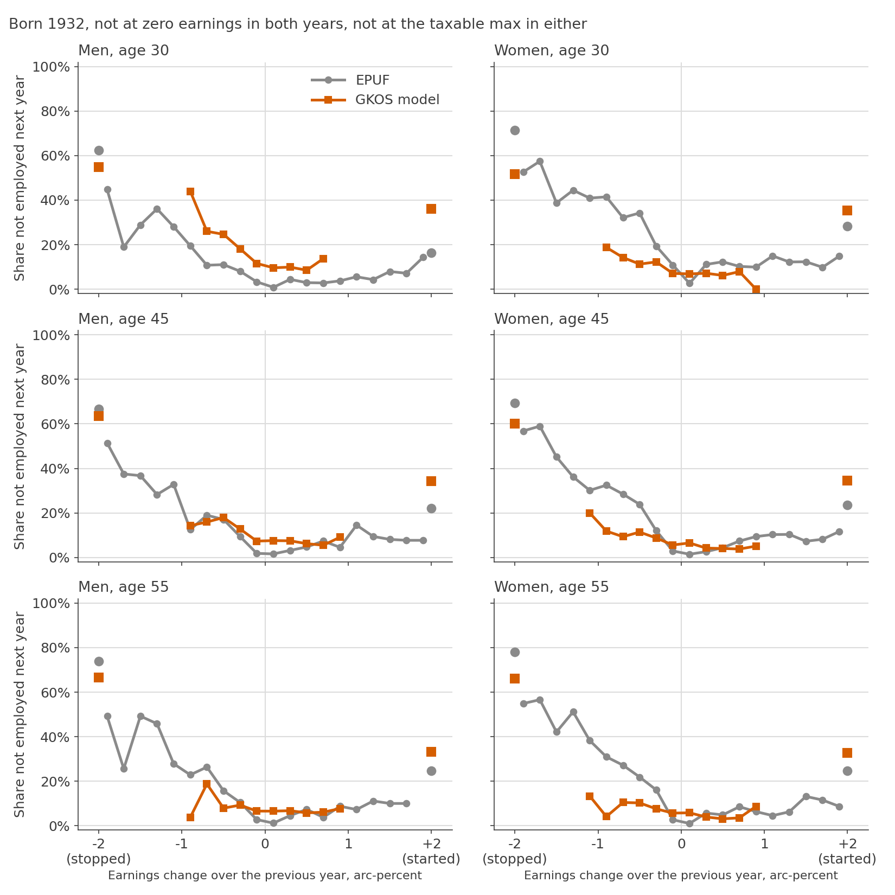
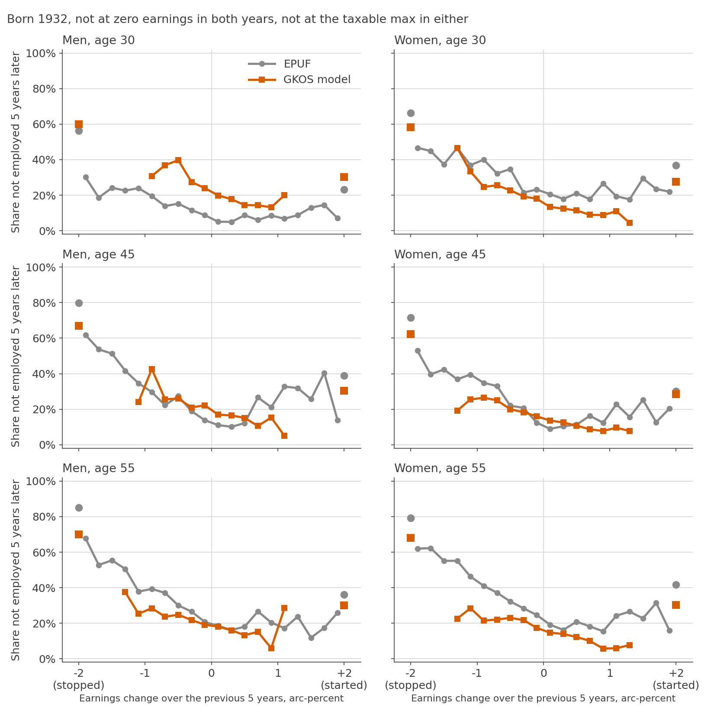

**x:** arc-percent change from a−h to a, (y1−y0)/((y1+y0)/2).
- Separate points: −2 = employed at a−h and out at a ("stopped"); +2 = out at a−h and employed at a
  ("started").
- Line: bins of width 0.2 in between.
- Sample: excludes anyone at zero in both years or at the taxable maximum in either year.

**y:** share with zero earnings at a+h.

**Observation.**
- **The model does not produce enough large changes.** Share of the one-year sample with an interior change of
  |arc| > 1: EPUF 7–14%, model 0.1–0.5%. The model's line spans only about −1 to +1.
- **It misses the very stably attached: people with neither large earnings changes nor employment changes.**
  - Both sources have about the same mass of small changes (|arc| < 0.2): EPUF 44–57% of the one-year sample,
    model 50–57% (EPUF women at 30: 29%).
  - In EPUF almost none of them leave: about 2% are out the next year.
  - In the model, 6–10% of them are out the next year.
- **"Stopped" stay out less, "started" drop out more in the model.**

  | Share out next year | EPUF   | Model  |
  |---------------------|--------|--------|
  | Stopped (−2)        | 62–78% | 52–67% |
  | Started (+2)        | 16–28% | 33–36% |

#### 8. Earnings changes, absolute (real 2013$, symlog axis)

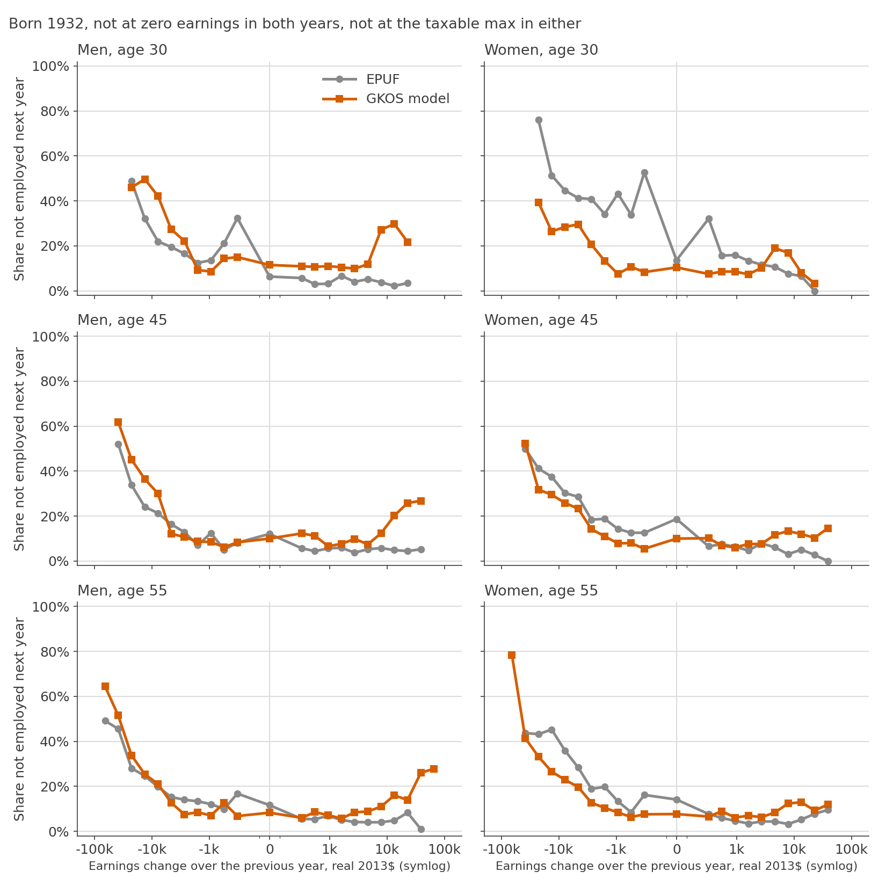
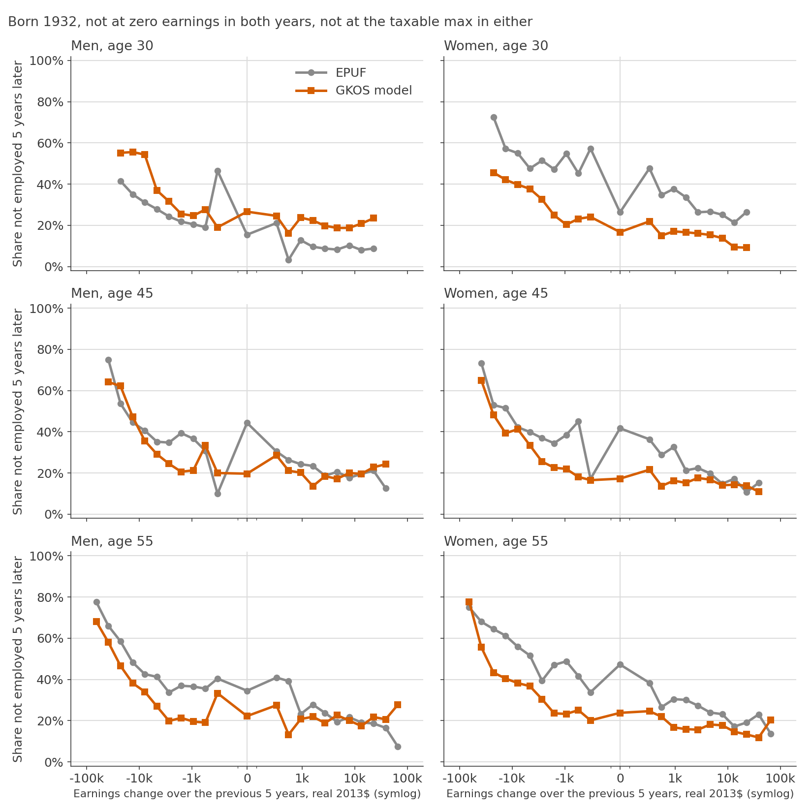

**x:** real change y1 − y0, from a−h to a.
- A centre bin for |Δ| < $250.
- 12 geometric bins per side, ratio 1.7.
- Same sample as plot 7.

**y:** share with zero earnings at a+h.

**Observation.** The model does reasonably well on job-to-job earnings changes. Through the middle of the change
distribution the levels and the U shape match. In the 5-year version at 55 the model is below EPUF in most bins
(19 of 23 for men, 21 of 23 for women), by 7 and 12 points on average.

#### 9. Large one-year changes: at what age they happen

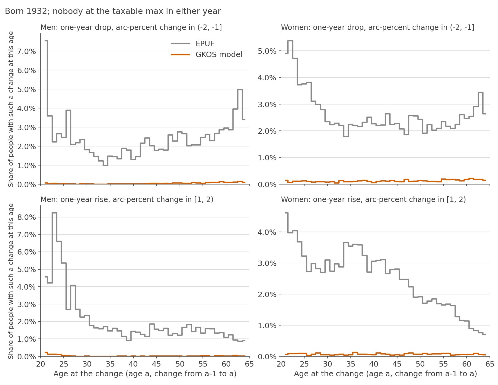

**Events:**
- a **drop** is a one-year arc change (a−1 → a) in (−2, −1];
- a **rise** is one in [1, 2);
- the sample excludes anyone at the taxable max in either year.

**y:** events at age a divided by persons in the base.

**Observation.**
- **Large drops are concentrated early and late in life, for both sexes** (EPUF, per year):

  | Drops | 21–29 | 30–44 | 45–54 | 55–61 | 62–64 |
  |-------|-------|-------|-------|-------|-------|
  | Men   | 3.2%  | 1.6%  | 2.2%  | 2.7%  | 4.1%  |
  | Women | 3.9%  | 2.3%  | 2.2%  | 2.4%  | 3.0%  |

- **Large rises are concentrated at young ages:**
  - men: 4.5% a year at 21–29, then about 1.5%;
  - women: 3–4% to about 45, then declining to under 1% by 62–64.
- **The model has almost none of either:** 0.02–0.05 drops and 0.01–0.03 rises per person over the whole of
  21–64, against about 1 each in EPUF.

#### 10. Large one-year changes: what follows (EPUF only)

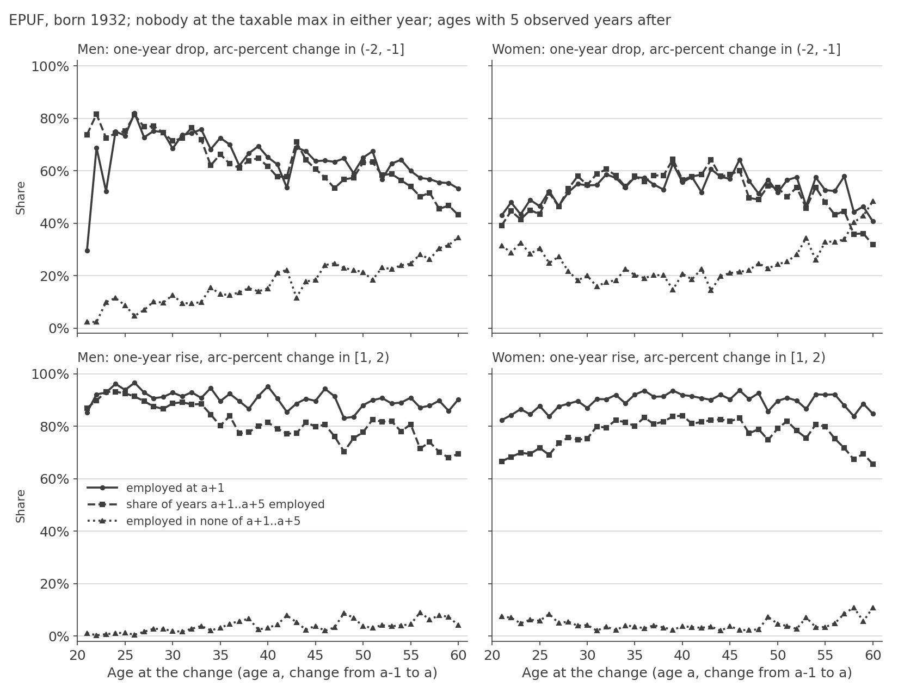

The model has almost no such events (section 9), so there is nothing to compute for it.

**x:** age at the change, restricted to a ≤ 60 so all five following years are observed.

**y (three lines):**
- share employed at a+1;
- share of the years a+1..a+5 employed;
- share employed in none of a+1..a+5.

Ages 21–60, EPUF:

| Event, sex | Employed at a+1 | Share of a+1..a+5 employed | Employed in none of a+1..a+5 |
|------------|-----------------|----------------------------|------------------------------|
| Drop, men   | 63% | 64% | 16% (6% at 21–29 → 30% at 55–60) |
| Drop, women | 52% | 51% | 26% (19–28% to 54 → 39% at 55–60) |
| Rise, men   | 91% | 85% | 3%  |
| Rise, women | 89% | 77% | 5%  |

**Observation.**
- **Not employed the next year:** 37% of men and 48% of women after a drop.
- **Out for all five following years**, a permanent exit (retirement, disability, death or non-covered work): 16%
  and 26%, rising to 30% and 39% for drops at 55–60.

**How much of the large-change tail is left once exits are removed.** Share of the one-year change sample
(ages 21–64), pooled over ages:

| | Men: EPUF | Men: Model | Women: EPUF | Women: Model |
|---|---|---|---|---|
| Interior large changes, 1 ≤ abs(arc) < 2 | 10.2% | 0.17% | 10.3% | 0.28% |
| … of which drops followed by a zero year | 2.2% | 0.02% | 2.6% | 0.03% |
| **Remaining tail, excluding those exits** | **8.1%** | **0.15%** | **7.7%** | **0.25%** |

So even after removing every drop that is followed by non-employment, EPUF has 30–50 times the model's mass of
large interior changes.

---

### (c) Non-employment age profile vs. earnings dependence

#### 11. Share not employed by age, within lifetime-earnings quartiles

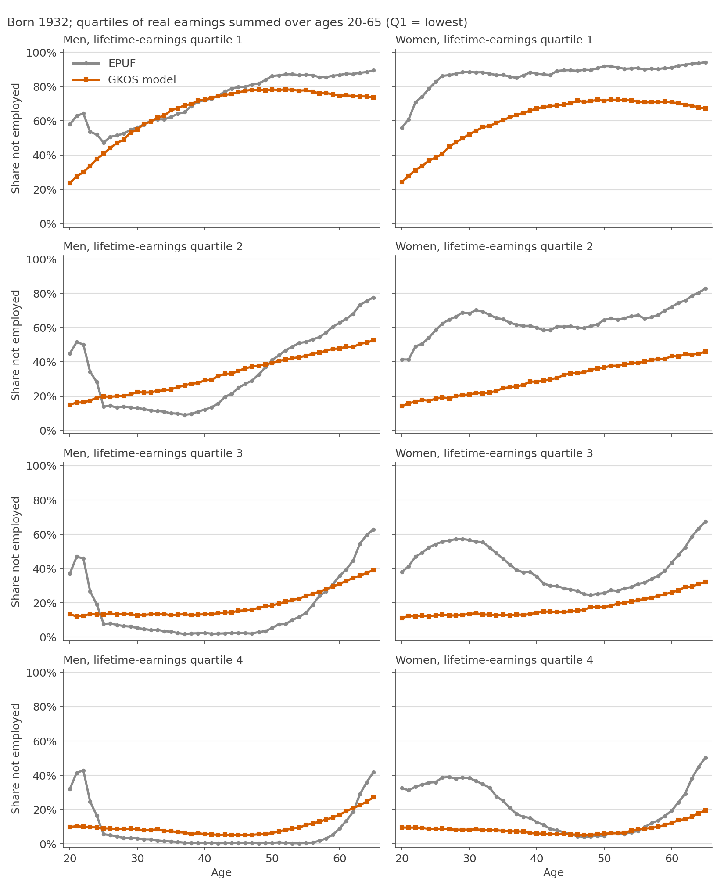

**x:** age.

**y:** share with zero earnings at that age.

**Panels:** quartiles of real earnings summed over ages 20–65, ranked within sex and source (Q1 = lowest).

Mean share not employed by age band:

| Sex | Quartile | Source | 20–29 | 30–44 | 45–54 | 55–61 | 62–65 |
|-----|----------|--------|-------|-------|-------|-------|-------|
| Men | Q1 | EPUF  | 55% | 67% | 84% | 86% | 88% |
|     |    | Model | 39% | 68% | 78% | 76% | 74% |
|     | Q2 | EPUF  | 28% | 13% | 38% | 58% | 74% |
|     |    | Model | 19% | 27% | 39% | 46% | 51% |
|     | Q3 | EPUF  | 21% | 3%  | 6%  | 27% | 55% |
|     |    | Model | 13% | 13% | 19% | 28% | 37% |
|     | Q4 | EPUF  | 18% | 1%  | 1%  | 5%  | 31% |
|     |    | Model | 9%  | 7%  | 7%  | 15% | 24% |
| Women | Q1 | EPUF  | 77% | 88% | 91% | 91% | 94% |
|       |    | Model | 38% | 63% | 72% | 71% | 68% |
|       | Q2 | EPUF  | 56% | 63% | 63% | 69% | 79% |
|       |    | Model | 18% | 26% | 36% | 42% | 45% |
|       | Q3 | EPUF  | 51% | 42% | 27% | 38% | 61% |
|       |    | Model | 12% | 14% | 18% | 24% | 30% |
|       | Q4 | EPUF  | 36% | 21% | 5%  | 15% | 41% |
|       |    | Model | 9%  | 7%  | 6%  | 11% | 17% |

**Observation.**
- **Non-employment depends less on lifetime income in the model than in the data.**
  - Q1–Q4 gap at 45–54: EPUF 83 points (men) and 86 (women), against model 71 and 66.
  - In Q3–Q4 the model has more non-employment mid-career than EPUF: men at 30–54, 7–19% vs 1–6%.
- **The model misses early-life exits by low-lifetime-income people.** At 20–29, Q1 non-employment is EPUF 55% vs
  model 39% for men, and 77% vs 38% for women.
- **At 62–65 the model is below EPUF in every quartile.**

**Mortality is in this figure.** The model's lines come from the run with deaths. The no-mortality run gives a visibly different picture: at 65 men's Q1 is 74% with mortality vs 55% without, and Q4 is 27% vs 12%.

**Why model non-employment rises with age.** Two sources: the logit itself up to about 50, and mortality after.

1. **The logit, up to about 50.** The probability of a zero year is `logistic(a + b t + (c + d t) z)` with
   a = −3.35, b = −0.86, c = −5.03, d = −2.90.
   - Because d < 0, the z-gradient steepens with age: from −3.9 at age 20 to −16.9 at 65.
   - At z = 0 the probability falls with age (4.7% at 20, 0.4% at 50).
   - At z = −0.6 it rises (34% at 20, 88% at 50, 96% at 65).
   - z is persistent (ρ = 0.959) and its dispersion grows over the life cycle (sd 0.71 at 25, toward about 0.88).
     So the low-z tail is pushed toward certain non-employment while everyone else is pushed toward certain
     employment.
   - Averaged over people, this raises non-employment: without mortality the model goes from 15.6% at 20 to 29%
     at 50, then is flat at about 30% to 65.
   - Within the bottom quartile it is steeper, because that quartile is selected on low z: 24% at 20 to 68% at 50.
2. **Mortality, after 50.** With deaths added, overall non-employment keeps rising after 50 (men: 36% at 50, 48%
   at 65), because every death is a permanent zero.

   Without mortality the bottom quartile's non-employment falls after 50 (men 68% → 55% at 65), as z mean-reverts.
   With mortality it stays at about 75%.

#### 12. Share of remaining years not employed, by cumulative earnings to date

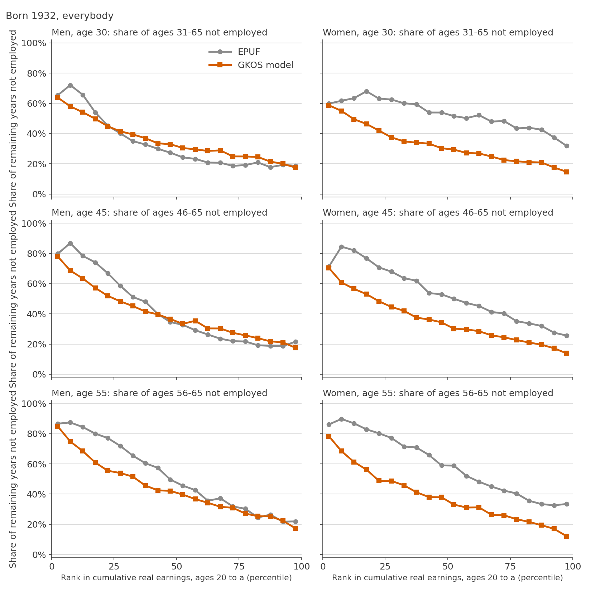

**x:** rank in cumulative real earnings over ages 20 to a (inclusive), everybody.

**y:** share of the remaining ages a+1..65 with zero earnings.

Selected ventiles, EPUF / model:

| Group | 1st ventile | 2nd | 5th | Median (10th–11th) | 20th |
|-------|-------------|-----|-----|--------------------|------|
| Men, 30   | 65 / 64 | 72 / 58 | 45 / 45 | 26 / 32 | 19 / 18 |
| Men, 45   | 80 / 78 | 87 / 69 | 67 / 52 | 34 / 35 | 21 / 18 |
| Men, 55   | 87 / 85 | 87 / 75 | 77 / 55 | 48 / 41 | 22 / 17 |
| Women, 30 | 60 / 59 | 63 / 55 | 63 / 42 | 53 / 30 | 32 / 15 |
| Women, 45 | 71 / 70 | 85 / 61 | 71 / 48 | 52 / 32 | 26 / 14 |
| Women, 55 | 86 / 78 | 90 / 68 | 80 / 49 | 59 / 36 | 33 / 12 |

**Observation.**
- **We are missing labour-market exits at the bottom of the income distribution.** For men the model is close at
  the lowest ventile but 12–22 points too low at ventiles 2–5 at 45 and 55.
- **For women we are also missing the child penalty.** At 30 the model is too low everywhere above the lowest
  ventile, by 21–23 points from the 5th ventile to the median.

**Labour-market exit or weak attachment?** Count the transitions in the remaining years:

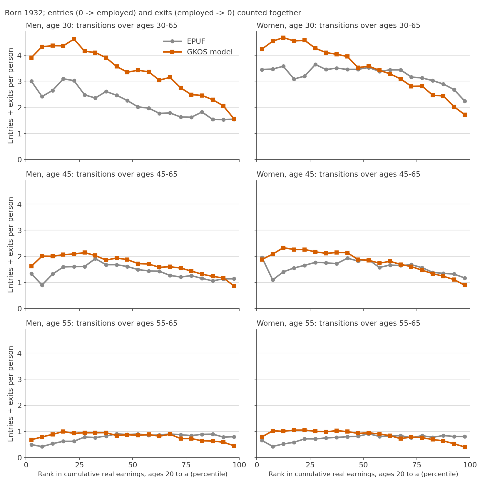

**x:** rank in cumulative real earnings over ages 20 to a (inclusive).

**y:** mean number per person of entries plus exits (employed ↔ not employed) over ages a..65, counted together.

Entries + exits per person, EPUF / model, by rank quintile:

| Group | Bottom 20% | 20–40% | 40–60% | 60–80% | Top 20% |
|-------|------------|--------|--------|--------|---------|
| Men, 30   | 2.8 / 4.2 | 2.6 / 4.2 | 2.2 / 3.4 | 1.7 / 2.9 | 1.6 / 2.1 |
| Men, 45   | 1.3 / 1.9 | 1.7 / 2.0 | 1.6 / 1.8 | 1.3 / 1.5 | 1.1 / 1.2 |
| Men, 55   | 0.5 / 0.8 | 0.8 / 0.9 | 0.9 / 0.9 | 0.9 / 0.8 | 0.8 / 0.6 |
| Women, 30 | 3.4 / 4.5 | 3.5 / 4.2 | 3.5 / 3.6 | 3.3 / 3.0 | 2.7 / 2.2 |
| Women, 45 | 1.5 / 2.1 | 1.7 / 2.2 | 1.8 / 1.9 | 1.6 / 1.6 | 1.3 / 1.1 |
| Women, 55 | 0.6 / 1.0 | 0.7 / 1.0 | 0.8 / 0.9 | 0.8 / 0.8 | 0.8 / 0.6 |

**Observation.**
- **At the bottom, EPUF has fewer transitions than the model at every age**, despite more non-employment: 0.3–1.5
  fewer per person in the bottom quintile. Low cumulative earners in EPUF exit and stay out; in the model they
  cycle in and out.
- **Men at 30: the model has more transitions at every rank**, by 0.5–1.6 per person.
- **At the top at 55, EPUF has more** (0.8 vs 0.6): retirement.
- **Women: the model has too many below the median and too few above it**, at 30 and 45.

**Permanent exit or re-entry?** The figure below splits the share of remaining years not employed by what the
person does later. The horizon stops at 60, to keep retirement out.

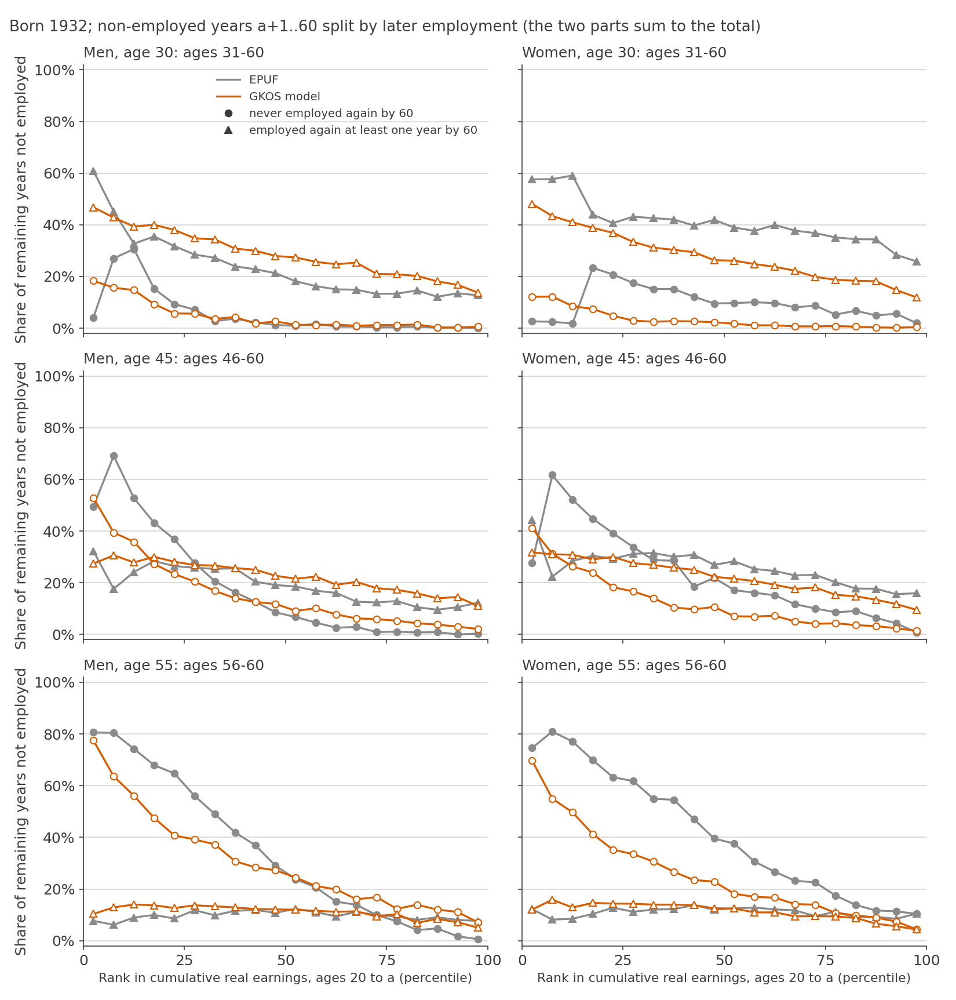

**x:** rank in cumulative real earnings over ages 20 to a (inclusive).

**y:** share of the remaining ages a+1..60 not employed, split into the years of people who:
- ● are never employed again by 60: a permanent exit;
- ▲ are employed again in at least one of those years: re-entry.

Both parts have the same denominator (everybody × all remaining years), so they sum to the share in section 12
(on the shorter horizon to 60). Filled markers are EPUF, hollow markers the model.

Means over rank quintiles, EPUF / model:

| Group | Bottom 20%: never again | Bottom 20%: re-entry | 40–60%: never again | 40–60%: re-entry | Top 20%: never again | Top 20%: re-entry |
|-------|------|------|------|------|------|------|
| Men, 30   | 19 / 15% | 44 / 42% | 2 / 2%   | 20 / 28% | 0 / 1%  | 13 / 17% |
| Men, 45   | 54 / 39% | 26 / 29% | 8 / 11%  | 19 / 23% | 0 / 3%  | 11 / 14% |
| Men, 55   | 76 / 61% | 8 / 13%  | 28 / 25% | 12 / 12% | 3 / 11% | 8 / 7%   |
| Women, 30 | 8 / 10%  | 55 / 43% | 10 / 2%  | 40 / 27% | 5 / 0%  | 31 / 16% |
| Women, 45 | 47 / 31% | 31 / 31% | 18 / 9%  | 28 / 22% | 5 / 3%  | 17 / 12% |
| Women, 55 | 76 / 54% | 10 / 14% | 39 / 20% | 13 / 12% | 12 / 8% | 9 / 6%   |

**Observation.**
- **The model's shortfall at the bottom is permanent exits.** Bottom quintile at 45 and 55, share of remaining
  years spent by people who never work again:

  | | EPUF | Model |
  |---|---|---|
  | Men at 45   | 54% | 39% |
  | Men at 55   | 76% | 61% |
  | Women at 45 | 47% | 31% |
  | Women at 55 | 76% | 54% |

  The re-entry part is about equal, or larger in the model.
- **Men above the median: the model has too much re-entry non-employment** (short spells) at 30 and 45.
- **Women at 30: the model is short on both parts above the bottom quintile.**
  - Permanent exits: 5–17% vs 0–3%.
  - Re-entry: 31–42% vs 16–33%. That is the child-penalty pattern.
- **Caveat at the lowest ventile at 30 and 45.** EPUF's "never again" point drops there, because the base requires
  some covered earnings at 20–65. People who have not worked by a must work later, possibly after 60.

---

### (d) Weak labour-force attachment

Mortality adds one exit per person who dies while employed, in both sources.

#### 13. Entries and exits up to 65, by current earnings

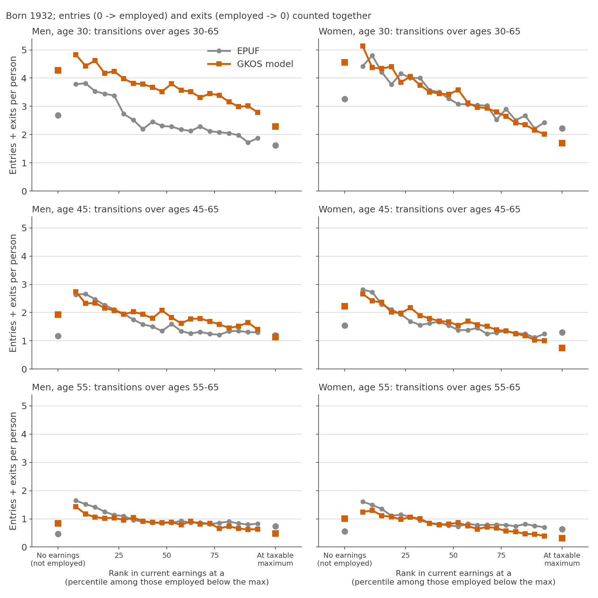

The cumulative-earnings version is in section 12.

**x:** current earnings at a, in the exit-plot layout.
- Left point: not employed at a.
- Right point: at the taxable max.
- Line: 20 rank bins among people employed below the max.

**y:** mean number per person of entries plus exits over ages a..65, counted together.

Entries + exits per person, EPUF / model:

| Group | Not employed at a | Bottom 20% of earners | Middle 20% | Top 20% below max | At max |
|-------|-------------------|-----------------------|------------|-------------------|--------|
| Men, 30   | 2.7 / 4.3 | 3.7 / 4.5 | 2.3 / 3.6 | 1.9 / 3.0 | 1.6 / 2.3 |
| Men, 45   | 1.2 / 1.9 | 2.5 / 2.4 | 1.5 / 1.8 | 1.3 / 1.5 | 1.2 / 1.1 |
| Men, 55   | 0.5 / 0.8 | 1.5 / 1.2 | 0.9 / 0.9 | 0.8 / 0.7 | 0.7 / 0.5 |
| Women, 30 | 3.3 / 4.6 | 4.3 / 4.6 | 3.2 / 3.4 | 2.5 / 2.2 | 2.2 / 1.7 |
| Women, 45 | 1.6 / 2.2 | 2.5 / 2.4 | 1.5 / 1.7 | 1.2 / 1.1 | 1.3 / 0.8 |
| Women, 55 | 0.6 / 1.0 | 1.4 / 1.2 | 0.8 / 0.8 | 0.8 / 0.5 | 0.6 / 0.3 |

**Observation.**
- **The not employed at a have far more future transitions in the model**, at every age: 0.3–1.6 more. In EPUF a
  zero is more often the start of a long or permanent spell.
- **Low current earners:**
  - at 30 the model has more transitions than EPUF;
  - at 45 the two are about equal;
  - at 55 the model has fewer (1.2 vs 1.4–1.5).

  Low earners late in life churn more in EPUF.
- **Men at 30: the model has more transitions all along the earnings line** (by 0.8–1.3).
- **Top earners and those at the max, at 45–55: EPUF has more transitions** (retirement), especially women at the
  max (1.3 vs 0.8 at 45, 0.6 vs 0.3 at 55).

#### 14. Entries and exits over ages 20–65, by lifetime earnings

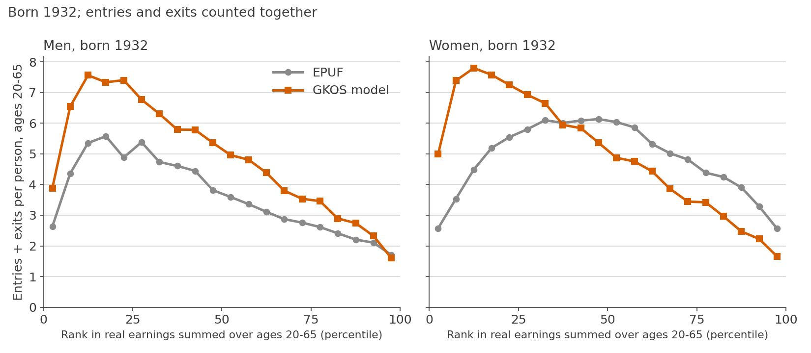

**x:** rank in real earnings summed over ages 20–65.

**y:** mean number per person of entries plus exits over 20–65, counted together.

| | Average, EPUF / model | Peak, EPUF | Peak, model | Lowest ventile, EPUF / model | Top ventile, EPUF / model |
|---|---|---|---|---|---|
| Men   | 3.6 / 4.9 | 5.6 at the 18th pct | 7.6 at the 13th pct | 2.6 / 3.9 | 1.7 / 1.6 |
| Women | 4.9 / 5.0 | 6.1 at the 48th pct | 7.8 at the 13th pct | 2.6 / 5.0 | 2.6 / 1.7 |

**Observation.**
- **Both sources: transitions are hump-shaped in lifetime earnings.**
  - Few at the very bottom: people who barely ever work.
  - The most among low-to-middle earners.
  - Fewest at the top.
- **Men: the model has more transitions at every rank below about the 90th percentile**, about 2 more per person
  around the 10th–20th percentile.
- **Women: the averages match, but the shape differs.**
  - The model's peak is at the 13th percentile, and it has more transitions than EPUF below about the 37th
    percentile and fewer above it.
  - EPUF's is at the median (6.1 vs 5.4 in the model). Women with middling careers leave and re-enter, which fits
    the child-penalty pattern in sections 2 and 4.
  - EPUF's top women also churn more than the model's (2.6 vs 1.7).

#### 15. Future entries and exits by age, within lifetime-earnings quartiles

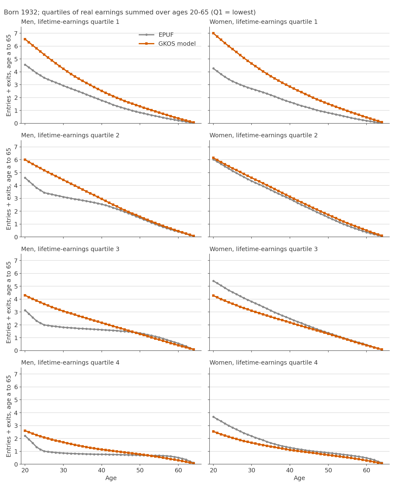

**x:** age a.

**y:** mean number per person of entries plus exits over the rest of the window, a → 65.

**Panels:** quartiles of real earnings summed over ages 20–65 (Q1 = lowest), as in section 11.

Future entries + exits per person, EPUF / model:

| Sex | Quartile | From 20 | 25 | 30 | 40 | 50 | 60 |
|-----|----------|---------|----|----|----|----|----|
| Men | Q1 | 4.6 / 6.6 | 3.5 / 5.4 | 2.9 / 4.2 | 1.8 / 2.5 | 0.8 / 1.3 | 0.2 / 0.4 |
|     | Q2 | 4.6 / 6.0 | 3.4 / 5.2 | 3.1 / 4.4 | 2.5 / 3.0 | 1.5 / 1.6 | 0.4 / 0.5 |
|     | Q3 | 3.1 / 4.3 | 2.0 / 3.6 | 1.8 / 3.1 | 1.6 / 2.2 | 1.4 / 1.3 | 0.6 / 0.4 |
|     | Q4 | 2.2 / 2.6 | 1.0 / 2.1 | 0.9 / 1.7 | 0.8 / 1.1 | 0.7 / 0.8 | 0.5 / 0.3 |
| Women | Q1 | 4.3 / 7.0 | 3.3 / 5.8 | 2.7 / 4.7 | 1.7 / 2.9 | 0.8 / 1.5 | 0.2 / 0.5 |
|       | Q2 | 6.0 / 6.2 | 5.1 / 5.3 | 4.4 / 4.6 | 3.0 / 3.1 | 1.5 / 1.7 | 0.4 / 0.5 |
|       | Q3 | 5.4 / 4.3 | 4.5 / 3.6 | 3.8 / 3.1 | 2.5 / 2.2 | 1.4 / 1.3 | 0.5 / 0.4 |
|       | Q4 | 3.7 / 2.6 | 2.9 / 2.1 | 2.2 / 1.7 | 1.3 / 1.1 | 0.9 / 0.7 | 0.5 / 0.3 |

**Observation.**
- **Q1, both sexes: the model has far more future churning.** From age 20, 6.6 vs 4.6 for men and 7.0 vs 4.3 for
  women, and the gap persists to 60.
  - EPUF's lowest earners are not weakly attached.
  - They have fewer spells, which are long or permanent.
- **Men Q2–Q4: EPUF's churning happens almost entirely before 25.**
  - The curve drops 1.1–1.2 between 20 and 25.
  - It is then nearly flat until the mid-50s: Q3 2.0 → 1.4 between 25 and 50, Q4 1.0 → 0.7.
  - It drops again in the last decade: retirement.
- **The model's men decline steadily at all ages.** So by 30 they have 0.8–1.3 more future transitions than EPUF in
  Q2–Q4, and fewer than EPUF after about 50 in Q3–Q4.
- **Women: the model matches Q2 almost exactly.** It has too few future transitions in Q3–Q4, by 0.5–1.1 at ages 20–30,
  and too many in Q1.

---

## Part II. The modified model

**Purpose.** Change as little as possible in GKOS's nonemployment block and see what each change buys against the
figures of Part I. The GKOS logit is `p(t, z) = logistic(a + b·t + (c + d·t)·z)`, one intercept for everybody and
z the only state. Three things are added: the intercept depends on sex and on whether the person was employed
last year; each year a share of people leave covered work for good, with a hazard that is quadratic in age; and
the logit index loads on the person's fixed earnings component α + β·t as well as on z.

### Model

Everything else is the GKOS model of Part I, mortality included. The nonemployment probability is

    p(t, x; s, e_{-1}) = logistic(a_s + g_N·1[not employed last year] + b·t + (c + d·t)·x),
    x = z + κ·(α + β·t),   s ∈ {men, women},   t = (age − 24)/10

and each year from 20, before the draw above, a person still in the labour market exits for good with probability

    h(t) = logistic(k + k_t·t + k_t2·t²),

the same for both sexes and independent of earnings; earnings are zero from then on through 65.

- b = −0.859, c = −5.034, d = −2.895: GKOS's values, unchanged. α and β are the person's GKOS fixed effects
  (sd 0.30 and 0.196 per decade, correlation 0.768), so α + β·t is the fixed part of log earnings at age t.
- GKOS is the special case a_men = a_women = −3.353, g_N = 0, k → −∞, κ = 0. Seven parameters in total.
- Order within a year: death, then the permanent exit, then the temporary draw.
- **Initial condition.** Everyone is employed at 18. Status at 19 is drawn from the logit with the
  employed-last-year intercept (z at 20 standing in for z at 19), and the lag starts from there. This adds no
  parameter.

### Estimation

- **Moments:** SMM on 2,493 EPUF moments, the statistics behind sections 1–15 computed by the same code. Left out:
  - the arc-change statistics (sections 7, 9, 10);
  - employment by age (section 2), which is the weighted average of the quartile profiles in section 11 and would
    count them twice.

  Entries and exits are counted together.
- **Blocks:** moments are grouped into the four blocks (a)–(d) of Part I; the overview statistics count under (c).
- **Units: percentage points of a share, the same for every figure.** Shares are used as they are. Two figures are
  converted first:
  - **Transition counts become annual rates.** Switches between a and 65 are divided by 65 − a, and switches over
    20–65 by 45.
  - **The years-worked histogram becomes its cumulative distribution.**
- **Weights:** diagonal. Each block gets ¼, each figure an equal share of its block, and each moment an equal share
  of its figure. So a figure's term is its weight × its mean squared gap in percentage points. Bins with fewer than
  50 EPUF observations are dropped.
- **Simulation:** 20,000 people per sex, common random numbers.
- **Optimiser: TikTak** (Arnoud, Guvenen and Kleineberg 2022; `code/dynamics/tiktak.py`), because single
  Nelder–Mead starts of intermediate models landed in different places (the linear-exit model: J = 47.01 with
  k_t = −0.59 against J = 47.72 with k_t = +0.06).
  - 1,024 Sobol' points over a box, evaluated in parallel; the best 48 are seeds.
  - Local searches are Nelder–Mead (100 evaluations, tolerance 0.01), 16 at a time, each started from a convex
    combination of its seed and the best point so far with weight (i/48)^¼, so the search concentrates after the
    first batches. The run stops when the last two different incumbents agree to 0.01 (AGK's rule) or after a
    600-second budget, then a 200-evaluation polish.
  - The run: 176 local searches, 18,824 evaluations, 12.6 minutes on 16 cores of the SOM cluster. The incumbent
    did not move after search 96 (J = 35.264; polish 35.206). The 177 local minima
    (`nonemp_tiktak_yob1932_absq_alpha.csv`) are one basin: 133 lie within 0.4 of the optimum, and those agree to
    0.3 in every intercept and exit parameter and to 0.05 in κ.
  - The objective is a step function of the parameters (shares of indicator draws), so gradient methods do not
    apply; Powell local searches were tried and were worse per evaluation than Nelder–Mead.

### Code

- `python code/dynamics/estimate_nonemp.py --spec absq_alpha --tiktak 1024 --keep 48 --local-maxfev 100
  --budget 600` writes `nonemp_params_yob1932_absq_alpha.csv`, `nonemp_fit_yob1932_absq_alpha.csv`,
  `nonemp_tiktak_yob1932_absq_alpha.csv` and `transition_rates_yob1932_absq_alpha.csv`. The inputs come from
  `processed_data/nonemp_inputs_yob1932.npz` (written by the first run on a machine with the database), so it
  runs without the database; `estimate_nonemp.sbatch` is the Slurm wrapper for the SOM cluster.
- `python code/dynamics/plots/plot_transition_rates.py --new absq_alpha` draws every figure of Part III with
  the suffix `_absq_alpha`; `plot_perm_exit_dec.py --model absq_alpha` draws the permanent-exit decomposition.
- The model is `nonemp_model.py`; `--spec` selects which parameters are free. The nested and alternative
  specifications below are `sexint`, `sexlag_add`, `sexlag`, `sexlag_abs`, `sexlag_absq`, `sexlag_abs55` and
  `absq_zcap`; their files carry those suffixes.

### Estimates

| Parameter | GKOS | Modified GKOS |
|-----------|------|---------------|
| a_men | −3.353 | **−6.071** |
| a_women | −3.353 | **+1.034** |
| g_N (not employed last year) | 0 | **+0.898** |
| k (permanent exit) | −∞ | **−5.489** |
| k_t (per decade of age) | — | **−1.460** |
| k_t2 (per decade²) | — | **+0.546** |
| κ (on α + β·t) | 0 | **+0.409** |

- The intercept is −6.07 (men) / +1.03 (women) after a year in work, and −5.17 / +1.93 after a year out.
- **The fixed effect carries a fifth to a half of z's weight.** κ·(α + β·t) has sd 0.13 at 25, 0.27 at 45 and
  0.39 at 60, against 0.61–0.85 for z. A man with α and β one sd below average is, at 45, 0.29 lower in the index,
  which with c + d·t = −11.1 at that age is +3.2 on the logit; at 60 it is +6.4. So the fixed effect matters little
  before 30 and sorts people more and more as the z-slope steepens with age.
- **The permanent exit is U-shaped in age**: 0.8% a year at 20, 0.36% at 25, 0.21% at 30, a minimum of 0.16% at
  37, 0.21% at 45, 0.37% at 50, 0.84% at 55, 2.5% at 60, 4.1% at 62 and 9.1% at 65. Without mortality it takes 7%
  of a cohort out for good by 45, 11% by 55, 24% by 62 and 39% by 65.

### What each addition bought

The additions were made one at a time, each model re-estimated in full. J is the objective above; the blocks are
Part I's (a)–(d).

| Block | GKOS | + sex intercept | + last year's status | + permanent exit | **+ fixed effect** |
|-------|------|-----------------|----------------------|------------------|--------------------|
| a: transitions across the income distribution | 57.7 | 18.6 | 18.6 | 14.3 | **9.8** |
| b: non-employment dynamics | 34.6 | 26.5 | 22.9 | 18.8 | **16.9** |
| c: age profile vs earnings dependence | 63.0 | 13.7 | 14.1 | 9.7 | **8.1** |
| d: weak attachment | 2.1 | 2.3 | 0.6 | 0.5 | **0.5** |
| **Total** | **157.5** | **61.0** | **56.2** | **43.3** | **35.2** |

- **The sex-specific intercept does most of the work** (157 → 61; a_men = −3.83, a_women = +2.03), almost all of
  it in blocks (a) and (c): women's level. GKOS's single intercept gives women men's participation (section 2:
  29% of women's person-years not employed against EPUF's 54%). Everything that conditions on women's
  employment status or ranks women by earnings inherits that error, which is why one parameter removes 60% of J.
- **Last year's status adds 61 → 56** (a_men = −4.12, a_women = +1.88, g_N = +1.27), in 1-year persistence
  (3.7 → 1.2) and the entries + exits figures of block (d) (2.3 → 0.6): a state variable for being out makes a
  spell last and halves the churning. The level is unchanged.
- **The permanent exit adds 56 → 43.** Its target was 5-year persistence, which the intercepts could not reach:
  re-entry among those who do come back runs at about 20% a year after the second year in both EPUF and the
  intercept-only model, so the gap is not duration dependence but a missing mass of people who never return
  (men out at 40–50 who never work again by 61: EPUF 62%, intercept-only model 45%). That share does not depend
  on earnings before the spell (37 / 32 / 35% of men's spells by tercile of pre-spell earnings), so the hazard
  has age terms and no earnings term. Gains: 5-year persistence 5.3 → 3.6, remaining years not employed
  3.2 → 1.5, never-vs-again employed 2.2, 5-year cumulative rank 6.1 → 4.0, the quartile age profiles 7.3 → 5.5,
  men's employment from 50 on (section 2) including the rise after 55. Cost: men's employed-last-year intercept
  drops from −4.12 to −6.24, so non-employment and churning before 25 nearly vanish.
- **The fixed effect adds 43 → 35, half of it in block (a)**: 1-year exit 2.2 → 0.9, 5-year exit 3.6 → 1.9,
  1-year cumulative rank 4.5 → 3.8, 5-year 4.0 → 3.1; also 5-year absolute changes 8.3 → 6.2, never-vs-again
  employed 2.2 → 1.5, remaining years not employed 1.5 → 0.9 and 5-year persistence 3.6 → 3.3. It costs 1-year
  absolute changes (5.7 → 6.1) and 1-year persistence (1.2 → 1.4). Its target was men's exits across the earnings
  distribution and the mid-career attachment of men in the upper half (section 4 and 11): with z alone in the
  index a high earner is only as attached as his current z, and a few bad draws take him out, so the model had
  twice EPUF's exit rate among long-tenured middle and top earners. With the fixed effect in the index the
  people in the lowest current-earnings bin are the people with low α, and they are the ones who leave; the
  permanent exit, which had been front-loaded to 20–25 to produce the same sorting, halves at the young ages
  (1.7% → 0.8% at 20) and is unchanged after 55.

Aggregate share of person-years at 20–65 not employed:

| | EPUF | GKOS | Modified |
|-|------|------|----------|
| Men | 32.6% | 31.7% | 30.8% |
| Women | 53.5% | 29.4% | 53.6% |

### Alternatives tried and not adopted

- **A permanent exit linear in age** (logit k + k_t·t; J = 46.9). The estimated hazard *falls* with age (0.7% a
  year at 20, 0.25% at 60): a linear logit that rises steeply after 55 would have to rise at every age, and the
  fit preferred front-loading the exits. That put cumulative permanent exits 6 points above EPUF by 45 and 15
  points below by 65. The surface has two basins (k_t = −0.59 vs +0.06), which is what prompted TikTak.
- **A kink at 55 instead of the quadratic** (k + k_t·t + k_55·(t − 3.1)₊; J = 44.2 against the quadratic's 43.3).
  Worse in every block; dropped.
- **A cap on z instead of the fixed effect**, (c + d·t)·min(z, z̄_s), one cap per sex (J = 42.6 against 35.2).
  This was the first candidate for the mid-career problem, suggested by a diagnostic inside the six-parameter
  model (there, α explains only 13% of the variance of log lifetime earnings, and the Q3 men who never leave have
  *lower* α than those who do). The men's cap estimates at z̄ = −0.34 and the women's at the upper bound (no
  cap), and the gain is one point against the fixed effect's eight. The diagnostic was a statement about the
  model's own split of earnings into α and z, which EPUF does not identify; what EPUF says is that the people
  who stay are low-risk in a way z alone does not carry. The cap may still have a role on top of the fixed
  effect (see the open issues).
- **Two discrete attachment types** were considered for the same problem and not estimated: within a lifetime
  quartile EPUF shows no within-person persistence of spells (P(any year out at 45–54 | any out at 25–34) is no
  higher than P(· | none out at 25–34): Q2 64 vs 74%, Q3 22 vs 25%, Q4 5 vs 3%), which is the signature a type
  model would need.
- **An entry margin for men** (an ad hoc check, not estimated): half of men entering at 20 and half uniformly at
  21–25, earnings zero before entry and the nonemployment process untouched. It overshoots at 20 (51% of men
  not employed against EPUF's 43% for this cohort and 21% for a cohort without Korean-War service) and by
  construction has nothing left to explain at 25–35, where the model is still 7–9 points too employed. The
  early-20s gap is the intercept, not entry timing.

---

## Part III. GKOS model, modified GKOS and EPUF on the same figures

Every figure of Part I redrawn with three lines: grey = EPUF, orange = GKOS, light blue = Modified GKOS. Tables
read EPUF / GKOS / modified. The section numbers match Part I; the definitions of x, y and samples are there.

### Overview

#### 1. Lifetime: share of ages 20–65 employed, by lifetime earnings

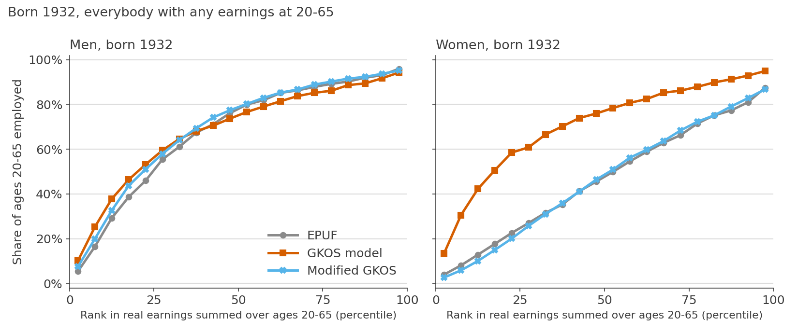

| Sex | 2.5 | 17.5 | 32.5 | 47.5 | 62.5 | 77.5 | 92.5 |
|-----|-----|------|------|------|------|------|------|
| Men | 5 / 10 / 8 | 39 / 46 / 44 | 61 / 65 / 64 | 76 / 74 / 77 | 85 / 81 / 85 | 89 / 86 / 90 | 93 / 92 / 94 |
| Women (7.5, 22.5, …) | 8 / 31 / 6 | 23 / 59 / 20 | 35 / 70 / 36 | 50 / 78 / 51 | 63 / 85 / 64 | 75 / 90 / 75 | 87 / 95 / 87 |

- **Men: within 1 point of EPUF above the 30th percentile and within 5 below it.** GKOS was 5–8 points too high
  at the bottom.
- **Women: within 3 points of EPUF everywhere.** GKOS was 23–36 points too high through the middle.

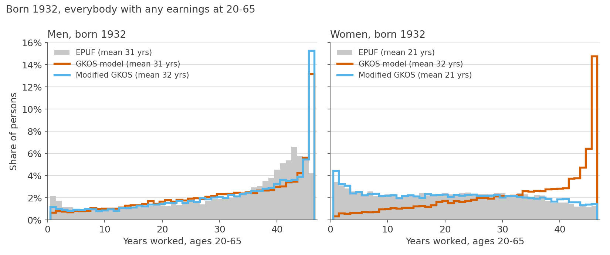

- **Women: the distribution matches EPUF's flat shape** (mean 21.4 years vs EPUF 21.4 and GKOS 32.5; 1.4% at 46
  years vs EPUF's 1.3%).
- **Men: the spike at 46 years is now larger than GKOS's** (15.3% vs GKOS 13.2% and EPUF 4.2%): a complete career
  is the norm for anyone with an average fixed effect whom the permanent exit does not take. The mean is 31.9 years
  against EPUF's 31.0. For this cohort EPUF's spike is small because of Korean-War service at 18–21.

#### 2. Share employed by age

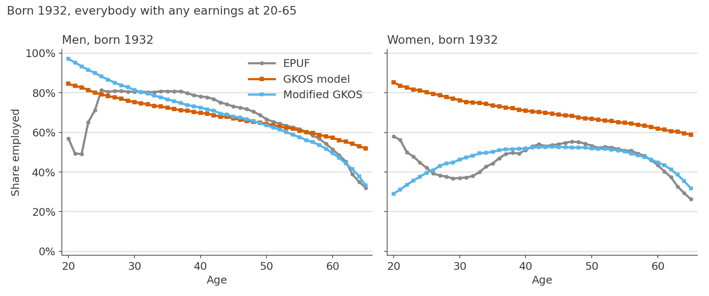

Share not employed:

| Sex | 20 | 25 | 30 | 40 | 50 | 60 | 65 |
|-----|----|----|----|----|----|----|----|
| Men | 43 / 16 / 3 | 19 / 21 / 12 | 19 / 25 / 19 | 22 / 30 / 27 | 33 / 36 / 36 | 49 / 43 / 50 | 68 / 48 / 67 |
| Women | 42 / 15 / 71 | 58 / 20 / 60 | 63 / 24 / 54 | 49 / 29 / 48 | 47 / 33 / 48 | 57 / 38 / 55 | 74 / 41 / 68 |

- **Men from 25 to 65 are within 7 points of EPUF**, including the rise after 50 (50% at 60, 67% at 65 vs EPUF
  49%, 68%; GKOS 43%, 48%). The widest gaps are 7 points too low at 25 and 5 too high at 40.
- **Men before 25 are worse than in GKOS.** With a_men = −6.07 almost nobody is out at 20 (3% vs EPUF 43%, GKOS
  16%). EPUF's 43% is partly Korean-War service with uncovered pay, but a cohort without it still has 21%. The low
  intercept is what lets the permanent exit and the fixed effect carry the later non-employment without
  overshooting the middle ages, and no figure targets the early 20s on their own.
- **Women: right from 35 to 60, too high before 25, 6 points low at 65.** At 20 the model has 71% not employed
  against EPUF's 42%. The profile still falls from 20: with GKOS's b and d a women's intercept this high can only
  produce a decline (see the open issues). The rise after 55 is there (55% at 60 vs 57%) but not the last step
  (68% at 65 vs 74%).

#### 3. Permanent exits by age, decomposed

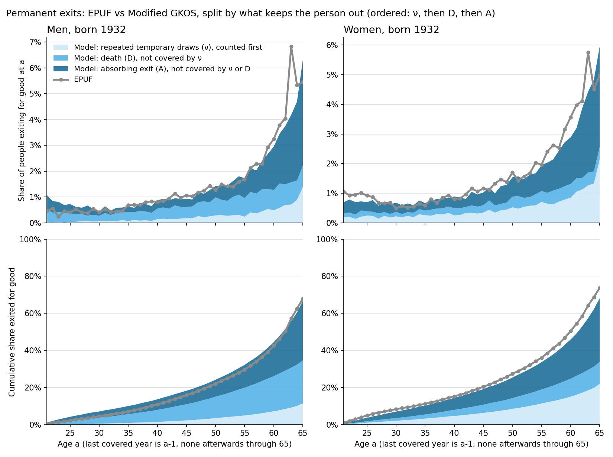

Same construction as Part I, with the absorbing exit as a third part (ordered ν, then D, then A). Cumulative share
exited for good, EPUF / GKOS (ν + D) / modified (ν + D + A):

| Sex | by 45 | by 55 | by 65 |
|-----|-------|-------|-------|
| Men | 15.9 / 12.8 / 18.2 (2.2 + 8.7 + 7.3) | 29.6 / 24.4 / 32.2 (4.9 + 15.0 + 12.3) | 67.9 / 48.1 / 66.7 (11.4 + 23.1 + 32.2) |
| Women | 20.4 / 9.9 / 19.1 (6.2 + 4.4 + 8.4) | 36.1 / 19.5 / 33.6 (11.4 + 7.6 + 14.7) | 73.7 / 41.0 / 68.1 (21.9 + 11.8 + 34.4) |

- **By 65 men are on EPUF (66.7% vs 67.9%) and women 6 points short**; GKOS was 20–33 points short. By 62: men
  51.6% vs 50.3%, women 52.9% vs 58.4%.
- **Men are 2–3 points too high by 45 and 55**: the hazard is highest at 20–25 (0.8% at 20), so it front-loads
  exits.
- **The shape at 62–63 is still wrong**: EPUF's exits jump (6.8% of men at 63), the model's hazard is a smooth
  curve through 60–65. Getting the step needs a retirement term at 62, not a steeper polynomial.
- **For men the absorbing exit (32.2% by 65) is larger than death (23.1%)**; for women it is three times death
  (34.4% vs 11.8%), and ν runs are 21.9%.

### (a) Employment and non-employment transitions across the income distribution

#### 4. Exit: share not employed at a+h by current-earnings rank

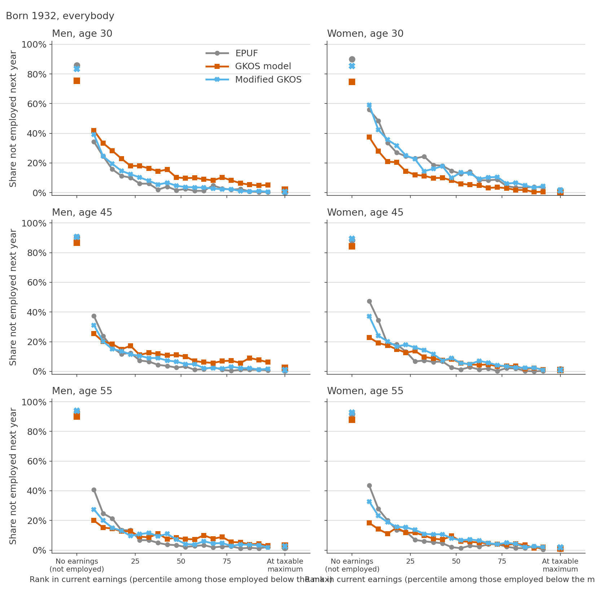
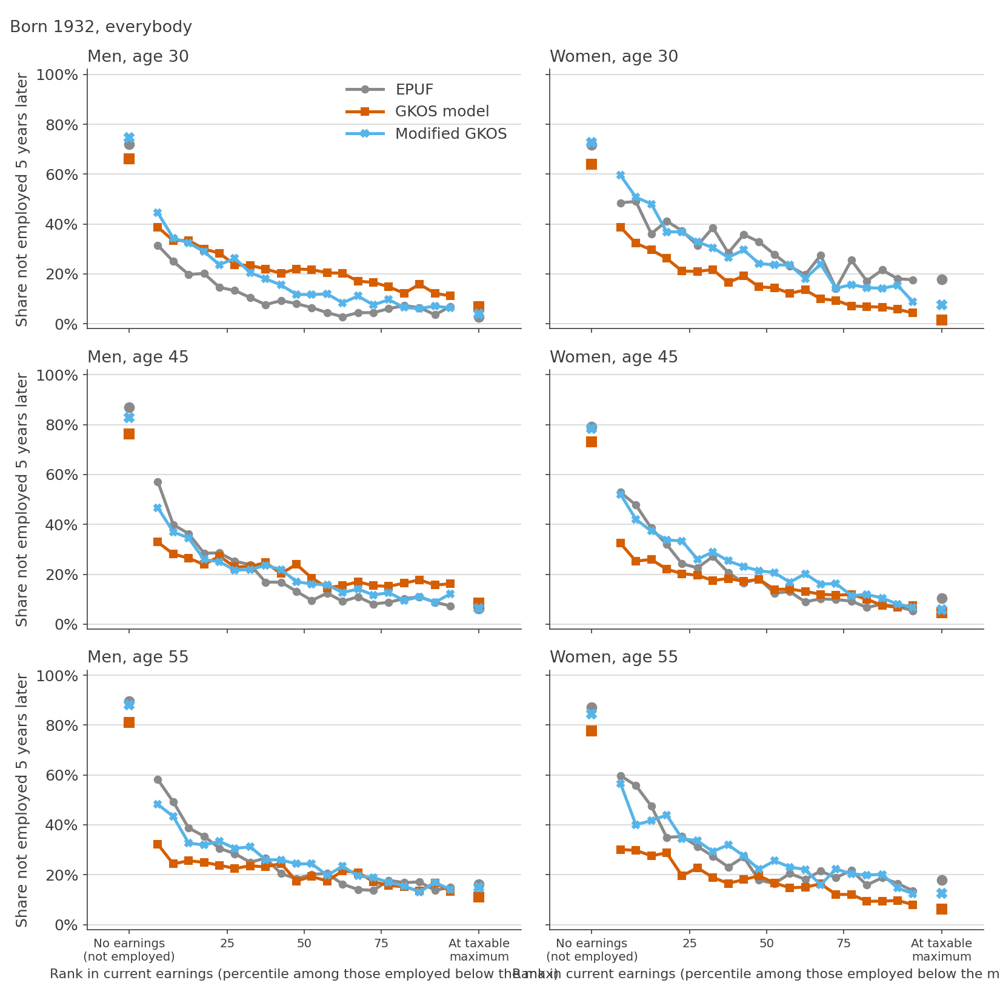

Employed below the max at a, share out at a+1:

| Age | Men | Women |
|-----|-----|-------|
| 30 | 7 / 15 / 8 | 18 / 10 / 18 |
| 45 | 7 / 11 / 8 | 9 / 9 / 11 |
| 55 | 8 / 9 / 9 | 8 / 8 / 10 |

- **Men's exits from employment are on EPUF at every age**, where GKOS had twice too many at 30. The whole curve
  matches at 30 and 45 from the 10th percentile up; GKOS and the six-parameter model ran 5–10 points above it
  through the middle.
- **Young women's exits are now right** (18% at 30 vs EPUF 18%, GKOS 10%).
- **The earnings gradient at 55** (bottom 20% vs top 20% of current earners, out the next year): men 25 vs 2%
  EPUF, 16 vs 4% GKOS, **19 vs 3%** modified; women 26 vs 1%, 15 vs 3%, **23 vs 3%**. Five years ahead the bottom
  20% are out 45–50% in EPUF, 27–29% in GKOS, **39–46%** in the modified model.
- **The not employed (left point) now stay out as in EPUF**: a year later 83–94% vs EPUF 86–93% (GKOS 75–90%).

#### 5. Cumulative rank: everybody, by cumulative-earnings rank to date

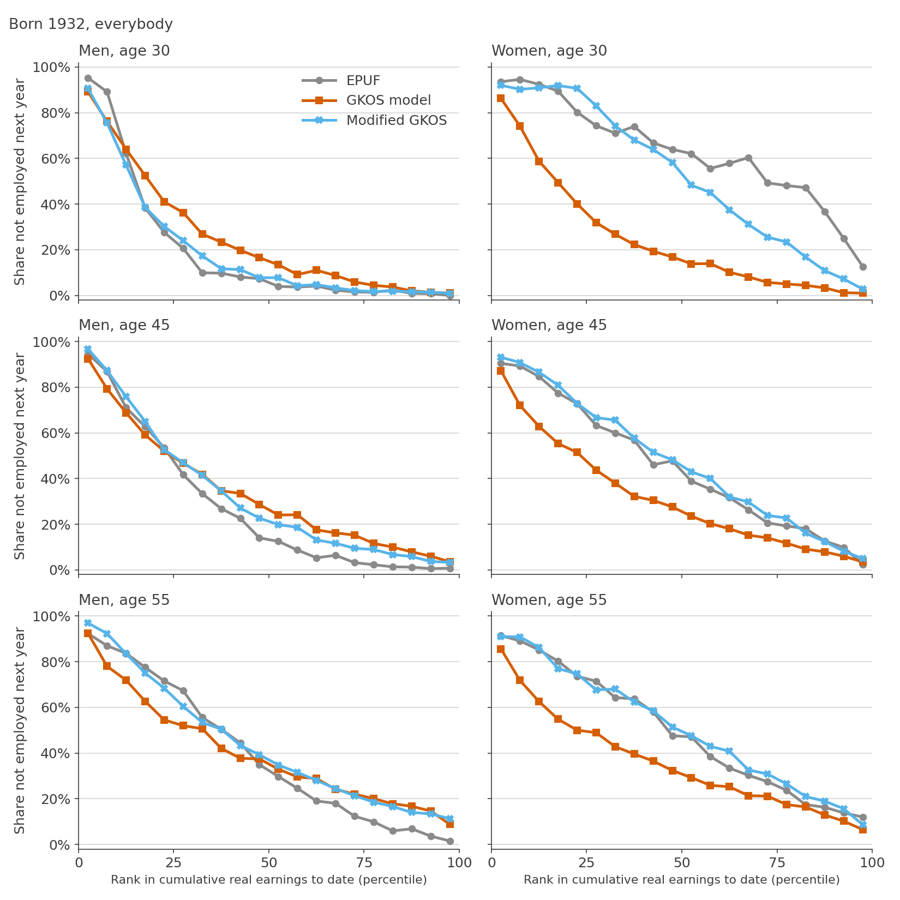
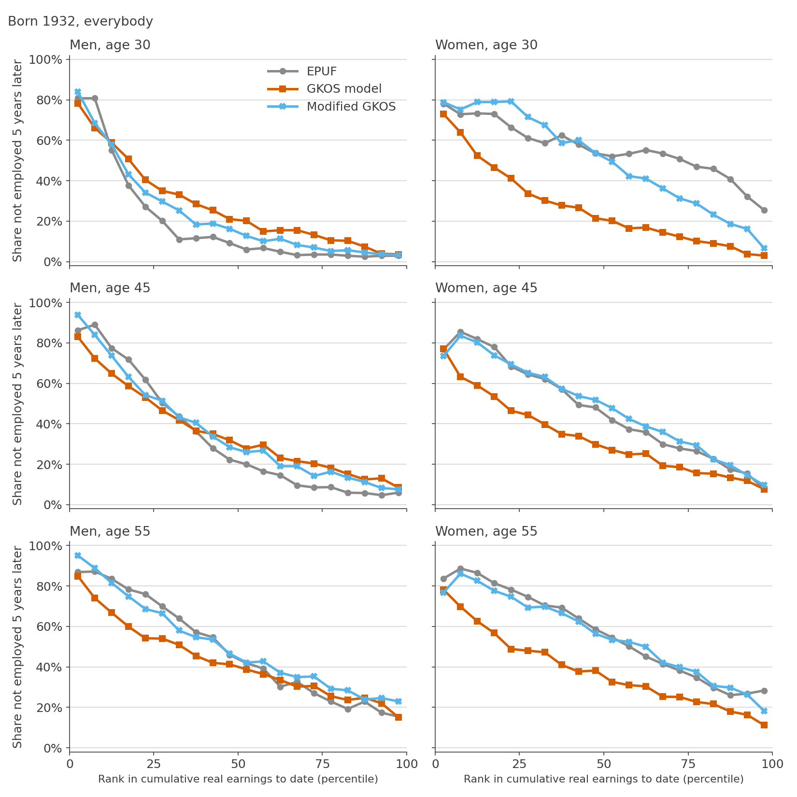

Women, share out one year later, averaged over ranks:

| Women, age | EPUF | GKOS | Modified |
|------------|------|------|----------|
| 30 | 63% | 25% | 53% |
| 45 | 45% | 32% | 47% |
| 55 | 49% | 36% | 51% |

- **Women's level is fixed at 45 and 55 and 10 points short at 30**, all of it in the upper half of cumulative
  earners (top 20% at 30: EPUF 30%, modified 9%, GKOS 2%): women with good early careers who leave at 30 are the
  child-penalty pattern the model cannot time (section 2).
- **The gradient for men is right at 30 and 45** (bottom vs top 20%, out a year later: 45: EPUF 79 vs 1%, GKOS
  75 vs 7%, modified 81 vs 5%) and still too flat at 55 at the top (EPUF 5%, modified 14%, GKOS 15%): men with
  the highest cumulative earnings retire less abruptly in the model.

### (b) Non-employment dynamics

#### 6. Persistence: the not employed at a, by cumulative-earnings rank

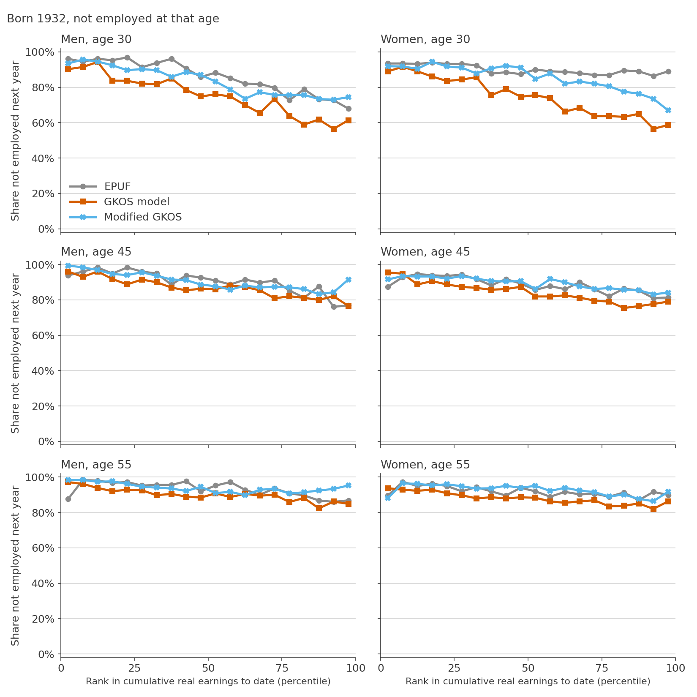
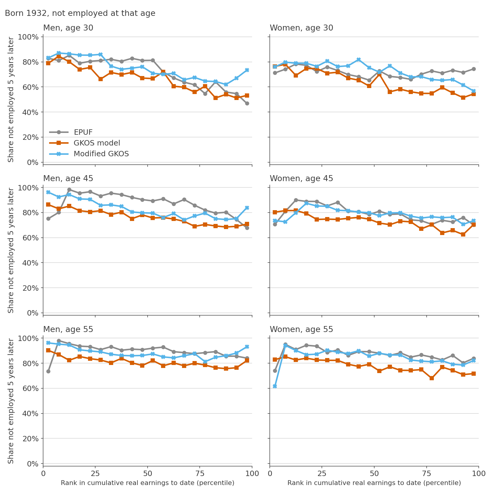

Share of the not employed at a still not employed 1 / 5 years later:

| Sex | Horizon | 30 | 45 | 55 |
|-----|---------|----|----|----|
| Men | 1 year | 86 / 75 / 83 | 90 / 87 / 91 | 93 / 90 / 94 |
|     | 5 years | 72 / 66 / 75 | 87 / 76 / 83 | 90 / 81 / 88 |
| Women | 1 year | 90 / 75 / 85 | 88 / 84 / 89 | 92 / 88 / 93 |
|       | 5 years | 72 / 64 / 73 | 79 / 73 / 78 | 87 / 78 / 85 |

- **5-year persistence is within 1–4 points of EPUF** (men at 45: 83% vs 87%; GKOS 76%).
  - Of men not employed at 40–50, the share never employed again by 61 is 60% in the model and 62% in EPUF
    (GKOS-type dynamics without the exit: 45%); women 44% vs 47%.
  - Re-entry odds by years out, men aged 40–55, EPUF / modified: 31 / 26% after 1 year, 17 / 17% after 2,
    11 / 11% after 3, 7 / 9% after 4, 6 / 7% after 5.
- **1-year persistence is within 1–5 points**, 3–5 points low at 30 for both sexes.
- **At 30 men's 5-year persistence overshoots by 3** (75% vs 72%): the hazard is still highest when young.

#### 7. Earnings changes, arc-percent

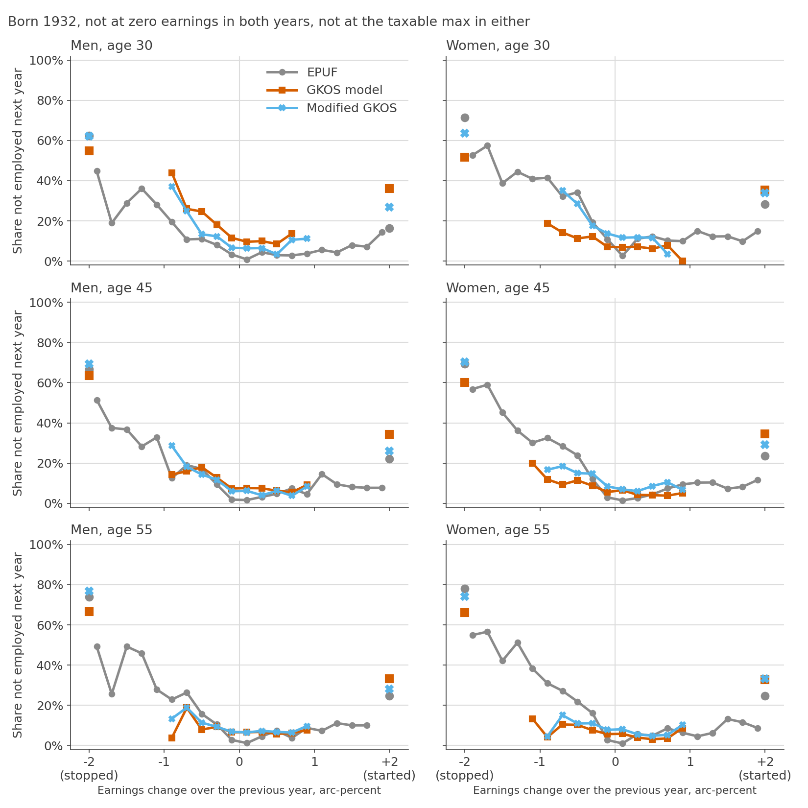
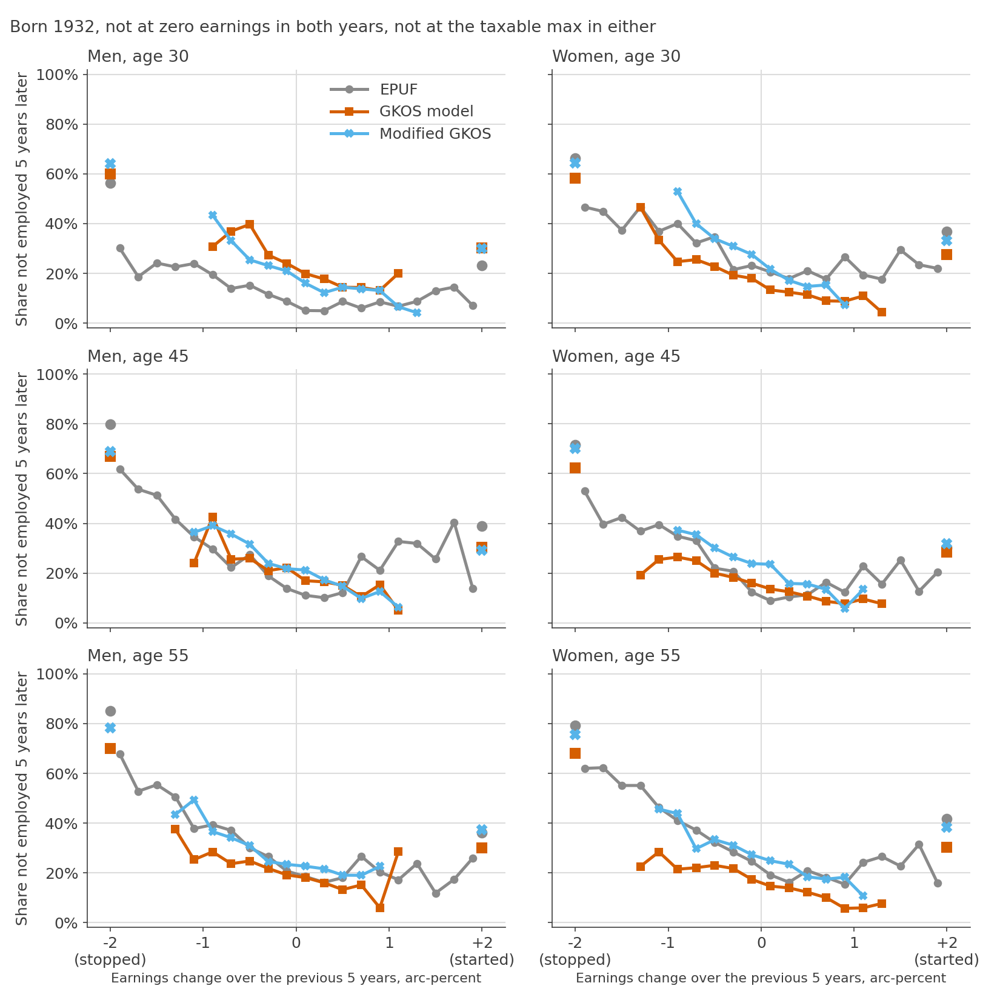

Not targeted in the estimation.

- **Neither model produces large changes.** Share of the one-year sample with an interior change of |arc| > 1:
  EPUF 8–20%, GKOS 0.1–0.5%, modified 0.1–0.4%. The earnings process is untouched, so this cannot move.
- **The stably attached are closer.** Among people with a small change (|arc| < 0.2), share out the next year,
  men at 30 / 45 / 55: EPUF 2 / 2 / 2%, GKOS 10 / 7 / 7%, **modified 6 / 6 / 7%**; women: 6 / 2 / 2%, 7 / 6 / 6%,
  12 / 7 / 8%. The fixed effect takes the exits out of the middle of the change distribution for men, not all
  the way.
- **"Stopped" now stay out as in EPUF**, men 62 / 69 / 77% at 30 / 45 / 55 vs EPUF 62 / 67 / 74% (GKOS
  55–67%); women 64 / 70 / 74% vs 71 / 69 / 78%. **"Started" still drop out too often**: men 26–28% vs EPUF
  16–25%, though down from GKOS's 33–36%.

#### 8. Earnings changes, absolute (real 2013$, symlog axis)

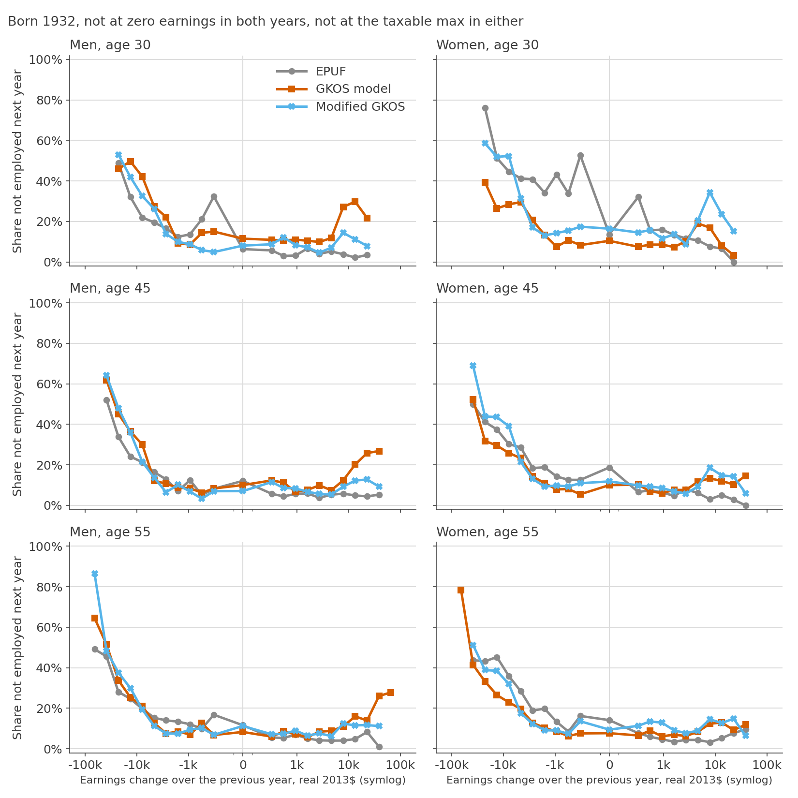
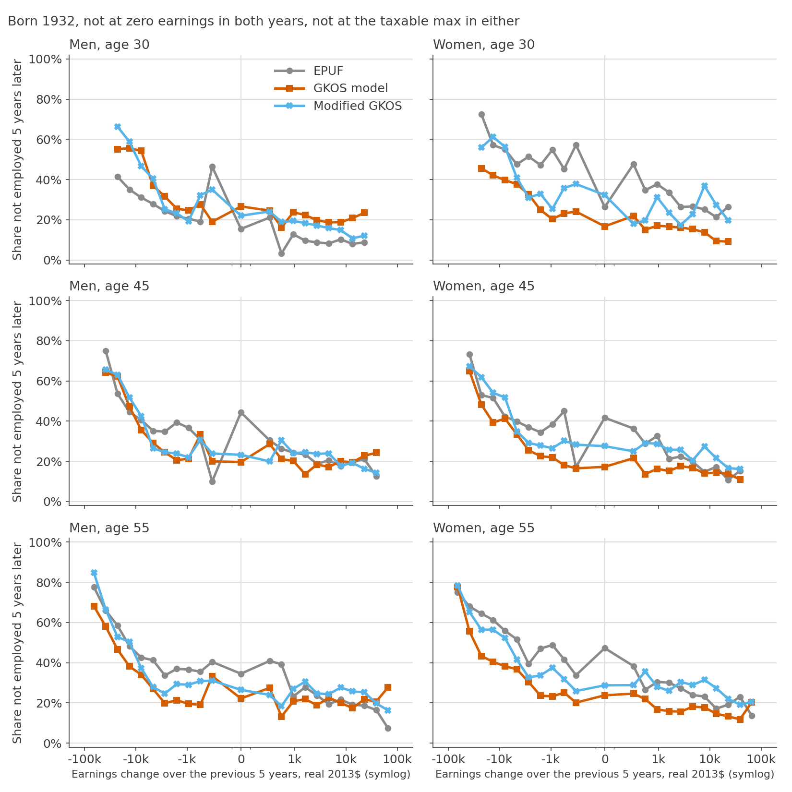

- **The 5-year version at 55 is now centred on EPUF**: the modified model is below EPUF in 11 of 23 bins for men
  (GKOS 19), mean gap −2.4 points (GKOS −7.4); women 15 of 23 (GKOS 21), −3.0 (−12.1). The two 5-year panels
  remain the largest terms in J (6.2 and 6.1), because EPUF's curve is jagged where the models' are smooth.
- **The centre bin (|Δ| < $250) one year ahead**: men out next year 6 / 12 / 8% at 30, 12 / 10 / 7% at 45,
  12 / 8 / 11% at 55; women 14 / 10 / 16%, 19 / 10 / 12%, 14 / 8 / 9%. EPUF's stable-earnings women at 45 leave
  more than either model's.

#### 9. Large one-year changes: at what age they happen

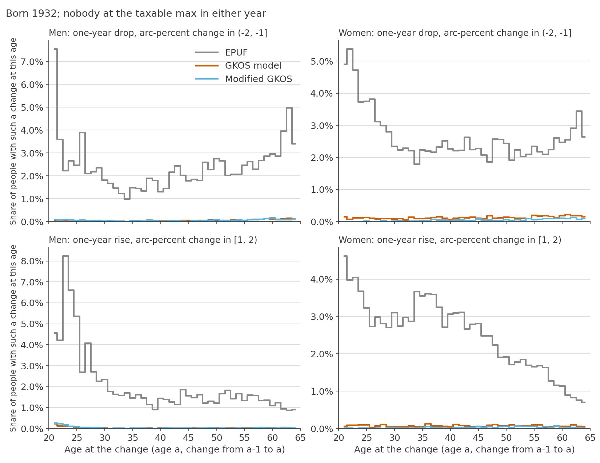

- **Unchanged from GKOS: both models have almost none of these events.** Drops per year, men: EPUF 3.2% at 21–29,
  1.6% at 30–44, 2.2% at 45–54, 2.7% at 55–61, 4.1% at 62–64; GKOS and modified 0.0–0.1% throughout. Rises the
  same. The nonemployment block changes who is at zero, not the size of interior earnings changes.

#### 10. Large one-year changes: what follows

Both models have 30–50 times fewer such events than EPUF (section 9), so their lines rest on a few dozen cases
and are not informative. The EPUF reading is in Part I.

### (c) Non-employment age profile vs. earnings dependence

#### 11. Share not employed by age, within lifetime-earnings quartiles

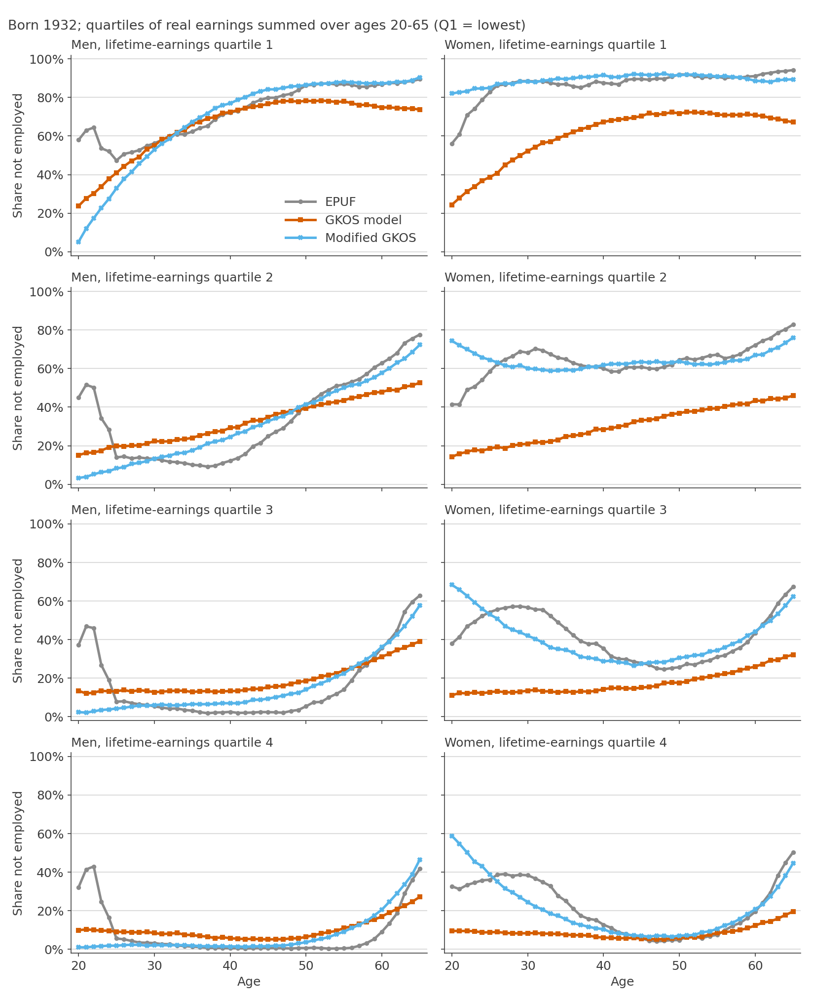

| Sex | Quartile | 25 | 45 | 60 |
|-----|----------|----|----|----|
| Men | Q1 | 47 / 41 / 33 | 80 / 77 / 84 | 87 / 75 / 87 |
|     | Q2 | 14 / 20 / 8 | 25 / 35 / 33 | 63 / 48 / 58 |
|     | Q3 | 8 / 13 / 4 | 2 / 15 / 9 | 36 / 31 / 36 |
|     | Q4 | 6 / 9 / 2 | 1 / 5 / 2 | 9 / 17 / 21 |
| Women | Q1 | 83 / 39 / 85 | 90 / 70 / 92 | 91 / 71 / 89 |
|       | Q2 | 59 / 19 / 65 | 61 / 33 / 64 | 72 / 43 / 67 |
|       | Q3 | 54 / 13 / 53 | 28 / 15 / 27 | 43 / 26 / 44 |
|       | Q4 | 36 / 9 / 39 | 6 / 6 / 7 | 19 / 12 / 21 |

- **Men at 45: Q3 9% and Q4 2% vs EPUF 2% and 1%** (GKOS 15% and 5%). Half of the upper half's mid-career gap is
  closed; Q2 is 8 points high (33% vs 25%).
- **Men at 60 are on EPUF in Q1 and Q3** (87 / 36% vs 87 / 36%), 5 short in Q2 and 12 too high in Q4: the exit
  hazard is flat in earnings, so the late rise lands in every quartile alike where EPUF's is concentrated in Q1–Q2.
- **Men at 25 are too low in every quartile** (Q1: 33% vs 47%; Q4: 2% vs 6%), the early-20s problem of section 2.
- **Women: the level in each quartile is right from about 35 to 60** (within 4 points; GKOS was 20–45 points low
  in Q1–Q2); the 25–35 hump in Q2–Q4 still comes out as a decline from 20.

#### 12. Share of remaining years not employed, by cumulative earnings to date

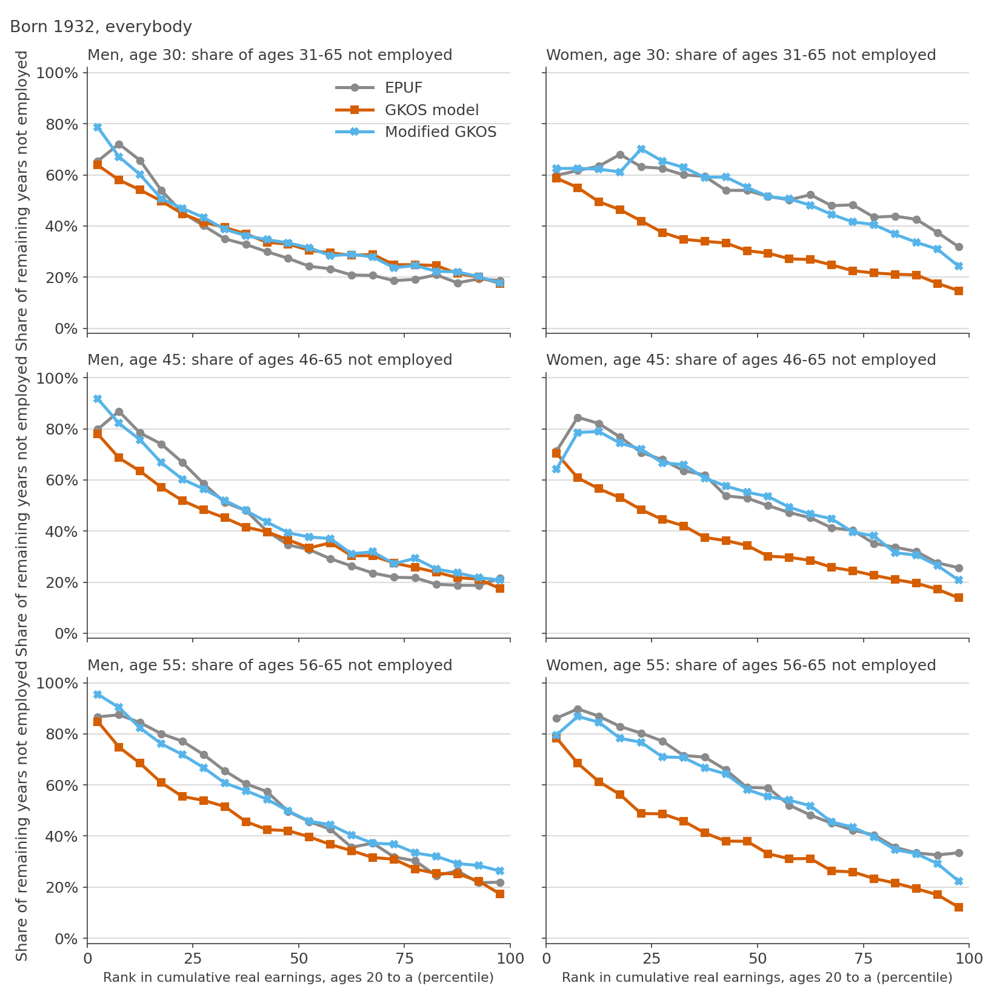

Selected ventiles:

| Group | 1st ventile | 2nd | 5th | Median (10th–11th) | 20th |
|-------|-------------|-----|-----|--------------------|------|
| Men, 30   | 65 / 64 / 79 | 72 / 58 / 67 | 45 / 45 / 47 | 26 / 32 / 32 | 19 / 18 / 18 |
| Men, 45   | 80 / 78 / 92 | 87 / 69 / 82 | 67 / 52 / 60 | 34 / 35 / 38 | 21 / 18 / 21 |
| Men, 55   | 87 / 85 / 95 | 87 / 75 / 90 | 77 / 55 / 72 | 48 / 41 / 48 | 22 / 17 / 26 |
| Women, 30 | 60 / 59 / 62 | 62 / 55 / 63 | 63 / 42 / 70 | 53 / 30 / 53 | 32 / 15 / 24 |
| Women, 45 | 71 / 70 / 64 | 85 / 61 / 79 | 71 / 48 / 72 | 51 / 32 / 54 | 26 / 14 / 21 |
| Women, 55 | 86 / 78 / 80 | 90 / 68 / 87 | 80 / 49 / 77 | 59 / 36 / 57 | 33 / 12 / 22 |

- **The missing exits at the bottom are back**: ventiles 2–5 for men at 45 and 55 are within 5 points of EPUF
  (GKOS was 12–22 short). The lowest ventile now overshoots for men (79–95% vs 65–87%): the fixed effect makes
  the men with the least earnings to date nearly certain never to work again, where EPUF's lowest ventile
  includes late starters.
- **Women's child penalty at 30 is matched in level**: the median is 53% vs 53% (GKOS 30%), the 5th ventile 70%
  vs 63%. Above the median the model is still 8 points short at 30.

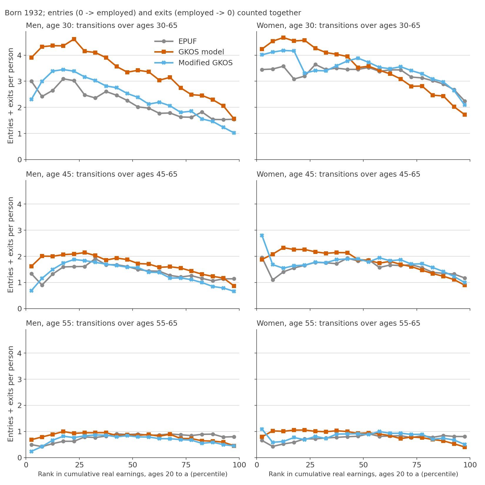

Entries + exits per person over a..65, by rank quintile:

| Group | Bottom 20% | 20–40% | 40–60% | 60–80% | Top 20% |
|-------|------------|--------|--------|--------|---------|
| Men, 30   | 2.8 / 4.2 / 3.0 | 2.6 / 4.2 / 3.1 | 2.2 / 3.4 / 2.4 | 1.7 / 2.9 / 2.0 | 1.6 / 2.1 / 1.3 |
| Men, 45   | 1.3 / 1.9 / 1.3 | 1.7 / 2.0 / 1.8 | 1.6 / 1.8 / 1.5 | 1.3 / 1.5 / 1.2 | 1.1 / 1.1 / 0.8 |
| Men, 55   | 0.5 / 0.8 / 0.5 | 0.7 / 0.9 / 0.8 | 0.9 / 0.9 / 0.8 | 0.9 / 0.8 / 0.7 | 0.8 / 0.6 / 0.5 |
| Women, 30 | 3.4 / 4.5 / 4.1 | 3.4 / 4.2 / 3.4 | 3.5 / 3.6 / 3.7 | 3.3 / 3.0 / 3.4 | 2.7 / 2.2 / 2.7 |
| Women, 45 | 1.5 / 2.1 / 1.9 | 1.7 / 2.2 / 1.8 | 1.8 / 1.9 / 1.9 | 1.6 / 1.6 / 1.8 | 1.3 / 1.1 / 1.3 |
| Women, 55 | 0.5 / 1.0 / 0.8 | 0.7 / 1.0 / 0.8 | 0.8 / 0.9 / 0.9 | 0.8 / 0.8 / 0.9 | 0.8 / 0.6 / 0.7 |

- **Men's churning is within 0.5 of EPUF at every rank and age** (GKOS: 0.5–1.6 too many at 30). Low cumulative
  earners now exit and stay out rather than cycling.
- **The top at 55 is still short** (men 0.5 vs 0.8; women 0.7 vs 0.8): retirement transitions among the highest
  earners.
- **Women below the median at 30 and 45 still churn too much** (bottom quintile 4.1 vs 3.4 at 30, 1.9 vs 1.5 at
  45).

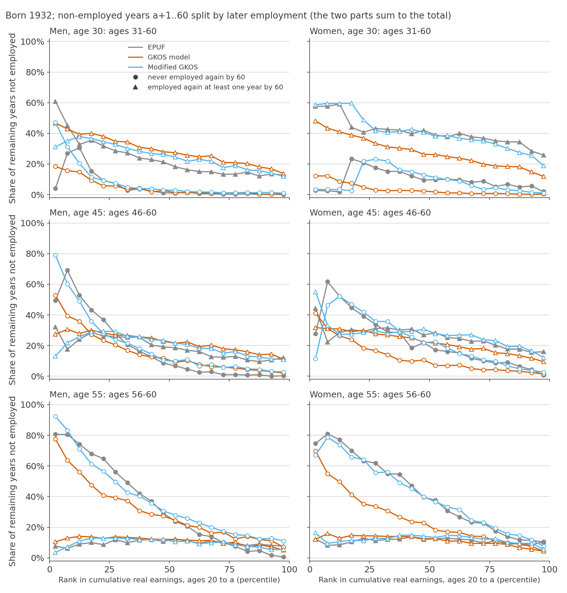

Share of remaining years to 60 not employed, split by never employed again / employed again, means over rank
quintiles:

| Group | Bottom 20%: never again | Bottom 20%: re-entry | 40–60%: never again | 40–60%: re-entry | Top 20%: never again | Top 20%: re-entry |
|-------|------|------|------|------|------|------|
| Men, 30   | 19 / 15 / 28 | 44 / 42 / 35 | 2 / 2 / 3 | 20 / 28 / 25 | 0 / 1 / 1 | 13 / 17 / 14 |
| Men, 45   | 54 / 39 / 56 | 26 / 29 / 22 | 8 / 11 / 11 | 19 / 23 / 22 | 0 / 3 / 4 | 11 / 14 / 12 |
| Men, 55   | 76 / 61 / 77 | 8 / 13 / 9 | 28 / 25 / 30 | 12 / 12 / 11 | 3 / 11 / 13 | 8 / 7 / 6 |
| Women, 30 | 8 / 10 / 3 | 55 / 43 / 59 | 10 / 2 / 12 | 40 / 27 / 40 | 5 / 0 / 2 | 31 / 16 / 26 |
| Women, 45 | 47 / 31 / 39 | 31 / 31 / 36 | 18 / 9 / 22 | 28 / 22 / 29 | 5 / 3 / 4 | 17 / 12 / 17 |
| Women, 55 | 76 / 54 / 71 | 10 / 14 / 12 | 39 / 20 / 39 | 13 / 12 / 14 | 12 / 8 / 12 | 9 / 6 / 9 |

- **The permanent-exit shortfall at the bottom is closed for men** (never again, bottom quintile: 56% vs 54% at
  45, 77% vs 76% at 55; GKOS 39%, 61%) **and mostly for women** (39% vs 47% at 45, 71% vs 76% at 55; GKOS 31%,
  54%).
- **Women at 30 now have the child-penalty re-entry mass** (40% vs 40% in the middle quintile; GKOS 27%) and the
  middle quintile's permanent exits (12% vs 10%; GKOS 2%).
- **Men's re-entry non-employment above the median is still a little high at 30** (25% vs 20% in the middle
  quintile), down from GKOS's 28%.
- **The top quintile at 55 has too many permanent exits for men** (13% vs 3%): the earnings-blind hazard again.

### (d) Weak labour-force attachment

#### 13. Entries and exits up to 65, by current earnings

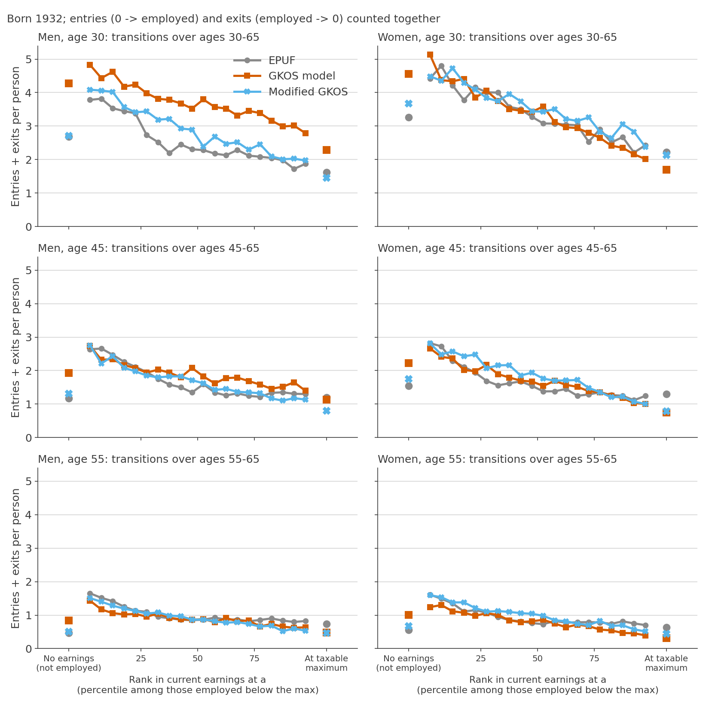

Entries + exits per person over a..65:

| Group | Not employed at a | Bottom 20% of earners | Middle 20% | Top 20% below max | At max |
|-------|-------------------|-----------------------|------------|-------------------|--------|
| Men, 30   | 2.7 / 4.3 / 2.7 | 3.6 / 4.5 / 3.9 | 2.3 / 3.6 / 2.7 | 1.9 / 3.0 / 2.0 | 1.6 / 2.3 / 1.5 |
| Men, 45   | 1.2 / 1.9 / 1.3 | 2.5 / 2.4 / 2.4 | 1.4 / 1.8 / 1.6 | 1.3 / 1.5 / 1.1 | 1.2 / 1.1 / 0.8 |
| Men, 55   | 0.5 / 0.8 / 0.5 | 1.5 / 1.2 / 1.3 | 0.9 / 0.9 / 0.9 | 0.8 / 0.7 / 0.6 | 0.7 / 0.5 / 0.5 |
| Women, 30 | 3.3 / 4.6 / 3.7 | 4.3 / 4.6 / 4.5 | 3.2 / 3.4 / 3.5 | 2.5 / 2.2 / 2.7 | 2.2 / 1.7 / 2.1 |
| Women, 45 | 1.5 / 2.2 / 1.7 | 2.5 / 2.4 / 2.6 | 1.5 / 1.7 / 1.8 | 1.2 / 1.1 / 1.1 | 1.3 / 0.7 / 0.8 |
| Women, 55 | 0.6 / 1.0 / 0.7 | 1.4 / 1.2 / 1.5 | 0.8 / 0.8 / 1.0 | 0.8 / 0.5 / 0.6 | 0.6 / 0.3 / 0.4 |

- **The not employed at a now have EPUF's number of future transitions** (men 2.7 / 1.3 / 0.5 vs EPUF 2.7 / 1.2 /
  0.5; GKOS 4.3 / 1.9 / 0.8): a zero is the start of a long or permanent spell in the model too.
- **Men at 30 are within 0.4 along the whole earnings line** (GKOS 0.8–1.3 too many).
- **Top earners and those at the max at 45–55: both models have too few transitions** (men at the max at 45:
  EPUF 1.2, GKOS 1.1, modified 0.8; women 1.3 / 0.7 / 0.8): retirement among high earners, the same gap as in
  sections 5 and 12.

#### 14. Entries and exits over ages 20–65, by lifetime earnings

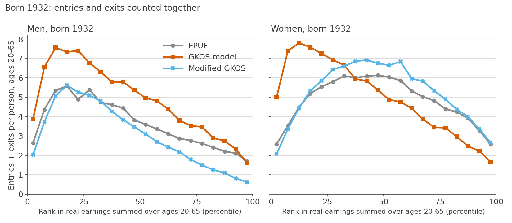

| | Average | Peak | Lowest ventile | Top ventile |
|---|---|---|---|---|
| Men   | 3.6 / 4.9 / 3.0 | 5.6 at the 18th pct / 7.6 at the 12th / 5.6 at the 18th | 2.6 / 3.9 / 2.0 | 1.7 / 1.6 / 0.6 |
| Women | 4.8 / 5.0 / 5.2 | 6.1 at the 48th / 7.8 at the 12th / 6.9 at the 42nd | 2.6 / 5.0 / 2.1 | 2.6 / 1.7 / 2.6 |

- **The shape is right for both sexes**: the men's peak is at the 18th percentile with EPUF's height, the women's
  near the median (42nd vs 48th) where GKOS put both at the 12th. Women's top ventile churns as in EPUF (2.6).
- **Men churn too little overall** (3.0 vs 3.6), and the shortfall is at the top: the top ventile has 0.6
  transitions against EPUF's 1.7. With the fixed effect, high lifetime earners' careers are uninterrupted; EPUF's
  have about two transitions, most of them before 25 (section 15).
- **Women churn slightly too much** in the middle (peak 6.9 vs 6.1).

#### 15. Future entries and exits by age, within lifetime-earnings quartiles

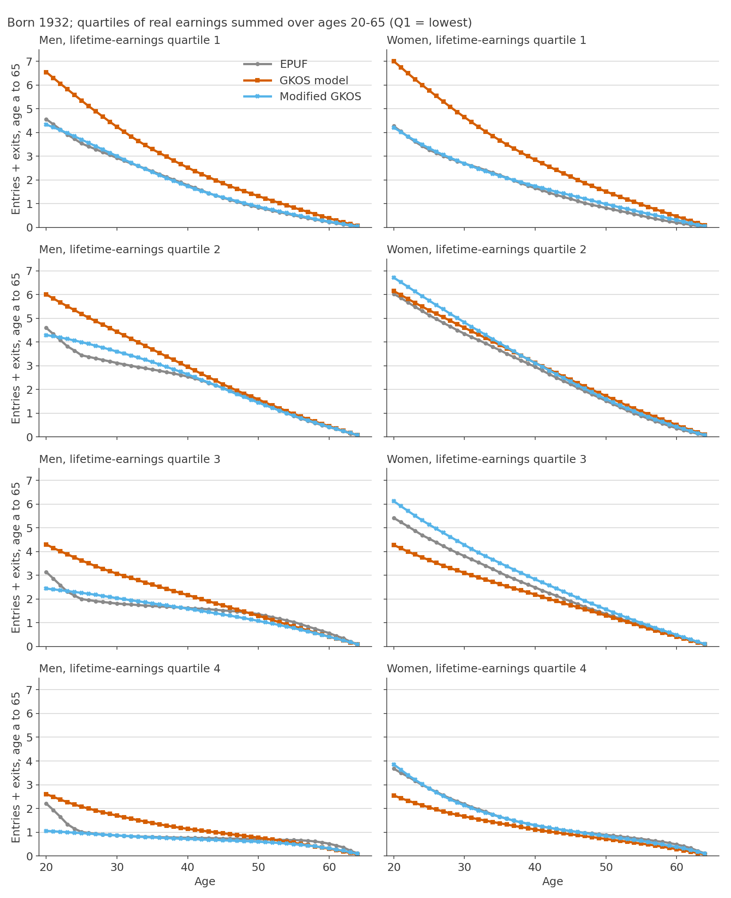

| Sex | Quartile | From 20 | From 30 | From 50 |
|-----|----------|---------|---------|---------|
| Men | Q1 | 4.6 / 6.5 / 4.3 | 2.9 / 4.2 / 3.0 | 0.8 / 1.3 / 0.9 |
|     | Q2 | 4.6 / 6.0 / 4.3 | 3.1 / 4.4 / 3.6 | 1.5 / 1.6 / 1.4 |
|     | Q3 | 3.1 / 4.3 / 2.4 | 1.8 / 3.1 / 2.0 | 1.4 / 1.3 / 1.1 |
|     | Q4 | 2.2 / 2.6 / 1.1 | 0.9 / 1.7 / 0.9 | 0.7 / 0.8 / 0.6 |
| Women | Q1 | 4.3 / 7.0 / 4.2 | 2.7 / 4.6 / 2.7 | 0.8 / 1.5 / 1.0 |
|       | Q2 | 6.0 / 6.1 / 6.7 | 4.3 / 4.6 / 4.8 | 1.5 / 1.7 / 1.6 |
|       | Q3 | 5.4 / 4.3 / 6.1 | 3.8 / 3.1 / 4.3 | 1.4 / 1.3 / 1.6 |
|       | Q4 | 3.7 / 2.5 / 3.9 | 2.2 / 1.7 / 2.1 | 0.9 / 0.7 / 0.8 |

- **Q1, both sexes: the churning is right** (men 4.3 vs 4.6 from 20, women 4.2 vs 4.3; GKOS 6.5 and 7.0). EPUF's
  lowest earners have few, long spells, and so do the model's now.
- **Men Q1–Q2 are within 0.5 of EPUF from every age; Q3–Q4 from 20 are 0.7–1.1 too low** (Q4: 1.1 vs 2.2). EPUF's
  upper-half churning happens before 25 and the model has none there.
- **Women are within 0.7 of EPUF everywhere**, slightly high in Q2–Q3.

### Summary

- **A sex-specific intercept fixes women's level**: lifetime employment, the years-worked distribution and the
  quartile levels at 35–60.
- **Last year's status fixes 1-year persistence and lifetime churning** for both sexes, without changing the level.
- **A permanent exit, flat in earnings and U-shaped in age, fixes 5-year persistence** (men at 45: 83% vs EPUF
  87%), the share who never return (60% vs 62% of men out at 40–50), the missing exits at the bottom of the
  cumulative-earnings distribution, and men's employment from 25 to 65 including the rise after 50.
- **The fixed effect in the logit fixes men's exits across the earnings distribution** (the exit curves at 30 and
  45 sit on EPUF's from the 10th percentile up) **and half of the upper half's mid-career gap** (Q3 at 45: 9% vs
  2%, from 15% in GKOS).
- **What it costs:** men's intercept is −6.1, so the model has almost no non-employment and too little churning
  before 25 (3% not employed at 20 vs 43%; 3.0 vs 3.6 transitions per person), the spike of complete 46-year
  careers is 15% against EPUF's 4%, and the lowest ventile of cumulative earners is too certain never to return.
- **Still missing for both sexes:**
  - the step of exits at 62–63 (the hazard is smooth through it), and retirement among the highest earners
    (too few transitions at the taxable maximum at 45–55, too few exits in the top 20% of cumulative earners
    at 55);
  - men's late rise lands in every quartile alike (Q4 at 60: 21% vs 9%), and Q2–Q3 at 45 are still 7–8 points
    high.
- **For women the model misses the timing:** too much non-employment before 30 (71% at 20 vs 42%), from GKOS's
  linear age slope at the women's intercept; the child-penalty level at 30 is right but its re-entry is not timed.
- **Untouched by construction:** the size of interior earnings changes (sections 7–10), which is the earnings
  process, not the nonemployment block.

---

## Open modelling issues

### Mid-career attachment of men in the upper half

The diagnostics that motivated the fixed effect, EPUF / six-parameter model (no fixed effect) / modified GKOS
(men):

- **Who is ever out at 30–54, by lifetime quartile** (share with at least one year out; years out among them):
  Q2 82 / 79 / 86% (7.0 / 9.1 / 8.4 years); Q3 **34 / 52 / 50%** (2.9 / 5.9 / 4.9); Q4 **10 / 27 / 18%**
  (2.5 / 4.2 / 3.7).
- **Exit rate at 40–50 by consecutive years employed, within current-earnings tercile.** Bottom tercile: 28 / 29 /
  30% after one year, 8 / 7 / 9% after ten or more. Middle: 11 / 23 / 14% after one year, **1.0 / 2.8 / 2.1%**
  after ten or more. Top: **0.6 / 1.3 / 0.8%** after ten or more.
- So the long-tenured top tercile is at EPUF's rate and the top quartile's ever-out share is half-way; Q3 has
  barely moved (50% vs 34%) and the long-tenured middle tercile is still twice EPUF. What remains is a
  z-sensitivity the fixed effect does not remove: a Q3 man's current z still moves his exit probability by GKOS's
  full slope. The z-cap of Part II is the natural next term on top of the fixed effect if that gap matters.
- **Spell-proneness is not a trait in EPUF** (within a quartile, P(any year out at 45–54 | any out at 25–34) is no
  higher than P(· | none out at 25–34)). The fixed effect makes it one in the model; whether the model now
  overstates within-person persistence has not been checked.

### A sex-specific intercept fixes the sign of the age profile

The intercept alone decides whether non-employment rises or falls with age, and that implication should be revisited.
- With GKOS's b, c and d, the age effect on the logit index is b + d·x, which is positive below x = −0.30 and negative
  above it.
- The x-slope c + d·t steepens with age, so low-x people move out and high-x people move in.
- **Men (a ≈ −6):** high-x men sit at the floor (p ≈ 0), so only low-x men's rising non-employment registers.
  Their non-employment rises with age.
- **Women (a ≈ +1):** low-x women sit at the ceiling (p ≈ 1, always out), so only high-x women's falling
  non-employment registers. Their non-employment falls with age: 71% at 20, 48% at 40.
- **Implication:** women's participation can only rise with age until the exit hazard takes over. The model can't
  produce EPUF's women's profile, which bottoms out near 30 and rises again after 55.
- **Alternatives to consider:**
  - sex-specific age terms (b, or an age polynomial);
  - sex-specific z-slopes (c, d);
  - a separate attachment type or state (stayers, or duration dependence) instead of moving the level through
    the intercept.

### Retirement

- EPUF's permanent exits step up at 62–63 for both sexes (section 3) and its highest earners retire more abruptly
  than the model's (sections 5, 12, 13). A retirement term at 62 in the exit hazard, or an earnings term in it
  at 60+, would address both; the current hazard is a smooth polynomial that is blind to earnings.
