# Non-employment dynamics: GKOS model vs EPUF, born 1937

**Model.** The GKOS (2021) process with re-estimated, EPUF-levelled g(t). Its nonemployment logit is GKOS's single
1978–2013 male estimate, `p(t, z) = logistic(a + b·t + c·z + d·t·z)`, the same for both sexes and every cohort.
**Mortality is included in the model:**
- uniform, i.e. not related to earnings, from age 20;
- q(x) read off the TR2023 historical period life tables, taking age x from the year 1937+x table;
- the dead have zero earnings from the year after death.

This removes 23% of men and 14% of women before 65 (12% and 7% by 55).

**Data.** The EPUF 1% file, zero-filled. "Employed" means positive covered earnings in the year. The base, in both
sources, is everyone with positive earnings at least once at ages 20–65: 13,379 men and 12,698 women. Grey = EPUF,
orange = model.

**Cohort.** Born 1937, so ages 20–65 are the years 1957–2002, all inside EPUF's 1951–2006 span. Military pay is
covered from 1957, the year this cohort turns 20, so unlike earlier cohorts there are no uncovered service years
in the window.

**Code.** `code/dynamics/transition_rates.py` computes the statistics and writes `transition_rates_yob1937.csv`;
`--no-mortality` writes the model run without deaths to `_nomort.csv`. `code/dynamics/plots/plot_transition_rates.py`
draws the figures; `code/dynamics/plots/plot_perm_exit_dec.py` draws section 3. The modified model's code is
listed in Part II.

**Structure.** Part I compares the GKOS model with EPUF on fifteen figures. Part II introduces the modified model,
what each of its additions bought, and the alternatives that were tried and not adopted. Part III redraws every
Part I figure with the GKOS model, the modified model and EPUF. Part IV recomputes GKOS's own key-moments figure
(their Figure 12) with the same three lines, to see what holding the rest of the process at GKOS's values costs.

**EPUF zeros the model still does not generate:** non-covered work (federal civil service hired before 1984,
uncovered state and local government jobs, railroads).

---

## Part I. GKOS model vs EPUF

### Overview

#### 1. Lifetime: share of ages 20–65 employed, by lifetime earnings

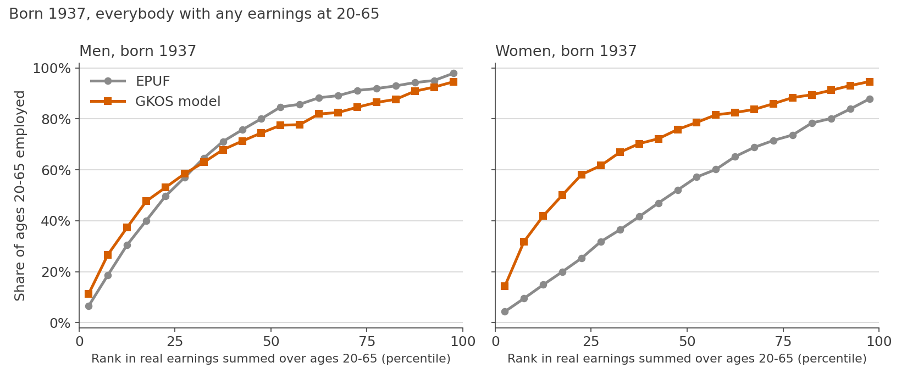

**x:** rank in real (2013$) earnings summed over ages 20–65.

**y:** share of the 46 years with positive earnings.

Share of person-years 20–65 employed:

|        | EPUF  | Model, with mortality | Model, no mortality |
|--------|-------|-----------------------|---------------------|
| Men    | 70.3% | 68.4%                 | 73.4%               |
| Women  | 50.5% | 70.6%                 | 73.4%               |
| Pooled | 60.6% | 69.5%                 | 73.4%               |

**Observation.** With mortality, the model is 2 points below men's aggregate. Women's model employment is 20 points
too high.

| Rank | Men: EPUF | Men: Model | Women: EPUF | Women: Model |
|------|-----------|------------|-------------|--------------|
| 2.5th percentile | 7%  | 11% | 4%  | 14% |
| 7.5th            | 19% | 27% | 9%  | 32% |
| 17.5th           | 40% | 48% | 20% | 50% |
| Median           | 82% | 76% | 55% | 77% |
| 97.5th           | 98% | 95% | 88% | 95% |

- **Men: the model has too much employment below about the 30th percentile, and 2–8 points too little above it.**
- **Women: the model has too much employment at every rank.**

**Distribution of years worked, 20–65:**

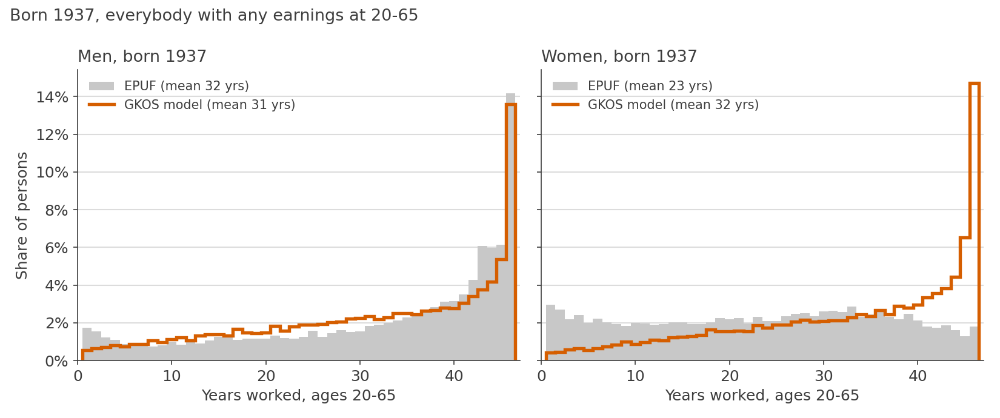

**x:** number of the 46 years with positive earnings.

**y:** share of people.

| | Mean | Median | ≤ 10 years | 11–30 | ≥ 40 | All 46 |
|---|---|---|---|---|---|---|
| Men, EPUF    | 32.3 | 37 | 11% | 25% | 43% | 14.2% |
| Men, model   | 31.5 | 34 | 8%  | 33% | 36% | 13.6% |
| Women, EPUF  | 23.2 | 24 | 22% | 43% | 12% | 1.8%  |
| Women, model | 32.5 | 36 | 7%  | 32% | 39% | 14.7% |

- **Men: the means match, and so does the spike at a full 46 years** (14.2% vs 13.6%: for this cohort the early
  20s are covered years, so a complete career is common in EPUF too). The shapes still differ: EPUF has 26% at
  41–45 years against the model's 20%, and the model has too much mass at 11–30 years, the churners (33% vs 25%).
- **Women: EPUF is almost flat from 1 to 37 years (about 2–3% each), with its mode at 1 year.** The model is
  shaped like the men's, with 15% working all 46 years.

#### 2. Share employed by age

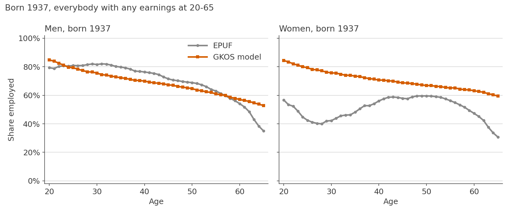

**x:** age.

**y:** share with positive earnings at that age, everybody in the base.

Share employed by age:

| Sex | Source | 22 | 25 | 30 | 40 | 50 | 55 | 60 | 62 | 65 |
|-----|--------|----|----|----|----|----|----|----|----|----|
| Men   | EPUF  | 80% | 81% | 82% | 76% | 69% | 63% | 54% | 48% | 35% |
|       | Model | 82% | 79% | 76% | 70% | 65% | 61% | 57% | 56% | 53% |
| Women | EPUF  | 52% | 42% | 42% | 56% | 60% | 56% | 47% | 42% | 31% |
|       | Model | 82% | 79% | 76% | 71% | 67% | 65% | 63% | 62% | 59% |

**Observation.** The model's profile is a smooth decline for both sexes, much of it mortality.

- **Men:**
  - At 20–24 the two agree (EPUF 79–80%, model 80–85%): with military pay covered there is no early gap for this
    cohort.
  - The model understates employment at 25–55, by 2–6 points (most at 30–40).
  - It matches at 56–57.
  - It overstates it from 58 on, with no retirement drop: 53% at 65 against 35%.
- **Women:** EPUF is U-shaped, with a trough of 40% at 26–28 (child rearing), a recovery to about 60% at 49–50, and
  then retirement. The model has none of this. It is too high at every age: by 27 points at 20, by up to 38 points
  at 27–28, and by 7–8 points at 48–50.

#### 3. Permanent exits by age, decomposed

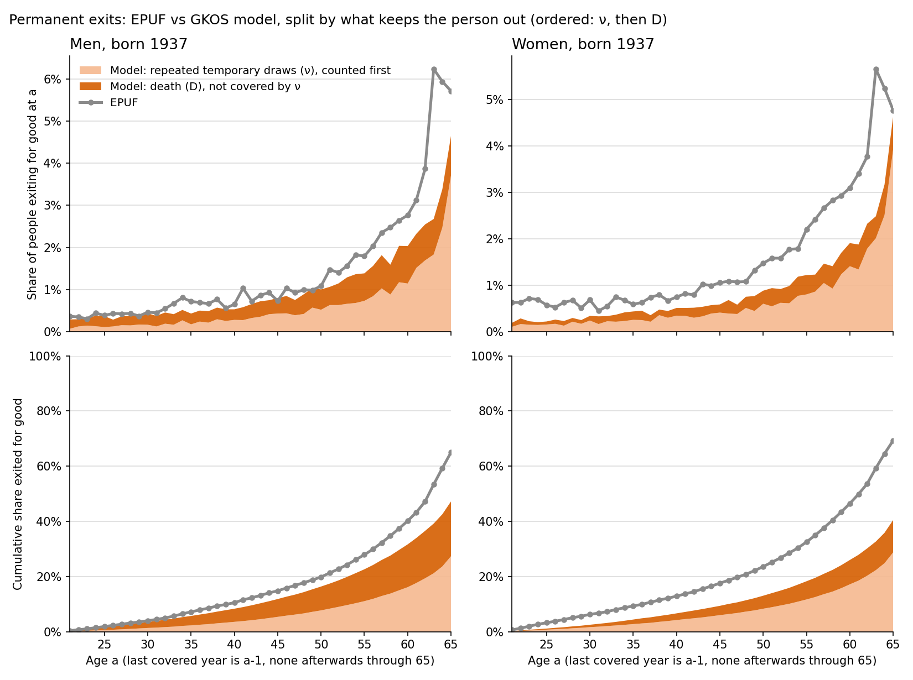

**x:** age a. A permanent exit at a means the last covered year is a−1, with none afterwards through 65.

**y:** top, share of the base exiting for good at a; bottom, cumulative.

**Model decomposition.** The model's permanent exits are split by what keeps the person out. The causes overlap, so
the split is ordered:
- **ν first:** the temporary nonemployment draws alone keep the person out (ν = 1 in every remaining year);
- **D second:** death, among the rest.

The two parts sum to the model's total. The model is simulated with `estimate_nonemp.py`'s draws (same process,
different random numbers from the CSV behind the other figures).

Cumulative share exited for good, EPUF / model (ν + D):

| Sex | by 45 | by 55 | by 62 | by 65 |
|-----|-------|-------|-------|-------|
| Men | 14.8 / 11.8 (5.4 + 6.5) | 27.9 / 22.6 (11.1 + 11.5) | 47.1 / 36.5 (19.3 + 17.2) | 65.0 / 47.2 (27.4 + 19.9) |
| Women | 17.6 / 9.4 (6.0 + 3.4) | 32.5 / 18.3 (11.7 + 6.6) | 53.6 / 30.2 (20.3 + 9.9) | 69.3 / 40.5 (28.8 + 11.7) |

**Observation.**
- **Men: the model tracks EPUF up to about 35, then falls behind.** By 65 it has 47% exited for good against 65%.
  - Death accounts for 19.9 of the model's 47 points.
  - Repeated ν draws account for 27.4.
- **Women: the model is too low from the start.** EPUF has 0.6% of women leaving for good every year in their 20s;
  the model 0.3%. By 65: 41% against 69%.
- **EPUF has a spike at 62–63:** last covered year 62 or 63 for 12.1% of men and 10.9% of women, against 6.1% and
  5.7% in the model. The model's exits rise smoothly and lag EPUF's by 2–5 years after 55.
- **Without mortality, GKOS has 31% of both sexes exiting for good by 65.** That is all ν. Mortality adds 16 points
  for men and 9 for women. The ν part falls slightly because some ν exits now die first and are counted as D.

---

### (a) Employment and non-employment transitions across the income distribution

#### 4. Exit: share not employed at a+h by current-earnings rank

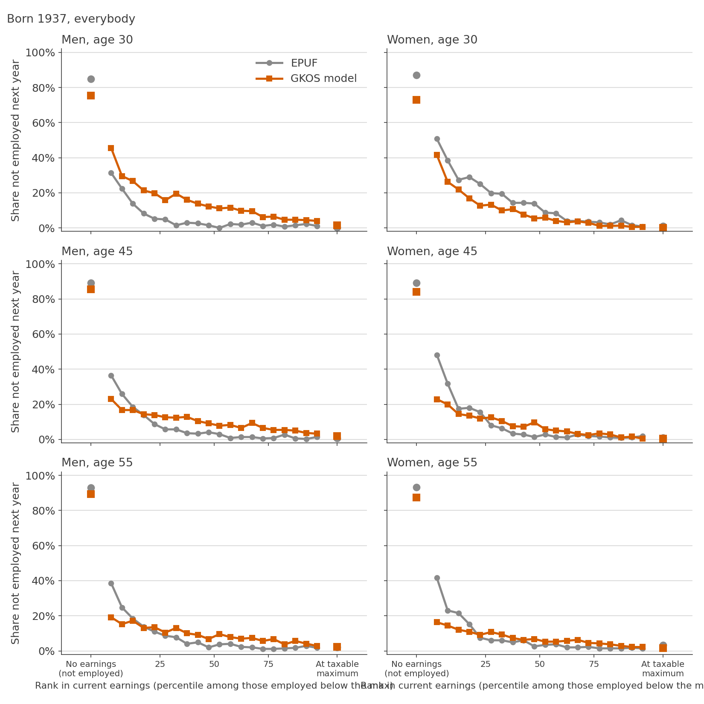
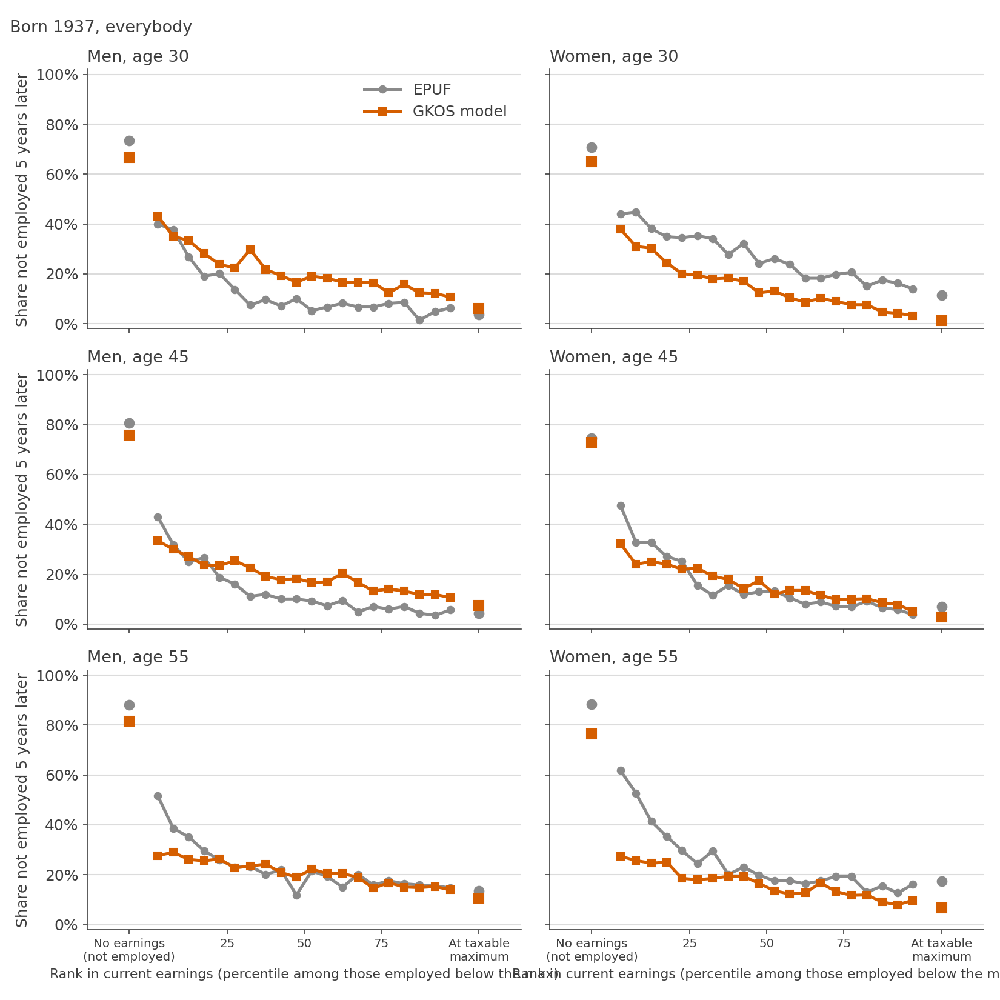

**x:** two separate points plus a line.
- Left point: people with zero earnings at age a.
- Right point: people at the taxable maximum at age a.
- Line: 20 equal-count bins of current-earnings rank among people employed below the maximum.

**y:** share with zero earnings at a+h.

**Observation.**
- **For men, the model has too many exits from employment.** Employed men who are out the next year:

  | Age | EPUF | Model |
  |-----|------|-------|
  | 30  | 5.5% | 14.6% |
  | 45  | 6.9% | 10.2% |
  | 55  | 7.8% | 9.4%  |

- **For young women it has too few:** at 30, EPUF 15%, model 10%. At 45 the two match (8.5% vs 8.0%).
- **At older ages the earnings gradient is not steep enough, for both sexes.** At 55, the share out the next year
  in the bottom 20% of current earners vs the top 20%:
  - men: EPUF 24% vs 1.9%, model 16% vs 4%;
  - women: EPUF 25% vs 1.5%, model 13% vs 3%.

  Five years ahead the bottom 20% are EPUF 39–48% out, model 26–27%. This already holds at 45.
- **The not employed (left point) stay out less in the model:** a year later EPUF 85–93% are still out, model
  73–89%.

#### 5. Cumulative rank: everybody, by cumulative-earnings rank to date

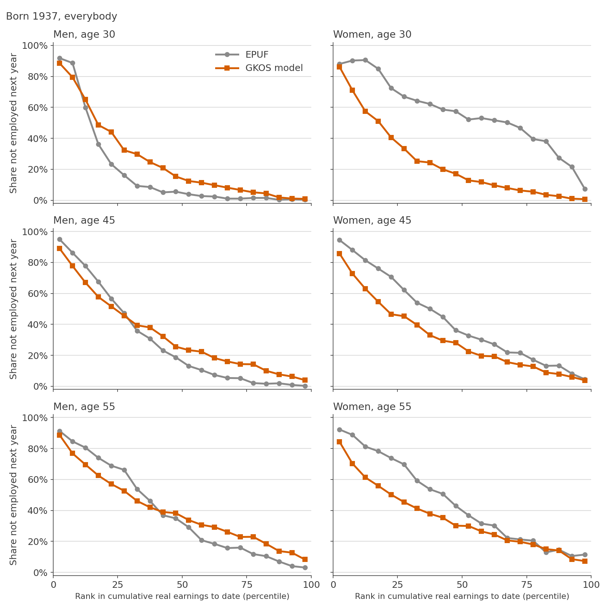
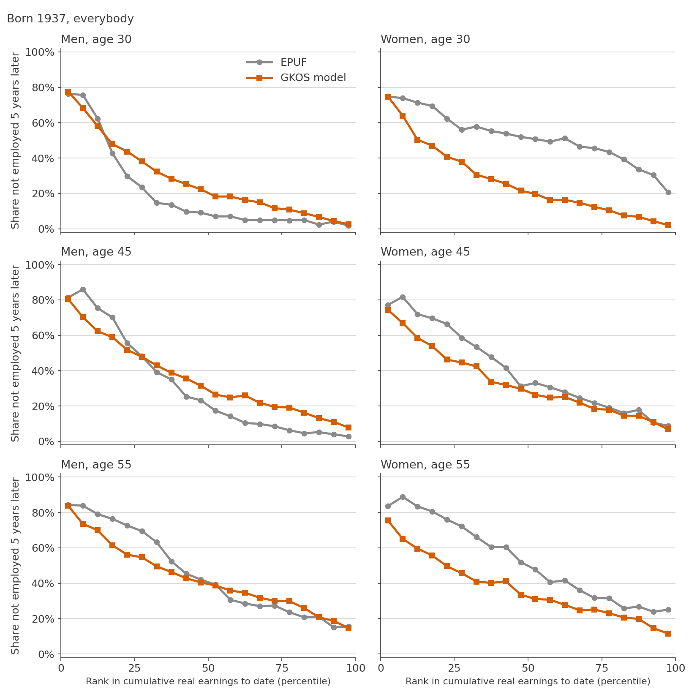

**x:** rank in cumulative real earnings over ages 20 to a (inclusive), everybody.

**y:** share with zero earnings at a+h.

**Observation.**
- **Female labour-force participation is consistently too high in the model:** at every age and rank, women's
  non-employment is below EPUF's. Averages one year ahead:

  | Women, age | EPUF | Model |
  |------------|------|-------|
  | 30         | 56%  | 24%   |
  | 45         | 42%  | 32%   |
  | 55         | 45%  | 35%   |

- **The gradient from cumulative earnings to non-employment is not quite steep enough.** Share out a year later,
  bottom 20% vs top 20% of cumulative earners:
  - men at 45: EPUF 82% vs 1%, model 73% vs 7%;
  - men at 55: EPUF 83% vs 6%, model 74% vs 13%.
- **Men at 30 match** (EPUF 69% vs 1%, model 70% vs 2%).

**Why women at 45 match in plot 4 but not here.**
- Both plots cover the same people with the same y, so their overall averages are identical: EPUF 42.4%, model
  31.5%.
- Plot 4 shows that the currently employed match.
- So the whole gap is the stock of non-employed women. EPUF has 42% not employed at 45, the model 31%, and they
  stay out more (89% vs 84%).
- Every cumulative-earnings bin here mixes both groups, so the gap appears at every rank.

---

### (b) Non-employment dynamics

#### 6. Persistence: the not employed at a, by cumulative-earnings rank

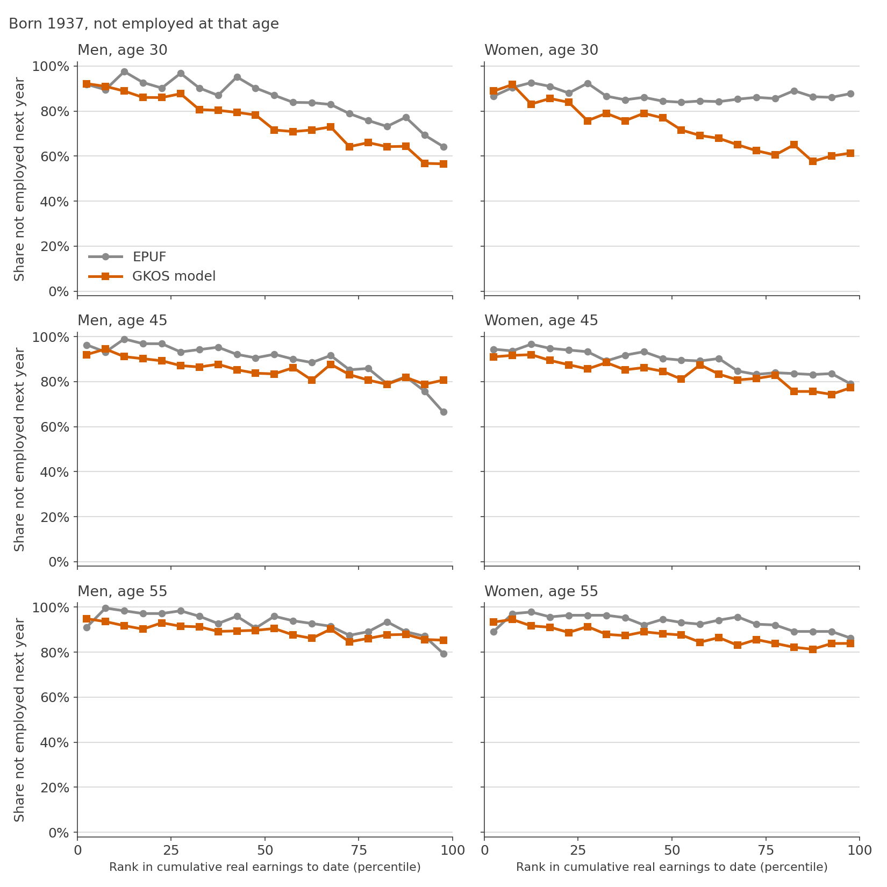
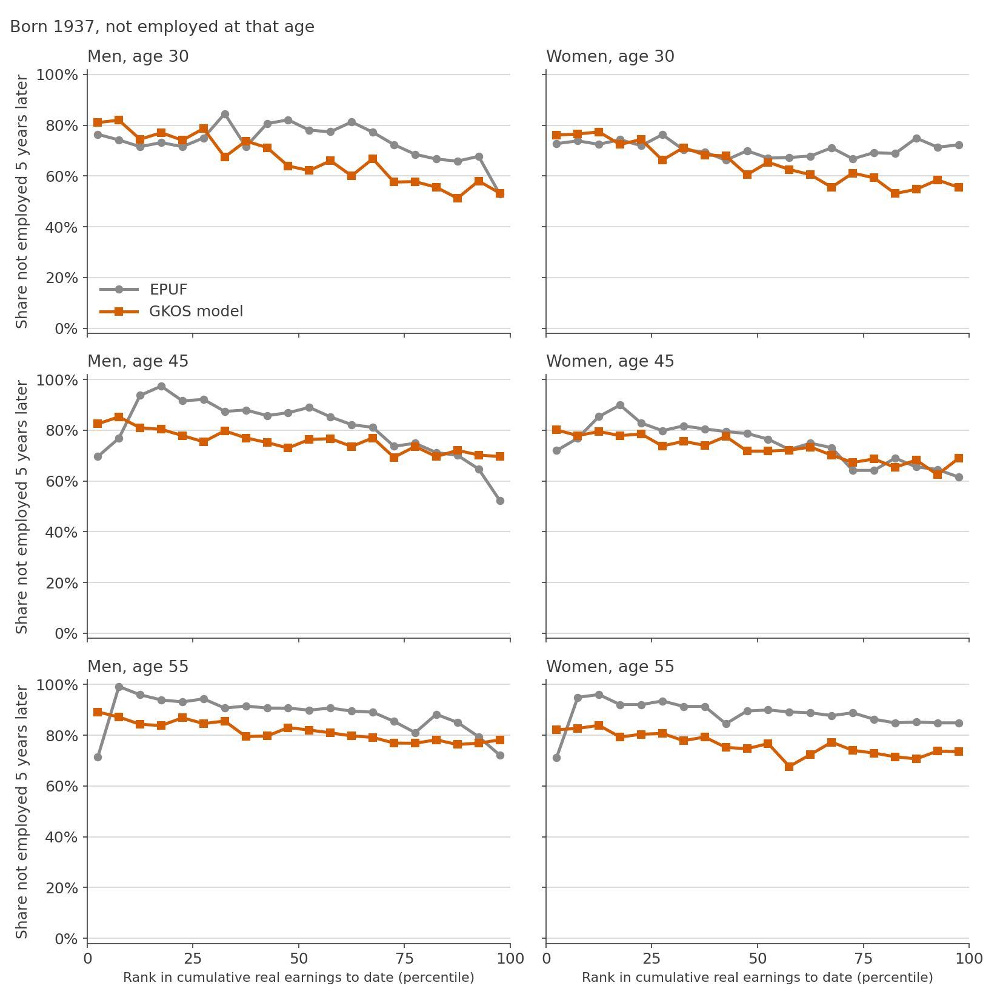

**x:** rank in cumulative real earnings over ages 20 to a−1, among people with zero earnings at a.

**y:** share with zero earnings at a+h.

**Observation.** Non-employment persistence is too low in the model at every age, even with mortality.

Share still not employed, among those not employed at a:

|           | Men, 1 yr: EPUF | Men, 1 yr: Model | Men, 5 yrs: EPUF | Men, 5 yrs: Model | Women, 1 yr: EPUF | Women, 1 yr: Model | Women, 5 yrs: EPUF | Women, 5 yrs: Model |
|-----------|------|-------|------|-------|------|-------|------|-------|
| Age 30    | 85%  | 75%   | 73%  | 67%   | 87%  | 73%   | 71%  | 65%   |
| Age 45    | 89%  | 85%   | 81%  | 76%   | 89%  | 84%   | 75%  | 73%   |
| Age 55    | 93%  | 89%   | 88%  | 81%   | 93%  | 87%   | 88%  | 76%   |

Without mortality the model's men at 55, five years ahead, were at 71%.

**Coding check.** I recomputed the EPUF side in plain SQL, independently of the Python pipeline, and it reproduces
the CSV exactly: men 55 → 56 92.9%, 55 → 60 88.1%, 45 → 46 89.2%, 45 → 50 80.7%.

#### 7. Earnings changes, arc-percent

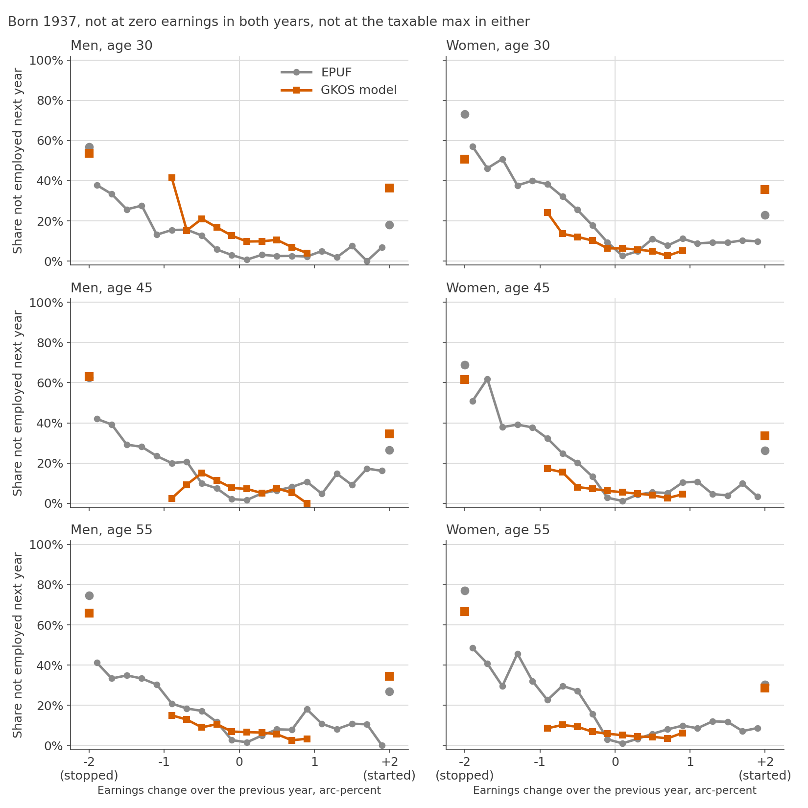
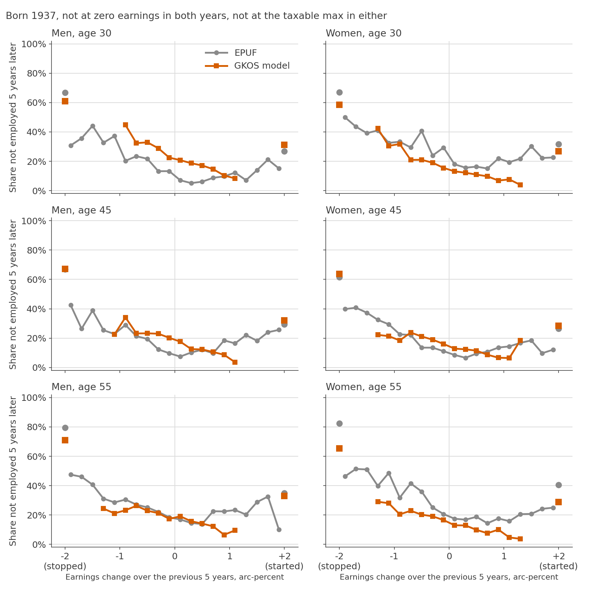

**x:** arc-percent change from a−h to a, (y1−y0)/((y1+y0)/2).
- Separate points: −2 = employed at a−h and out at a ("stopped"); +2 = out at a−h and employed at a
  ("started").
- Line: bins of width 0.2 in between.
- Sample: excludes anyone at zero in both years or at the taxable maximum in either year.

**y:** share with zero earnings at a+h.

**Observation.**
- **The model does not produce enough large changes.** Share of the one-year sample with an interior change of
  |arc| > 1: EPUF 7–13%, model 0.1–0.3%. The model's line spans only about −1 to +1.
- **It misses the very stably attached: people with neither large earnings changes nor employment changes.**
  - Both sources have about the same mass of small changes (|arc| < 0.2): EPUF 50–60% of the one-year sample,
    model 51–57% (EPUF women at 30: 29%).
  - In EPUF almost none of them leave: about 2% are out the next year (women at 30: 5%).
  - In the model, 5–11% of them are out the next year.
- **"Stopped" stay out less, "started" drop out more in the model.**

  | Share out next year | EPUF   | Model  |
  |---------------------|--------|--------|
  | Stopped (−2)        | 57–77% | 51–67% |
  | Started (+2)        | 18–30% | 29–36% |

#### 8. Earnings changes, absolute (real 2013$, symlog axis)

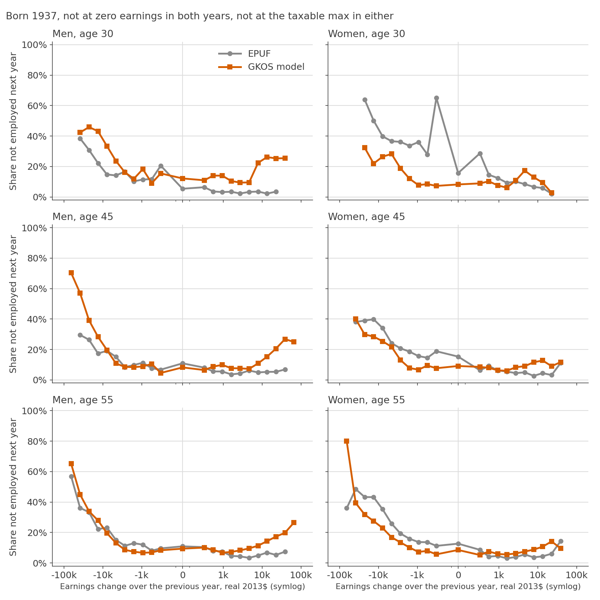
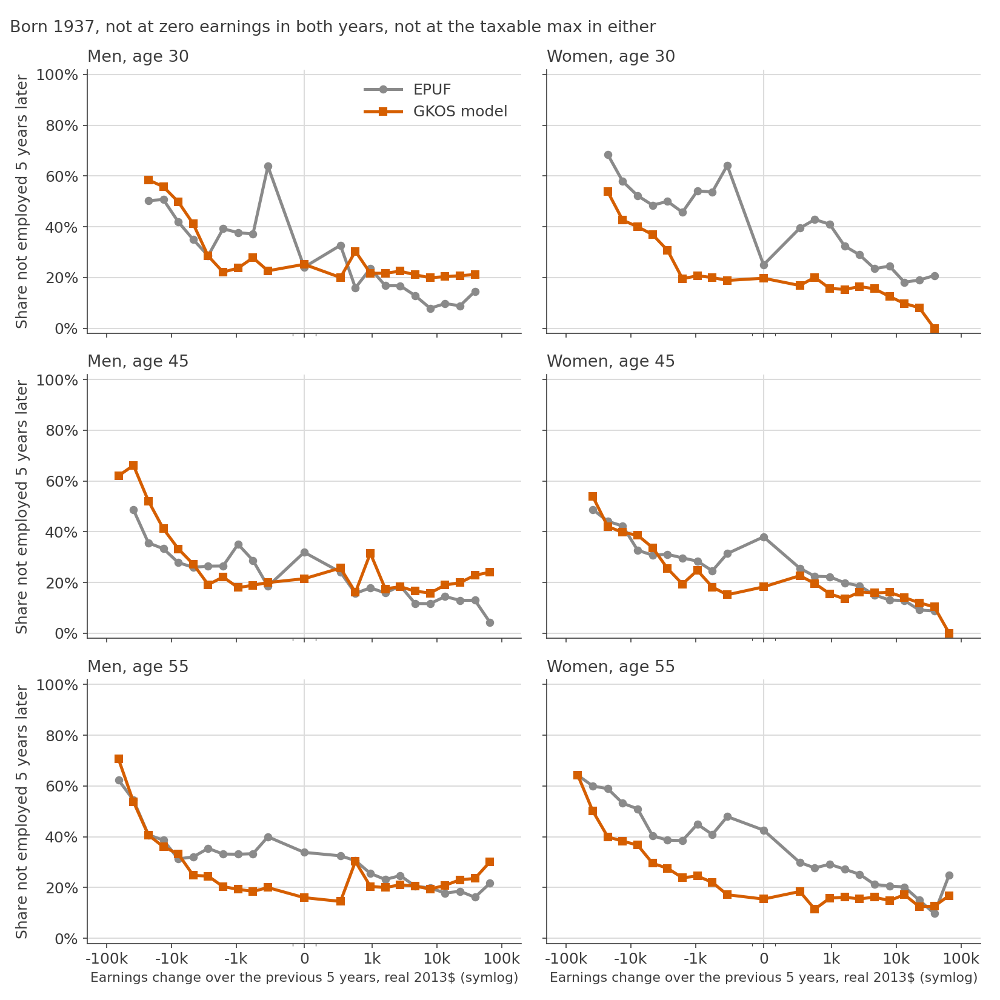

**x:** real change y1 − y0, from a−h to a.
- A centre bin for |Δ| < $250.
- 12 geometric bins per side, ratio 1.7.
- Same sample as plot 7.

**y:** share with zero earnings at a+h.

**Observation.** The model does reasonably well on job-to-job earnings changes. Through the middle of the change
distribution the levels and the U shape match. In the 5-year version at 55 the model is below EPUF in most bins
(16 of 23 for men, 21 of 23 for women), by 4 and 12 points on average.

#### 9. Large one-year changes: at what age they happen

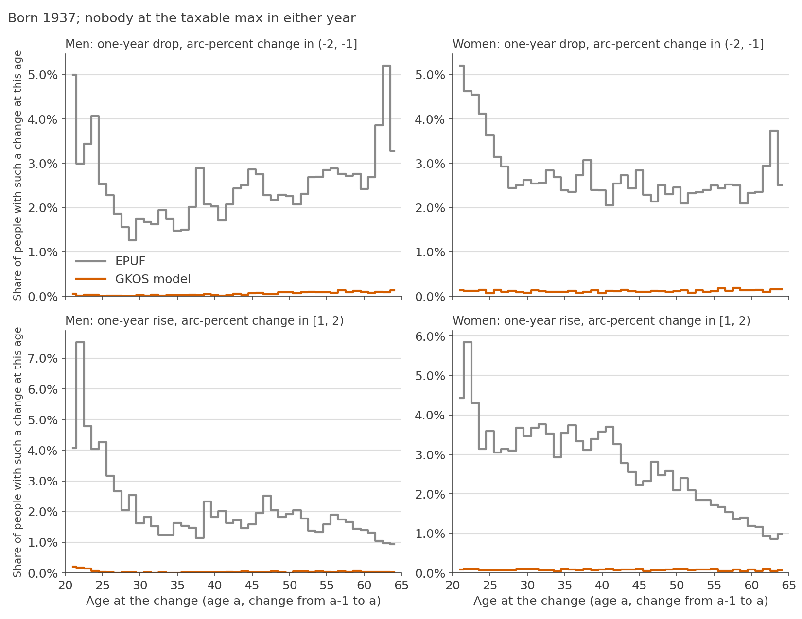

**Events:**
- a **drop** is a one-year arc change (a−1 → a) in (−2, −1];
- a **rise** is one in [1, 2);
- the sample excludes anyone at the taxable max in either year.

**y:** events at age a divided by persons in the base.

**Observation.**
- **Large drops are concentrated early and late in life, for both sexes** (EPUF, per year):

  | Drops | 21–29 | 30–44 | 45–54 | 55–61 | 62–64 |
  |-------|-------|-------|-------|-------|-------|
  | Men   | 2.8%  | 2.0%  | 2.4%  | 2.7%  | 4.1%  |
  | Women | 3.7%  | 2.6%  | 2.4%  | 2.4%  | 3.1%  |

- **Large rises are concentrated at young ages:**
  - men: 3.9% a year at 21–29, then about 1.6–1.8%, and 1.0% at 62–64;
  - women: 3.4–3.8% to 44, then declining to under 1% by 62–64.
- **The model has almost none of either:** 0.02–0.05 drops and 0.02–0.04 rises per person over the whole of
  21–64, against about 1 each in EPUF (men 1.1 and 0.9, women 1.2 and 1.2).

#### 10. Large one-year changes: what follows (EPUF only)

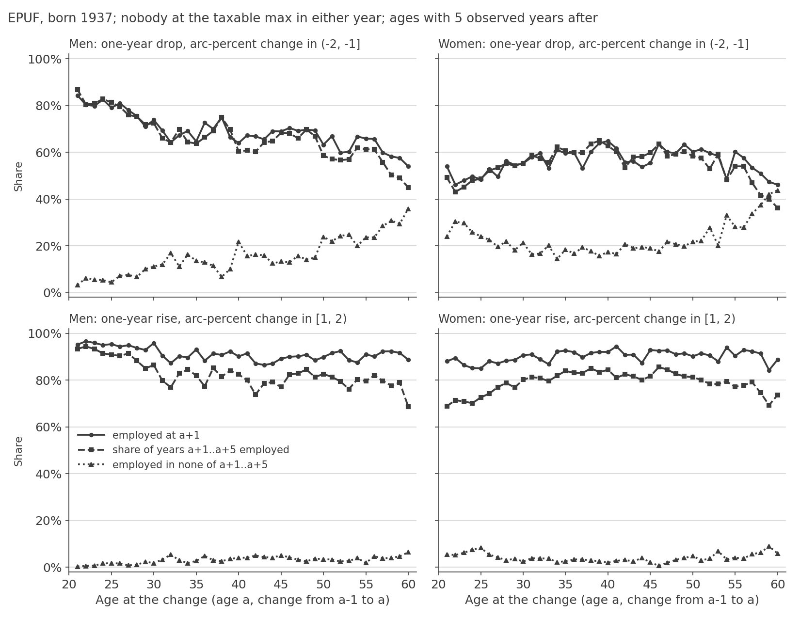

The model has almost no such events (section 9), so there is nothing to compute for it.

**x:** age at the change, restricted to a ≤ 60 so all five following years are observed.

**y (three lines):**
- share employed at a+1;
- share of the years a+1..a+5 employed;
- share employed in none of a+1..a+5.

Ages 21–60, EPUF:

| Event, sex | Employed at a+1 | Share of a+1..a+5 employed | Employed in none of a+1..a+5 |
|------------|-----------------|----------------------------|------------------------------|
| Drop, men   | 70% | 67% | 15% (6% at 21–29 → 28% at 55–60) |
| Drop, women | 55% | 54% | 23% (20–25% to 54 → 35% at 55–60) |
| Rise, men   | 92% | 85% | 3%  |
| Rise, women | 90% | 79% | 4%  |

**Observation.**
- **Not employed the next year:** 30% of men and 45% of women after a drop.
- **Out for all five following years**, a permanent exit (retirement, disability, death or non-covered work): 15%
  and 23%, rising to 28% and 35% for drops at 55–60.

**How much of the large-change tail is left once exits are removed.** Share of the one-year change sample
(ages 21–64), pooled over ages:

| | Men: EPUF | Men: Model | Women: EPUF | Women: Model |
|---|---|---|---|---|
| Interior large changes, 1 ≤ abs(arc) < 2 | 9.4% | 0.18% | 10.2% | 0.29% |
| … of which drops followed by a zero year | 1.7% | 0.03% | 2.3% | 0.03% |
| **Remaining tail, excluding those exits** | **7.8%** | **0.16%** | **7.8%** | **0.26%** |

So even after removing every drop that is followed by non-employment, EPUF has 30–50 times the model's mass of
large interior changes.

---

### (c) Non-employment age profile vs. earnings dependence

#### 11. Share not employed by age, within lifetime-earnings quartiles

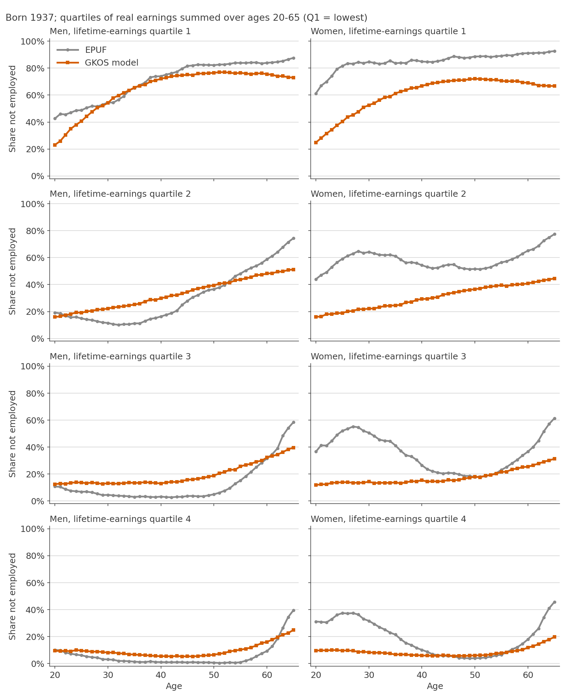

**x:** age.

**y:** share with zero earnings at that age.

**Panels:** quartiles of real earnings summed over ages 20–65, ranked within sex and source (Q1 = lowest).

Mean share not employed by age band:

| Sex | Quartile | Source | 20–29 | 30–44 | 45–54 | 55–61 | 62–65 |
|-----|----------|--------|-------|-------|-------|-------|-------|
| Men | Q1 | EPUF  | 49% | 68% | 83% | 84% | 86% |
|     |    | Model | 39% | 67% | 76% | 76% | 74% |
|     | Q2 | EPUF  | 15% | 14% | 36% | 54% | 69% |
|     |    | Model | 19% | 27% | 39% | 46% | 50% |
|     | Q3 | EPUF  | 7%  | 3%  | 6%  | 25% | 50% |
|     |    | Model | 13% | 14% | 19% | 29% | 37% |
|     | Q4 | EPUF  | 7%  | 2%  | 1%  | 6%  | 30% |
|     |    | Model | 9%  | 6%  | 7%  | 14% | 22% |
| Women | Q1 | EPUF  | 77% | 85% | 88% | 90% | 92% |
|       |    | Model | 38% | 63% | 71% | 70% | 67% |
|       | Q2 | EPUF  | 56% | 58% | 53% | 61% | 73% |
|       |    | Model | 19% | 27% | 36% | 40% | 43% |
|       | Q3 | EPUF  | 48% | 35% | 19% | 31% | 54% |
|       |    | Model | 13% | 14% | 17% | 24% | 30% |
|       | Q4 | EPUF  | 34% | 17% | 5%  | 13% | 37% |
|       |    | Model | 10% | 7%  | 6%  | 10% | 17% |

**Observation.**
- **Non-employment depends less on lifetime income in the model than in the data.**
  - Q1–Q4 gap at 45–54: EPUF 82 points (men) and 83 (women), against model 69 and 65.
  - In Q3–Q4 the model has more non-employment mid-career than EPUF: men at 30–54, 6–19% vs 1–6%.
- **The model misses early-life exits by low-lifetime-income people.** At 20–29, Q1 non-employment is EPUF 49% vs
  model 39% for men, and 77% vs 38% for women.
- **At 62–65 the model is below EPUF in every quartile.**

**Mortality is in this figure.** The model's lines come from the run with deaths. The no-mortality run gives a
visibly different picture: at 65 men's Q1 is 73% with mortality vs 57% without, and Q4 is 25% vs 12%.

**Why model non-employment rises with age.** Two sources: the logit itself up to about 50, and mortality after.

1. **The logit, up to about 50.** The probability of a zero year is `logistic(a + b t + (c + d t) z)` with
   a = −3.35, b = −0.86, c = −5.03, d = −2.90.
   - Because d < 0, the z-gradient steepens with age: from −3.9 at age 20 to −16.9 at 65.
   - At z = 0 the probability falls with age (4.7% at 20, 0.4% at 50).
   - At z = −0.6 it rises (34% at 20, 88% at 50, 96% at 65).
   - z is persistent (ρ = 0.959) and its dispersion grows over the life cycle (sd 0.71 at 25, toward about 0.86).
     So the low-z tail is pushed toward certain non-employment while everyone else is pushed toward certain
     employment.
   - Averaged over people, this raises non-employment: without mortality the model goes from 15% at 20 to 29%
     at 50, then is flat at about 30–32% to 65.
   - Within the bottom quartile it is steeper, because that quartile is selected on low z: 24% at 20 to 68% at 50.
2. **Mortality, after 50.** With deaths added, overall non-employment keeps rising after 50 (men: 35% at 50, 47%
   at 65), because every death is a permanent zero.

   Without mortality the bottom quartile's non-employment falls after 50 (men 68% → 57% at 65), as z mean-reverts.
   With mortality it stays at about 75%.

#### 12. Share of remaining years not employed, by cumulative earnings to date

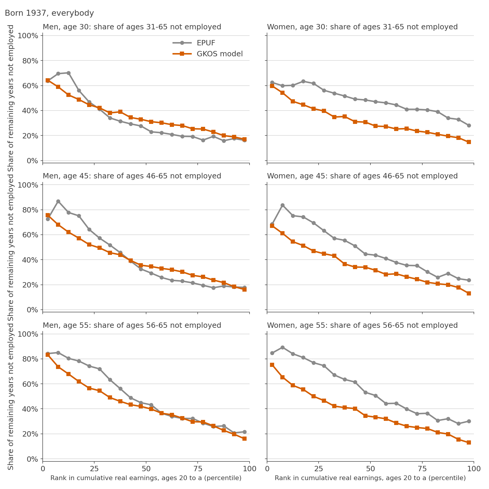

**x:** rank in cumulative real earnings over ages 20 to a (inclusive), everybody.

**y:** share of the remaining ages a+1..65 with zero earnings.

Selected ventiles, EPUF / model:

| Group | 1st ventile | 2nd | 5th | Median (10th–11th) | 20th |
|-------|-------------|-----|-----|--------------------|------|
| Men, 30   | 64 / 64 | 70 / 59 | 47 / 45 | 25 / 32 | 16 / 17 |
| Men, 45   | 73 / 76 | 87 / 68 | 64 / 52 | 31 / 35 | 18 / 16 |
| Men, 55   | 84 / 83 | 85 / 74 | 74 / 57 | 44 / 41 | 22 / 16 |
| Women, 30 | 62 / 60 | 60 / 54 | 62 / 41 | 48 / 29 | 28 / 15 |
| Women, 45 | 68 / 67 | 84 / 61 | 69 / 47 | 44 / 33 | 24 / 13 |
| Women, 55 | 85 / 75 | 89 / 65 | 77 / 50 | 52 / 34 | 30 / 13 |

**Observation.**
- **We are missing labour-market exits at the bottom of the income distribution.** For men the model is close at
  the lowest ventile but 11–19 points too low at ventiles 2–5 at 45 and 55.
- **For women we are also missing the child penalty.** At 30 the model is too low everywhere above the lowest
  ventile, by 19–21 points from the 5th ventile to the median.

**Labour-market exit or weak attachment?** Count the transitions in the remaining years:

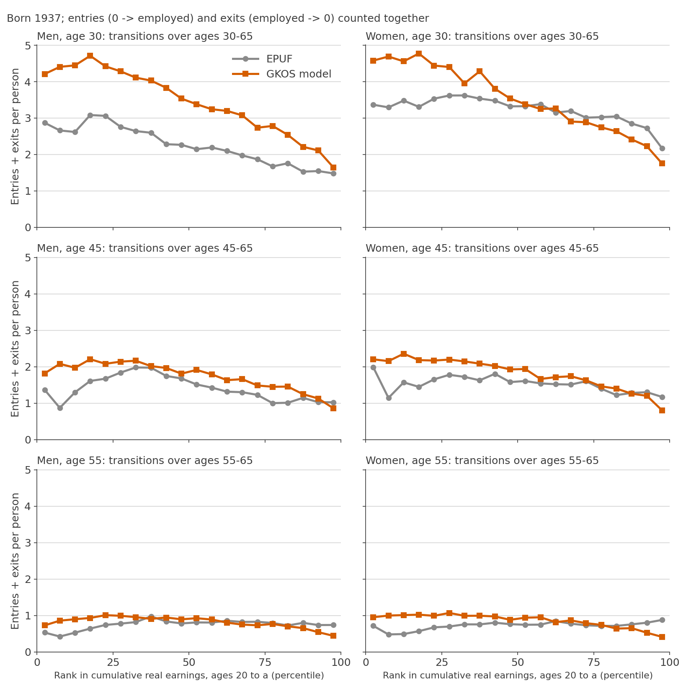

**x:** rank in cumulative real earnings over ages 20 to a (inclusive).

**y:** mean number per person of entries plus exits (employed ↔ not employed) over ages a..65, counted together.

Entries + exits per person, EPUF / model, by rank quintile:

| Group | Bottom 20% | 20–40% | 40–60% | 60–80% | Top 20% |
|-------|------------|--------|--------|--------|---------|
| Men, 30   | 2.8 / 4.4 | 2.8 / 4.2 | 2.2 / 3.5 | 1.9 / 2.9 | 1.6 / 2.1 |
| Men, 45   | 1.3 / 2.0 | 1.9 / 2.1 | 1.6 / 1.9 | 1.2 / 1.6 | 1.1 / 1.2 |
| Men, 55   | 0.5 / 0.9 | 0.8 / 1.0 | 0.8 / 0.9 | 0.8 / 0.8 | 0.7 / 0.6 |
| Women, 30 | 3.4 / 4.7 | 3.6 / 4.3 | 3.4 / 3.5 | 3.1 / 3.0 | 2.7 / 2.3 |
| Women, 45 | 1.5 / 2.2 | 1.7 / 2.2 | 1.6 / 1.9 | 1.5 / 1.6 | 1.2 / 1.2 |
| Women, 55 | 0.6 / 1.0 | 0.7 / 1.0 | 0.8 / 0.9 | 0.8 / 0.8 | 0.8 / 0.6 |

**Observation.**
- **At the bottom, EPUF has fewer transitions than the model at every age**, despite more non-employment: 0.4–1.6
  fewer per person in the bottom quintile. Low cumulative earners in EPUF exit and stay out; in the model they
  cycle in and out.
- **Men at 30: the model has more transitions at every rank**, by 0.5–1.6 per person.
- **At the top at 55, EPUF has more** (0.7 vs 0.6 for men, 0.8 vs 0.6 for women): retirement.
- **Women: the model has too many below the median and slightly too few at the top**, at 30 and 45.

**Permanent exit or re-entry?** The figure below splits the share of remaining years not employed by what the
person does later. The horizon stops at 60, to keep retirement out.

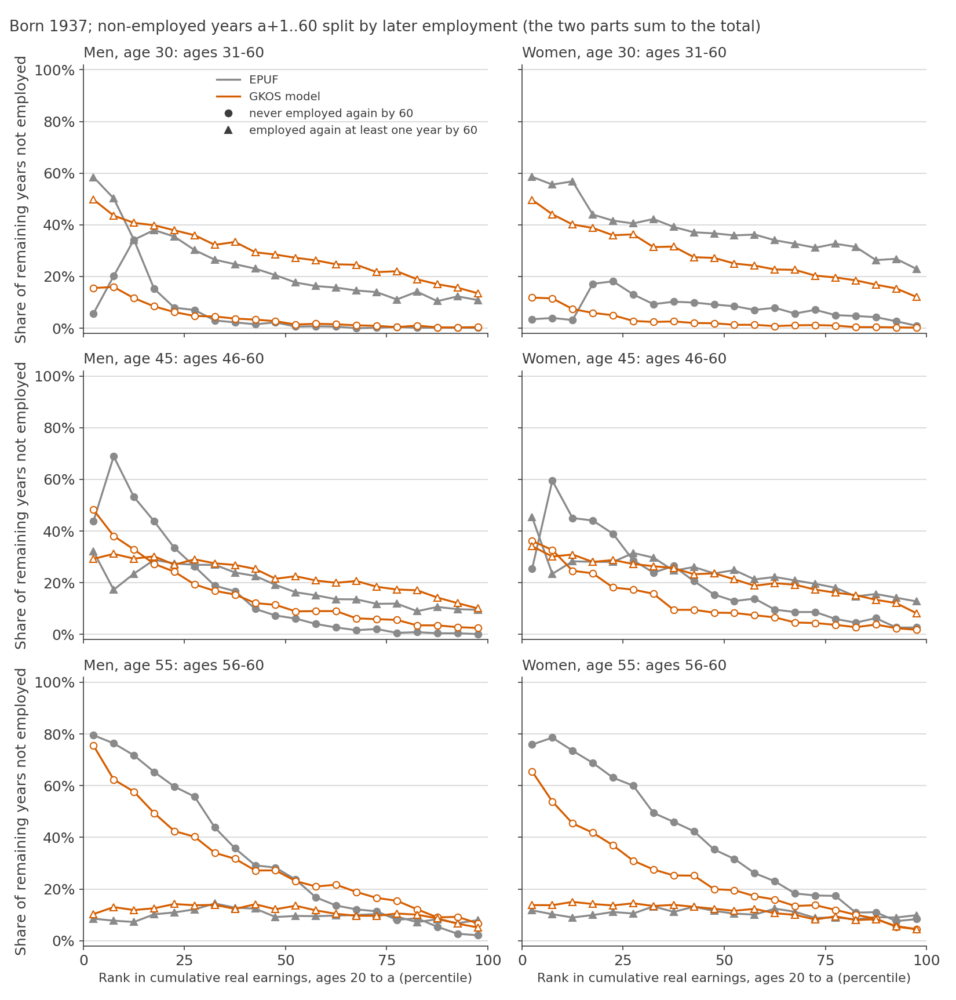

**x:** rank in cumulative real earnings over ages 20 to a (inclusive).

**y:** share of the remaining ages a+1..60 not employed, split into the years of people who:
- ● are never employed again by 60: a permanent exit;
- ▲ are employed again in at least one of those years: re-entry.

Both parts have the same denominator (everybody × all remaining years), so they sum to the share in section 12
(on the shorter horizon to 60). Filled markers are EPUF, hollow markers the model.

Means over rank quintiles, EPUF / model:

| Group | Bottom 20%: never again | Bottom 20%: re-entry | 40–60%: never again | 40–60%: re-entry | Top 20%: never again | Top 20%: re-entry |
|-------|------|------|------|------|------|------|
| Men, 30   | 19 / 13% | 45 / 43% | 1 / 2%   | 19 / 28% | 0 / 1%  | 12 / 16% |
| Men, 45   | 52 / 37% | 25 / 30% | 7 / 10%  | 18 / 23% | 0 / 3%  | 10 / 13% |
| Men, 55   | 73 / 61% | 8 / 12%  | 24 / 25% | 10 / 13% | 5 / 9%  | 8 / 8%   |
| Women, 30 | 7 / 9%   | 54 / 43% | 9 / 2%   | 36 / 26% | 3 / 0%  | 27 / 16% |
| Women, 45 | 44 / 29% | 31 / 31% | 16 / 8%  | 24 / 22% | 4 / 3%  | 14 / 12% |
| Women, 55 | 74 / 52% | 10 / 14% | 34 / 20% | 11 / 12% | 9 / 7%  | 9 / 7%   |

**Observation.**
- **The model's shortfall at the bottom is permanent exits.** Bottom quintile at 45 and 55, share of remaining
  years spent by people who never work again:

  | | EPUF | Model |
  |---|---|---|
  | Men at 45   | 52% | 37% |
  | Men at 55   | 73% | 61% |
  | Women at 45 | 44% | 29% |
  | Women at 55 | 74% | 52% |

  The re-entry part is about equal, or larger in the model.
- **Men above the median: the model has too much re-entry non-employment** (short spells) at 30 and 45.
- **Women at 30: the model is short on both parts above the bottom quintile.**
  - Permanent exits: 3–13% vs 0–3%.
  - Re-entry: 27–41% vs 16–34%. That is the child-penalty pattern.
- **Caveat at the lowest ventile at 30 and 45.** EPUF's "never again" point drops there (6% at 30, 44% at 45,
  against 19% and 52% for the whole bottom quintile), because the base requires some covered earnings at 20–65.
  People who have not worked by a must work later, possibly after 60.

---

### (d) Weak labour-force attachment

Mortality adds one exit per person who dies while employed, in both sources.

#### 13. Entries and exits up to 65, by current earnings

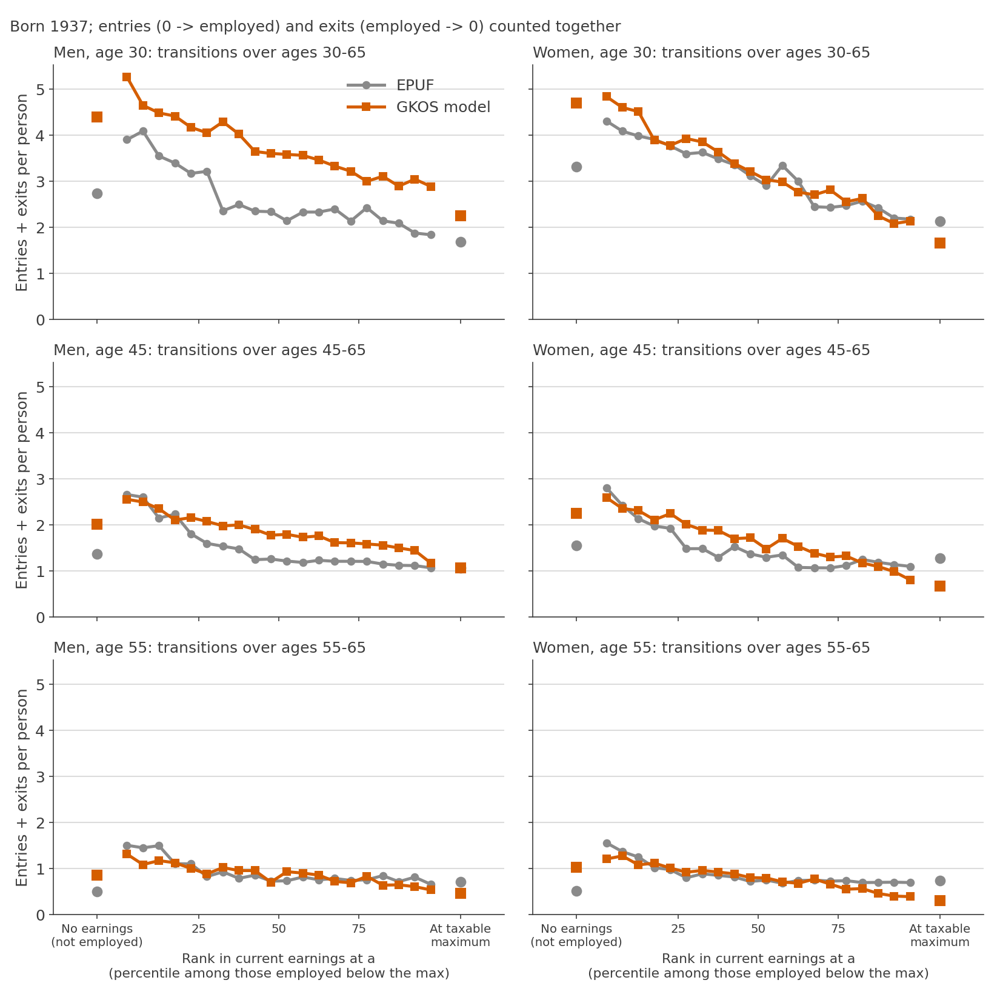

The cumulative-earnings version is in section 12.

**x:** current earnings at a, in the exit-plot layout.
- Left point: not employed at a.
- Right point: at the taxable max.
- Line: 20 rank bins among people employed below the max.

**y:** mean number per person of entries plus exits over ages a..65, counted together.

Entries + exits per person, EPUF / model:

| Group | Not employed at a | Bottom 20% of earners | Middle 20% | Top 20% below max | At max |
|-------|-------------------|-----------------------|------------|-------------------|--------|
| Men, 30   | 2.7 / 4.4 | 3.7 / 4.7 | 2.3 / 3.6 | 2.0 / 3.0 | 1.7 / 2.2 |
| Men, 45   | 1.4 / 2.0 | 2.4 / 2.4 | 1.2 / 1.8 | 1.1 / 1.4 | 1.1 / 1.1 |
| Men, 55   | 0.5 / 0.9 | 1.4 / 1.2 | 0.8 / 0.9 | 0.8 / 0.6 | 0.7 / 0.5 |
| Women, 30 | 3.3 / 4.7 | 4.1 / 4.5 | 3.2 / 3.2 | 2.3 / 2.3 | 2.1 / 1.7 |
| Women, 45 | 1.6 / 2.3 | 2.3 / 2.3 | 1.4 / 1.7 | 1.2 / 1.0 | 1.3 / 0.7 |
| Women, 55 | 0.5 / 1.0 | 1.3 / 1.2 | 0.7 / 0.8 | 0.7 / 0.5 | 0.7 / 0.3 |

**Observation.**
- **The not employed at a have far more future transitions in the model**, at every age: 0.4–1.7 more. In EPUF a
  zero is more often the start of a long or permanent spell.
- **Low current earners:**
  - at 30 the model has more transitions than EPUF;
  - at 45 the two are equal;
  - at 55 the model has fewer (1.2 vs 1.3–1.4).

  Low earners late in life churn more in EPUF.
- **Men at 30: the model has more transitions all along the earnings line** (by 1.0–1.3).
- **Top earners and those at the max, at 45–55: EPUF has more transitions** (retirement), especially women at the
  max (1.3 vs 0.7 at 45, 0.7 vs 0.3 at 55).

#### 14. Entries and exits over ages 20–65, by lifetime earnings

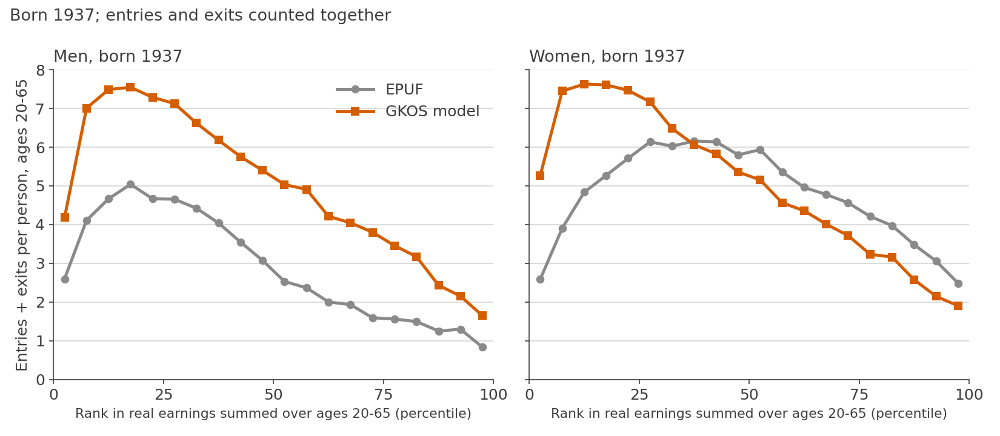

**x:** rank in real earnings summed over ages 20–65.

**y:** mean number per person of entries plus exits over 20–65, counted together.

| | Average, EPUF / model | Peak, EPUF | Peak, model | Lowest ventile, EPUF / model | Top ventile, EPUF / model |
|---|---|---|---|---|---|
| Men   | 2.9 / 5.0 | 5.0 at the 18th pct | 7.5 at the 18th pct | 2.6 / 4.2 | 0.8 / 1.6 |
| Women | 4.8 / 5.1 | 6.2 at the 38th pct | 7.6 at the 13th pct | 2.6 / 5.3 | 2.5 / 1.9 |

**Observation.**
- **Both sources: transitions are hump-shaped in lifetime earnings.**
  - Few at the very bottom: people who barely ever work.
  - The most among low-to-middle earners.
  - Fewest at the top.
- **Men: the model has more transitions at every rank**, about 2 more per person from the 10th to the 60th
  percentile and about twice EPUF's at the top (1.6 vs 0.8).
- **Women: the averages match, but the shape differs.**
  - The model's peak is at the 13th percentile, and it has more transitions than EPUF below about the 30th
    percentile and fewer above the median.
  - EPUF's peak is at the 38th percentile (6.2). Women with middling careers leave and re-enter, which fits
    the child-penalty pattern in sections 2 and 4.
  - EPUF's top women also churn more than the model's (2.5 vs 1.9).

#### 15. Future entries and exits by age, within lifetime-earnings quartiles

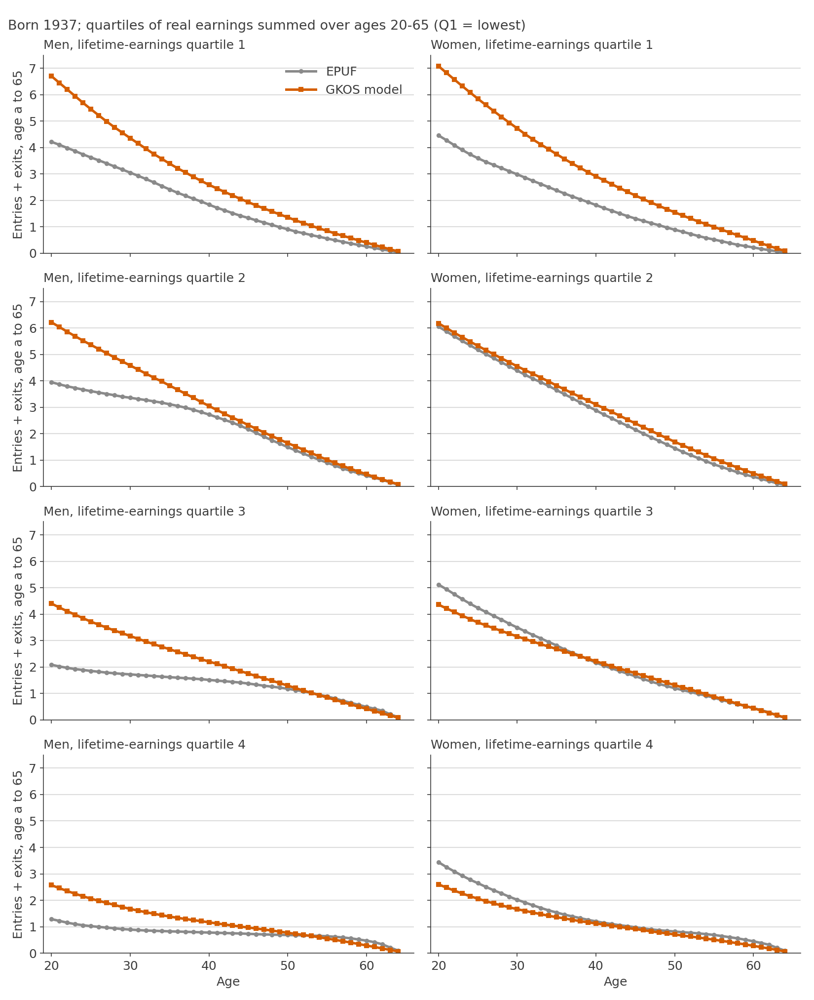

**x:** age a.

**y:** mean number per person of entries plus exits over the rest of the window, a → 65.

**Panels:** quartiles of real earnings summed over ages 20–65 (Q1 = lowest), as in section 11.

Future entries + exits per person, EPUF / model:

| Sex | Quartile | From 20 | 25 | 30 | 40 | 50 | 60 |
|-----|----------|---------|----|----|----|----|----|
| Men | Q1 | 4.2 / 6.7 | 3.6 / 5.5 | 3.1 / 4.4 | 1.8 / 2.6 | 0.9 / 1.4 | 0.3 / 0.4 |
|     | Q2 | 3.9 / 6.2 | 3.6 / 5.4 | 3.4 / 4.6 | 2.7 / 3.1 | 1.5 / 1.6 | 0.4 / 0.5 |
|     | Q3 | 2.1 / 4.4 | 1.9 / 3.7 | 1.7 / 3.2 | 1.5 / 2.2 | 1.2 / 1.3 | 0.5 / 0.4 |
|     | Q4 | 1.3 / 2.6 | 1.0 / 2.1 | 0.9 / 1.7 | 0.8 / 1.2 | 0.7 / 0.8 | 0.5 / 0.3 |
| Women | Q1 | 4.5 / 7.1 | 3.6 / 5.8 | 3.0 / 4.7 | 1.8 / 2.9 | 0.9 / 1.6 | 0.2 / 0.5 |
|       | Q2 | 6.1 / 6.2 | 5.2 / 5.3 | 4.4 / 4.6 | 2.9 / 3.1 | 1.5 / 1.7 | 0.4 / 0.5 |
|       | Q3 | 5.1 / 4.4 | 4.2 / 3.7 | 3.5 / 3.2 | 2.2 / 2.2 | 1.2 / 1.3 | 0.4 / 0.4 |
|       | Q4 | 3.4 / 2.6 | 2.6 / 2.1 | 2.0 / 1.7 | 1.2 / 1.1 | 0.8 / 0.7 | 0.4 / 0.3 |

**Observation.**
- **Q1, both sexes: the model has far more future churning.** From age 20, 6.7 vs 4.2 for men and 7.1 vs 4.5 for
  women, and the gap persists to 50.
  - EPUF's lowest earners are not weakly attached.
  - They have fewer spells, which are long or permanent.
- **Men Q2–Q4: EPUF's curves are nearly flat from 20 to the mid-40s.** Q3 goes 2.1 → 1.5 between 20 and 40, Q4
  1.3 → 0.8: about one transition per person over 25 years, then the retirement transitions in the last decade.
  (For the 1932 cohort the same curves dropped by 1.1–1.2 between 20 and 25, which was Korean-War service showing
  up as an entry; this cohort has none of that.)
- **The model's men start far higher and decline steadily.** At 20 they have 1.3–2.3 more future transitions than
  EPUF in Q2–Q4, still 0.8–1.5 more at 30, about as many at 50, and fewer than EPUF at 60 in Q3–Q4.
- **Women: the model matches Q2 almost exactly.** It has too few future transitions in Q3–Q4, by 0.3–0.8 at ages
  20–30, and too many in Q1.

---

## Part II. The modified model

**Purpose.** Change as little as possible in GKOS's nonemployment block and see what each change buys against the
figures of Part I. The GKOS logit is `p(t, z) = logistic(a + b·t + (c + d·t)·z)`, one intercept for everybody and
z the only state. Three things are added: the intercept depends on sex and on whether the person was employed
last year; each year a share of people leave covered work for good, with a hazard that is quadratic in age; and
the logit index loads on the person's fixed earnings component α + β·t as well as on z.

### Model

Everything else is the GKOS model of Part I, mortality included. The nonemployment probability is

    p(t, x; s, e_{-1}) = logistic(a_s + g_N·1[not employed last year] + b·t + (c + d·t)·x),
    x = z + κ·(α + β·t),   s ∈ {men, women},   t = (age − 24)/10

and each year from 20, before the draw above, a person still in the labour market exits for good with probability

    h(t) = logistic(k + k_t·t + k_t2·t²),

the same for both sexes and independent of earnings; earnings are zero from then on through 65.

- b = −0.859, c = −5.034, d = −2.895: GKOS's values, unchanged. α and β are the person's GKOS fixed effects
  (sd 0.30 and 0.196 per decade, correlation 0.768), so α + β·t is the fixed part of log earnings at age t.
- GKOS is the special case a_men = a_women = −3.353, g_N = 0, k → −∞, κ = 0. Seven parameters in total.
- Order within a year: death, then the permanent exit, then the temporary draw.
- **Initial condition.** Everyone is employed at 18. Status at 19 is drawn from the logit with the
  employed-last-year intercept (z at 20 standing in for z at 19), and the lag starts from there. This adds no
  parameter.

### Estimation

- **Moments:** SMM on 2,500 EPUF moments, the statistics behind sections 1–15 computed by the same code. Left out:
  - the arc-change statistics (sections 7, 9, 10);
  - employment by age (section 2), which is the weighted average of the quartile profiles in section 11 and would
    count them twice.

  Entries and exits are counted together.
- **Blocks:** moments are grouped into the four blocks (a)–(d) of Part I; the overview statistics count under (c).
- **Units: percentage points of a share, the same for every figure.** Shares are used as they are. Two figures are
  converted first:
  - **Transition counts become annual rates.** Switches between a and 65 are divided by 65 − a, and switches over
    20–65 by 45.
  - **The years-worked histogram becomes its cumulative distribution.**
- **Weights:** diagonal. Each block gets ¼, each figure an equal share of its block, and each moment an equal share
  of its figure. So a figure's term is its weight × its mean squared gap in percentage points. Bins with fewer than
  50 EPUF observations are dropped.
- **Reporting:** J is quoted relative to its value at GKOS + mortality (118.9 in total; 40.3 / 31.0 / 45.1 / 2.5
  for blocks (a)–(d)), by block, by figure and in total, so 1 is GKOS and 0 a perfect fit.
- **Simulation:** 20,000 people per sex, common random numbers.
- **Optimiser: TikTak** (Arnoud, Guvenen and Kleineberg 2022; `code/dynamics/tiktak.py`), because single
  Nelder–Mead starts of intermediate models landed in different places (on the 1932 cohort the linear-exit model
  had two basins, 0.299 and 0.303 of GKOS's J, with opposite signs of k_t).
  - Sobol' points over a box, evaluated in parallel; the best are seeds. Local searches are Nelder–Mead
    (100 evaluations, tolerance 0.01), one per core, each started from a convex combination of its seed and the
    best point so far with weight (i/seeds)^¼, so the search concentrates after the first batches. The run stops
    when the last two different incumbents agree to 0.01 (AGK's rule) or when the budget is used up, then a
    200-evaluation polish.
  - **The adopted run**: 4,096 Sobol' points, 384 seeds, a 3,600-second budget on 10 cores of the SOM cluster: 510
    local searches, 65,500 evaluations, 63 minutes. The incumbent moved for the last time at search 370
    (J = 30.01; polish 29.94, i.e. 0.252 of GKOS's 118.9). The 511 local minima
    (`nonemp_tiktak_yob1937_absq_alpha.csv`) are one basin: 298 lie within 0.4 of the optimum and 458 within 1.0,
    and the ones within 0.4 agree to 0.9 in the men's intercept, 0.6 in the women's, 0.6 in g_N, 0.7 in k, 0.5 in
    k_t, 0.2 in k_t2 and 0.2 in κ.
  - A shorter run (1,024 points, 48 seeds, 600 seconds, 160 searches) stopped at 30.31 with κ = 0.68 and
    k = −7.86: the same basin, 0.4 higher. The objective is flat along a ridge that trades κ against the level of
    the exit hazard, which is why the longer run was used.
  - The objective is a step function of the parameters (shares of indicator draws), so gradient methods do not
    apply; Powell local searches were tried and were worse per evaluation than Nelder–Mead.
- **The nested chain and the alternatives** below were each run with 1,024 points, 48 seeds and a 600-second
  budget on 10 cores (about 90 local searches each).

### Code

- `python code/dynamics/estimate_nonemp.py --yob 1937 --spec absq_alpha --tiktak 4096 --keep 384 --local-maxfev 100
  --budget 3600` writes `nonemp_params_yob1937_absq_alpha.csv`, `nonemp_fit_yob1937_absq_alpha.csv`,
  `nonemp_tiktak_yob1937_absq_alpha.csv` and `transition_rates_yob1937_absq_alpha.csv`. The inputs come from
  `processed_data/nonemp_inputs_yob1937.npz` (written by the first run on a machine with the database), so it
  runs without the database; `estimate_nonemp.sbatch` is the Slurm wrapper for the SOM cluster.
- `python code/dynamics/plots/plot_transition_rates.py --yob 1937 --new absq_alpha` draws every figure of Part III
  with the suffix `_absq_alpha`; `plot_perm_exit_dec.py --yob 1937 --model absq_alpha` draws the permanent-exit
  decomposition.
- The model is `nonemp_model.py`; `--spec` selects which parameters are free. The nested and alternative
  specifications below are `sexint`, `sexlag_add`, `sexlag`, `sexlag_abs`, `sexlag_absq`, `sexlag_abs55`,
  `absq_zcap` and the tenure forms `absq_ten`, `absq_ten3`, `absq_ewma`, `absq_grad`, `absq_hyp`, `absq_rho`;
  their files carry those suffixes.

### Estimates

| Parameter | GKOS | Modified GKOS |
|-----------|------|---------------|
| a_men | −3.353 | **−5.813** |
| a_women | −3.353 | **−0.059** |
| g_N (not employed last year) | 0 | **+1.374** |
| k (permanent exit) | −∞ | **−6.286** |
| k_t (per decade of age) | — | **−1.783** |
| k_t2 (per decade²) | — | **+0.688** |
| κ (on α + β·t) | 0 | **+0.492** |

- The intercept is −5.81 (men) / −0.06 (women) after a year in work, and −4.44 / +1.32 after a year out.
- **The fixed effect carries a quarter to a half of z's weight.** κ·(α + β·t) has sd 0.16 at 25, 0.33 at 45 and
  0.47 at 60, against 0.71–0.86 for z. A man with α and β one sd below average is, at 45, 0.33 lower in the index,
  which with c + d·t = −11.1 at that age is +3.7 on the logit; at 60 it is +7.3. So the fixed effect matters little
  before 30 and sorts people more and more as the z-slope steepens with age.
- **The permanent exit is a late-career hazard with a small early part**: 0.42% a year at 20, 0.16% at 25, 0.08%
  at 30, a floor of 0.06% from 35 to 40, 0.09% at 45, 0.19% at 50, 0.55% at 55, 2.2% at 60, 4.2% at 62 and 11.6%
  at 65. Without mortality it takes 3% of a cohort out for good by 45, 6% by 55, 18% by 62 and 37% by 65.

### What each addition bought

The additions were made one at a time, each model re-estimated in full. Every entry is J **relative to its value
at GKOS + mortality**, by block and in total, so GKOS is 1 everywhere and a cell is the share of GKOS's miss on
that block that remains (J at GKOS: 40.3 / 31.0 / 45.1 / 2.5 by block, 118.9 in total). The blocks are Part I's
(a)–(d). The two totals weight the blocks differently: the total is the ratio of the summed objectives, which
weights each block by GKOS's loss on it, so (a) and (c) dominate and (d) hardly counts; the standardized total
is the plain mean of the four block ratios, every block counting equally.

| Block | GKOS | + sex intercept | + last year's status | + permanent exit | **+ fixed effect** |
|-------|------|-----------------|----------------------|------------------|--------------------|
| a: transitions across the income distribution | 1 | 0.40 | 0.40 | 0.31 | **0.22** |
| b: non-employment dynamics | 1 | 0.79 | 0.67 | 0.61 | **0.54** |
| c: age profile vs earnings dependence | 1 | 0.23 | 0.21 | 0.14 | **0.09** |
| d: weak attachment | 1 | 1.06 | 0.27 | 0.19 | **0.11** |
| **Total** (J / J at GKOS) | 1 | **0.45** | **0.40** | **0.32** | **0.25** |
| **Standardized total** (mean of the block ratios) | 1 | **0.62** | **0.39** | **0.31** | **0.24** |

- **The sex-specific intercept does most of the work** (J to 0.45 of GKOS's; a_men = −4.16, a_women = +1.05),
  almost all of it in blocks (a) and (c): women's level; block (d) gets slightly worse (1.06). GKOS's single
  intercept gives women men's participation (section 2: 29% of women's person-years not employed against EPUF's
  50%). Everything that conditions on women's employment status or ranks women by earnings inherits that error,
  which is why one parameter removes 55% of J.
- **Last year's status takes J from 0.45 to 0.40** (a_men = −4.27, a_women = +0.66, g_N = +1.17), in 1-year
  persistence (0.67 → 0.26) and the entries + exits figures of block (d) (1.06 → 0.27): a state variable for
  being out makes a spell last and halves the churning. The level is unchanged.
- **The permanent exit takes J from 0.40 to 0.32.** Its target was 5-year persistence, which the intercepts could
  not reach: re-entry among those who do come back runs at about 20% a year after the second year in both EPUF
  and the intercept-only model, so the gap is not duration dependence but a missing mass of people who never
  return (men out at 40–50 who never work again by 61: EPUF 57%, GKOS 41%). That share does not depend on earnings
  before the spell, so the hazard has age terms and no earnings term. Gains: 5-year persistence 0.80 → 0.58,
  remaining years not employed 0.38 → 0.21, never-vs-again employed 0.56 → 0.44, 5-year cumulative rank
  0.38 → 0.27, the quartile age profiles 0.27 → 0.22, lifetime employment 0.08 → 0.02. **Without the fixed effect
  the hazard is an early-career one**: estimated on its own (k = −5.04, k_t = +0.13, k_t2 = −0.87) it is 0.5–0.65%
  a year at 20–30, 0.1% at 40 and zero after 45, taking 9% of a cohort out for good by 45 and nobody after. It is
  doing the work of sorting low earners out of the labour market early, and the men's intercept drops from −4.27
  to −5.70 to let it.
- **The fixed effect takes J from 0.32 to 0.25, half of the gain in block (a)**: 1-year exit 0.71 → 0.22, 5-year
  exit 0.56 → 0.39, 5-year cumulative rank 0.27 → 0.21; also the quartile age profiles 0.22 → 0.14, remaining
  years not employed 0.21 → 0.12, never-vs-again employed 0.44 → 0.29, future transitions by quartile
  0.27 → 0.13 and 5-year absolute changes 0.86 → 0.62. It costs 1-year persistence (0.24 → 0.28). Its target was
  men's exits across the earnings distribution and the mid-career attachment of men in the upper half (sections 4
  and 11): with z alone in the index a high earner is only as attached as his current z, and a few bad draws take
  him out, so the six-parameter model has twice EPUF's exit rate among long-tenured middle and top earners. With
  the fixed effect in the index the people in the lowest current-earnings bin are the people with low α, and they
  are the ones who leave. **The hazard then moves from the early career to the late one**: the early sorting is
  done by α, and the exit hazard is free to become the retirement hazard above (zero through 30–45, 2.2% at 60,
  11.6% at 65).

Aggregate share of person-years at 20–65 not employed:

| | EPUF | GKOS | Modified |
|-|------|------|----------|
| Men | 29.7% | 31.6% | 29.4% |
| Women | 49.5% | 29.4% | 48.8% |

### Alternatives tried and not adopted

- **A permanent exit linear in age** (logit k + k_t·t; J at 0.325 of GKOS's against the quadratic's 0.322,
  standardized 0.315 against 0.313). Without the fixed effect the estimated hazard *falls* with age (k_t = −0.69:
  0.6% a year at 20, 0.15% at 60), like the quadratic's early-career shape, and the two fit alike. On the 1932
  cohort the linear surface had two basins (k_t = −0.59 vs +0.06), which is what prompted TikTak.
- **A kink at 55 instead of the quadratic** (k + k_t·t + k_55·(t − 3.1)₊; J at 0.315 of GKOS's against the
  quadratic's 0.322, standardized 0.311 against 0.313). On this cohort the kink does marginally better at six
  parameters (k_55 = +6.1, a jump at 55 on top of a falling early hazard); on the 1932 cohort, where the chain was
  first built, it was worse in every block. The quadratic was kept: the difference is within what the two shapes
  can both do, and once the fixed effect is in, the hazard's early part is no longer needed (see above).
- **A cap on z instead of the fixed effect**, (c + d·t)·min(z, z̄_s), one cap per sex (J at 0.307 of GKOS's
  against the fixed effect's 0.252; standardized 0.30 against 0.24). This was the first candidate for the
  mid-career problem, suggested by a diagnostic inside the six-parameter model on the 1932 cohort (there, α
  explains only 13% of the variance of log lifetime earnings, and the Q3 men who never leave have *lower* α than
  those who do). The men's cap estimates at z̄ = −0.32 and the women's at +1.9 (no cap), and the gain is 1.5
  points against the fixed effect's 7. The diagnostic was a statement about the model's own split of earnings into
  α and z, which EPUF does not identify; what EPUF says is that the people who stay are low-risk in a way z alone
  does not carry. On this cohort the cap does not fix the attachment problem at all (men ever out at 30–54:
  Q3 63%, Q4 43%, against EPUF's 36% and 11% and the fixed effect's 48% and 15%; exit rate of long-tenured top
  earners 2.2% vs EPUF's 0.5%), because capping z's effect at the top removes the earnings gradient there
  rather than making high permanent earners attached. It also leaves the workers' earnings distribution
  untruncated (Part IV, panel (f): its variance profile is GKOS's), which is the other side of the same coin.
  The cap may still have a role on top of the fixed effect (see the open issues).
- **Two discrete attachment types** were considered for the same problem and not estimated: within a lifetime
  quartile EPUF shows no within-person persistence of spells (P(any year out at 45–54 | any out at 25–34) is no
  higher than P(· | none out at 25–34): Q2 65 vs 73%, Q3 27 vs 25%, Q4 7 vs 4%), which is the signature a type
  model would need.
- **An entry margin for men** (an ad hoc check, not estimated): half of men entering at 20 and half uniformly at
  21–25, earnings zero before entry and the nonemployment process untouched. It overshoots at 20 (51% of men
  not employed against EPUF's 21%) and by construction has nothing left to explain at 25–30, where the model is
  7 points too employed at 25 and on EPUF at 30. The early-20s gap is the intercept, not entry timing.
- **Tenure in place of the fixed effect** (κ dropped; the last-year's-status dummy replaced by, or joined with, a
  function of L, the number of years continuously employed up to last year). The input was the figure below:
  everybody at 30 / 45 / 55 by L (0 = not employed the year before, a − 20 = employed every year since 20), and
  the share employed at that age (`code/dynamics/tenure_exit.py`, `plots/plot_tenure_exit.py`; a per-quartile
  version is in `plots/tenure_exit_lq_{men,women}_yob1937.png`).

  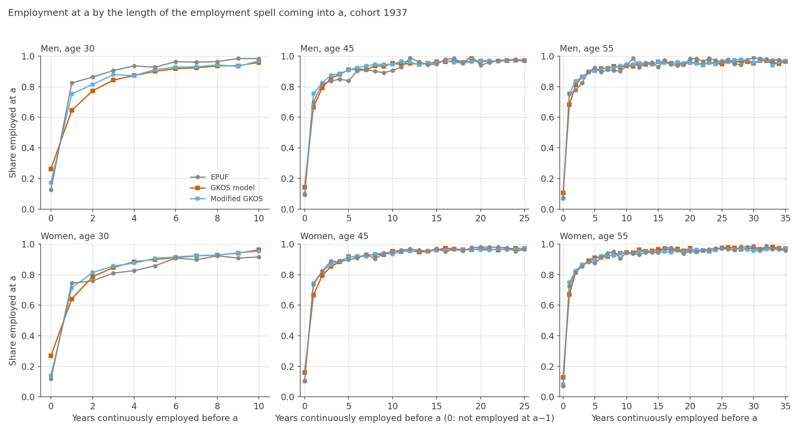

  - **The models already produce the tenure gradient without any tenure term.** The curve is a step and a slow
    climb: one in ten employed after a year out, seven to eight in ten after one year in, 96–97% after about
    ten years. GKOS's logit has no memory, and its curve still rises 2.5 log-odds from one year of tenure to
    ten (men at 30: 65% → 96%) against EPUF's 2.6: a person whose spell is unbroken has drawn z's that kept him
    in, and the longer the spell the stronger the selection. The modified model's dummy changes the curve only at
    L = 0 and 1; beyond two years it is within a point of GKOS's everywhere. So a cap at three years has nothing
    to explain (EPUF's climb over L = 1 to 3 is 0.5–0.8 log-odds, selection alone gives 0.8–0.9), and a tenure
    term is identified only by what is left: men at 30 more attached than the models at every tenure (a level),
    men at 45 with 3–11 years less attached, women at 30 with 2–5 years less attached (child-bearing). None of
    these is a gradient.
  - **Forms estimated (each nests the dummy exactly; same TikTak effort as the chain):** a ramp
    a_s + g_N·(1 − min(L, K)/K) with K free settles at K = 7.2 and fits *worse* than the dummy it nests (0.326 of
    GKOS's J against 0.322), because spreading one g_N over K years trades the step at 0 → 1, which the data want,
    for a gradient they do not; with K fixed at 3 it is worse again (0.332 when stopped, 0.337 profiled). An
    exponentially weighted attachment stock, A = δ·A₋₁ + (1 − δ)·e₋₁, raises J monotonically in δ. The form with
    the sign change built in, a_s + g_N·1[L = 0] − γ·h(L) with h = log L / log 10 or 1 − 1/L (one new
    parameter), estimates γ **negative** (−0.54 and −0.79; cluster runs, 320 and 112 local searches) and reaches
    0.312: the gain is an age effect, not attachment. Among the attached, tenure is age, so an intercept rising
    with log L is a late-career exit term (men not employed at 65: 57% against the dummy's 49% and EPUF's 65%;
    at 20 it is worse, 3% against 21%), and every attachment diagnostic is unchanged (men ever out at 30–54: Q3
    55%, Q4 28%, against the dummy's 53 / 26, EPUF's 36 / 11 and the fixed effect's 47 / 14).
  - **Why no function of tenure can produce the mid-career attachment of high earners.** The exit rate of men at
    40–50 with ten or more years of tenure is 8.6 / 1.1 / 0.5% a year in EPUF's bottom / middle / top
    current-earnings terciles, 6.5 / 2.8 / 1.1 in the dummy model and 8.9 / 1.7 / 0.6 with the fixed effect. A
    tenure term shifts everyone with the same tenure together, and the bottom tercile's long-tenured men already
    exit too little, so the attached intercept cannot fall. Interacting tenure with z does not do it either: a
    slope on x that steepens with tenure, (c + d·t)·x·(1 + 0.2·min(L, 10)/10), *raises* the top tercile's
    long-tenured exit rate (1.1 → 1.3%, and 1.7% at three times that steepening; J worse at every value), because
    within a tenure group the mean of a logistic in z rises when its slope rises (the convexity at low
    probabilities), and because z mean-reverts (half-life 16 years) while the top tercile's attachment in EPUF
    persists. A persistently low exit probability for a high earner has to come from the permanent component
    α + β·t, which is what κ supplies. The one tenure-shaped term with a negative derivative is a small
    *flattening* of the slope on top of κ (J −0.18 at 10% flattening at ten years), and it is small.

---

## Part III. GKOS model, modified GKOS and EPUF on the same figures

Every figure of Part I redrawn with three lines: grey = EPUF, orange = GKOS, light blue = Modified GKOS. Tables
read EPUF / GKOS / modified. The section numbers match Part I; the definitions of x, y and samples are there.

### Overview

#### 1. Lifetime: share of ages 20–65 employed, by lifetime earnings

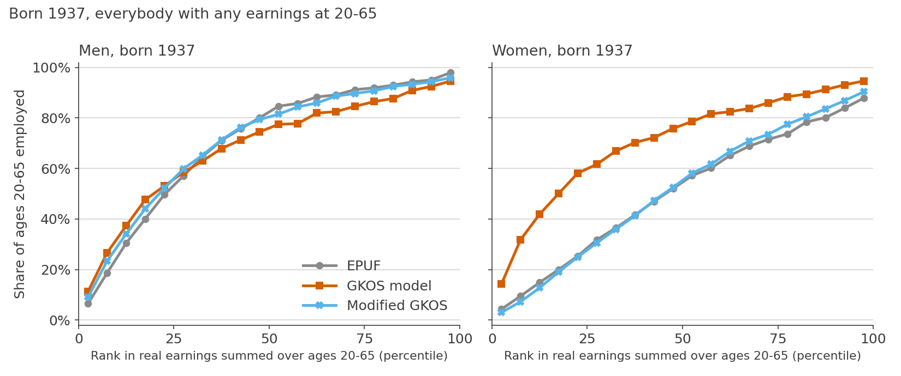

| Sex | 2.5 | 17.5 | 32.5 | 47.5 | 62.5 | 77.5 | 92.5 |
|-----|-----|------|------|------|------|------|------|
| Men | 7 / 11 / 9 | 40 / 48 / 44 | 65 / 63 / 65 | 80 / 74 / 79 | 88 / 82 / 86 | 92 / 86 / 91 | 95 / 92 / 94 |
| Women | 4 / 14 / 3 | 20 / 50 / 19 | 36 / 67 / 36 | 52 / 76 / 53 | 65 / 83 / 67 | 74 / 88 / 78 | 84 / 93 / 87 |

- **Men: within 2 points of EPUF above the 25th percentile and 2–4 points too high below it.** GKOS was 4–8
  points too high at the bottom and 3–8 too low above the 30th.
- **Women: within 4 points of EPUF everywhere.** GKOS was 20–31 points too high through the middle.

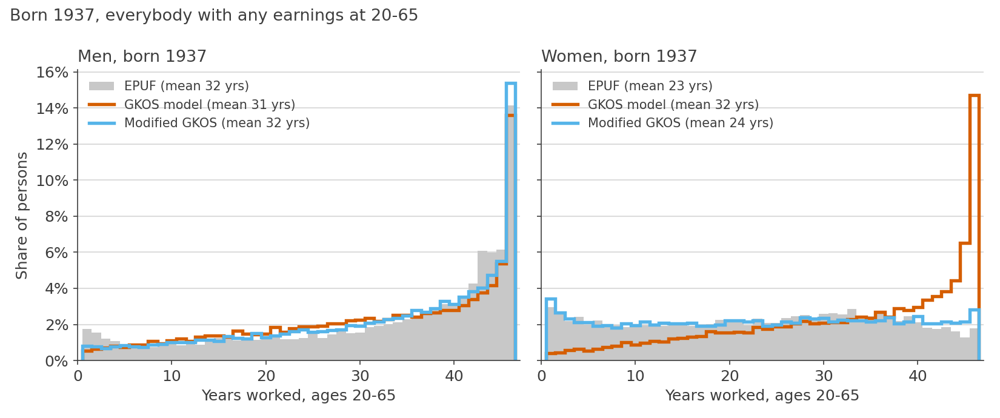

- **Women: the distribution matches EPUF's flat shape** (mean 23.6 years vs EPUF 23.2 and GKOS 32.5; 1.8–3.4% in
  each year from 1 to 37 vs EPUF's 1.8–3.0%; 2.8% at 46 years vs EPUF's 1.8%).
- **Men: the spike at 46 years is EPUF's** (15.4% vs EPUF 14.2%, GKOS 13.6%) and so is the mean (32.5 vs 32.3).
  The model has fewer very short careers (8% at ≤ 10 years vs 11%) and slightly more churners (29% at 11–30 years
  vs 25%).

#### 2. Share employed by age

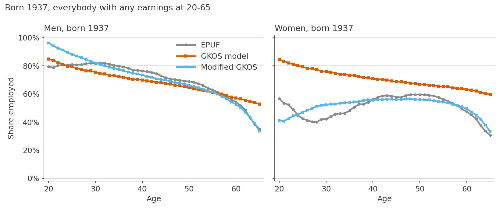

Share not employed:

| Sex | 20 | 25 | 30 | 40 | 50 | 60 | 65 |
|-----|----|----|----|----|----|----|----|
| Men | 21 / 15 / 4 | 19 / 21 / 12 | 18 / 24 / 18 | 24 / 30 / 27 | 31 / 35 / 34 | 46 / 43 / 47 | 65 / 47 / 67 |
| Women | 43 / 16 / 59 | 58 / 21 / 53 | 58 / 24 / 48 | 44 / 29 / 44 | 40 / 33 / 44 | 53 / 37 / 51 | 69 / 41 / 67 |

- **Men from 30 to 65 are within 3 points of EPUF**, including the rise after 50 (47% at 60 vs 46%, 67% at 65 vs
  65%; GKOS 43%, 47%). The widest gaps are 3 points too high at 40–50.
- **Men before 30 are worse than in GKOS.** With a_men = −5.81 almost nobody is out at 20 (4% vs EPUF 21%, GKOS
  15%) and the gap is still 7 points at 25 (12% vs 19%). This cohort's early 20s are covered years, so the 21% is
  not military service; it is the intercept. The low intercept is what lets the permanent exit and the fixed effect
  carry the later non-employment without overshooting the middle ages, and no figure targets the early 20s on
  their own.
- **Women: right from 40 to 65, too high before 25, 10 points low at 30.** At 20 the model has 59% not employed
  against EPUF's 43%, and the profile falls from there (48% at 30) where EPUF rises to its peak of 60% at 27–28:
  with GKOS's b and d a women's intercept this high can only produce a decline (see the open issues). The rise
  after 55 is there (51% at 60 vs 53%, 67% at 65 vs 69%).

#### 3. Permanent exits by age, decomposed

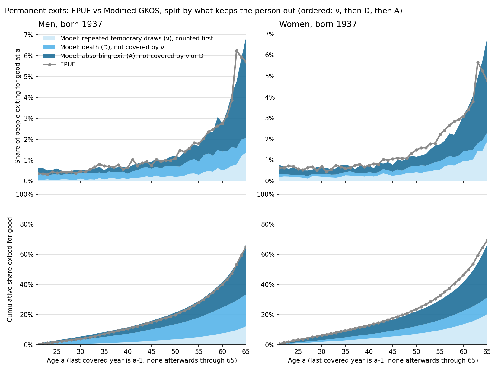

Same construction as Part I, with the absorbing exit as a third part (ordered ν, then D, then A). Cumulative share
exited for good, EPUF / GKOS (ν + D) / modified (ν + D + A):

| Sex | by 45 | by 55 | by 65 |
|-----|-------|-------|-------|
| Men | 14.8 / 11.8 / 15.8 (2.5 + 7.6 + 5.7) | 27.9 / 22.6 / 28.9 (5.0 + 13.0 + 10.9) | 65.0 / 47.2 / 66.5 (12.2 + 21.1 + 33.2) |
| Women | 17.6 / 9.4 / 16.7 (5.4 + 3.8 + 7.5) | 32.5 / 18.3 / 29.5 (9.6 + 6.8 + 13.1) | 69.3 / 40.5 / 66.8 (20.3 + 11.1 + 35.3) |

- **By 65 both sexes are within 3 points of EPUF (men 66.5% vs 65.0%, women 66.8% vs 69.3%)**; GKOS was 18–29
  points short. By 62: men 49.1% vs 47.1%, women 49.3% vs 53.6%. By 45 and 55 both sexes are within 3 points.
- **The mass of exits at 62–63 is there but not the step.** EPUF has 12.1% of men and 10.9% of women with a last
  covered year of 62 or 63; the model 10.7% and 10.6%. EPUF reaches it in a jump at 62 and flattens after; the
  model's hazard ramps from 2.2% at 60 to 11.6% at 65. Getting the step needs a retirement term at 62, not a
  steeper polynomial.
- **For men the absorbing exit (33.2% by 65) is larger than death (21.1%)**; for women it is three times death
  (35.3% vs 11.1%), and ν runs are 20.3%.

### (a) Employment and non-employment transitions across the income distribution

#### 4. Exit: share not employed at a+h by current-earnings rank

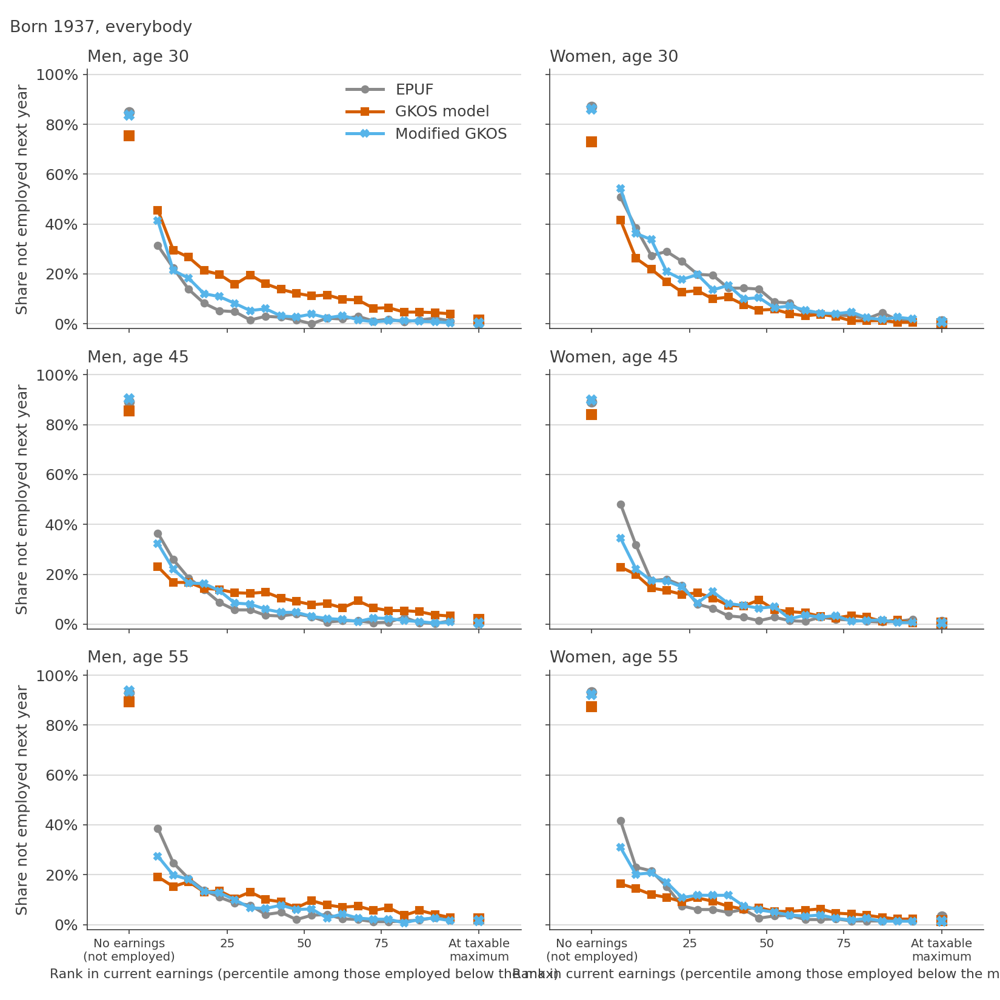
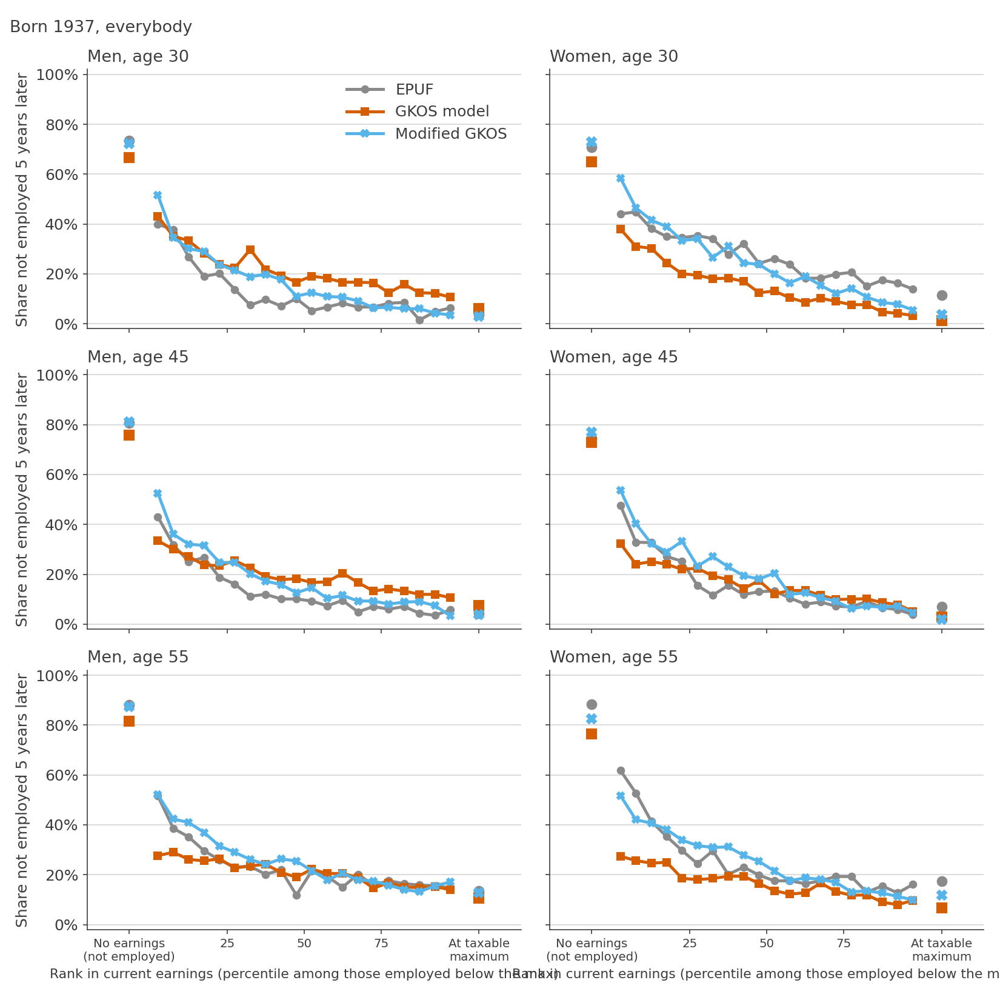

Employed below the max at a, share out at a+1:

| Age | Men | Women |
|-----|-----|-------|
| 30 | 6 / 15 / 7 | 15 / 10 / 14 |
| 45 | 7 / 10 / 8 | 9 / 8 / 9 |
| 55 | 8 / 9 / 8 | 8 / 7 / 9 |

- **Men's exits from employment are on EPUF at every age**, where GKOS had nearly three times too many at 30.
  The whole curve matches at 45 and 55 from the 10th percentile up; at 30 the bottom 20% are 4 points too high
  (23% vs 19%).
- **Young women's exits are right** (14% at 30 vs EPUF 15%, GKOS 10%).
- **The earnings gradient at 55** (bottom 20% vs top 20% of current earners, out the next year): men 24 vs 2%
  EPUF, 16 vs 4% GKOS, **20 vs 2%** modified; women 25 vs 2%, 13 vs 3%, **22 vs 2%**. Five years ahead the bottom
  20% are out 39–48% in EPUF, 26–27% in GKOS, **43%** in the modified model.
- **The not employed (left point) now stay out as in EPUF**: a year later 84–94% vs EPUF 85–93% (GKOS 73–89%).

#### 5. Cumulative rank: everybody, by cumulative-earnings rank to date

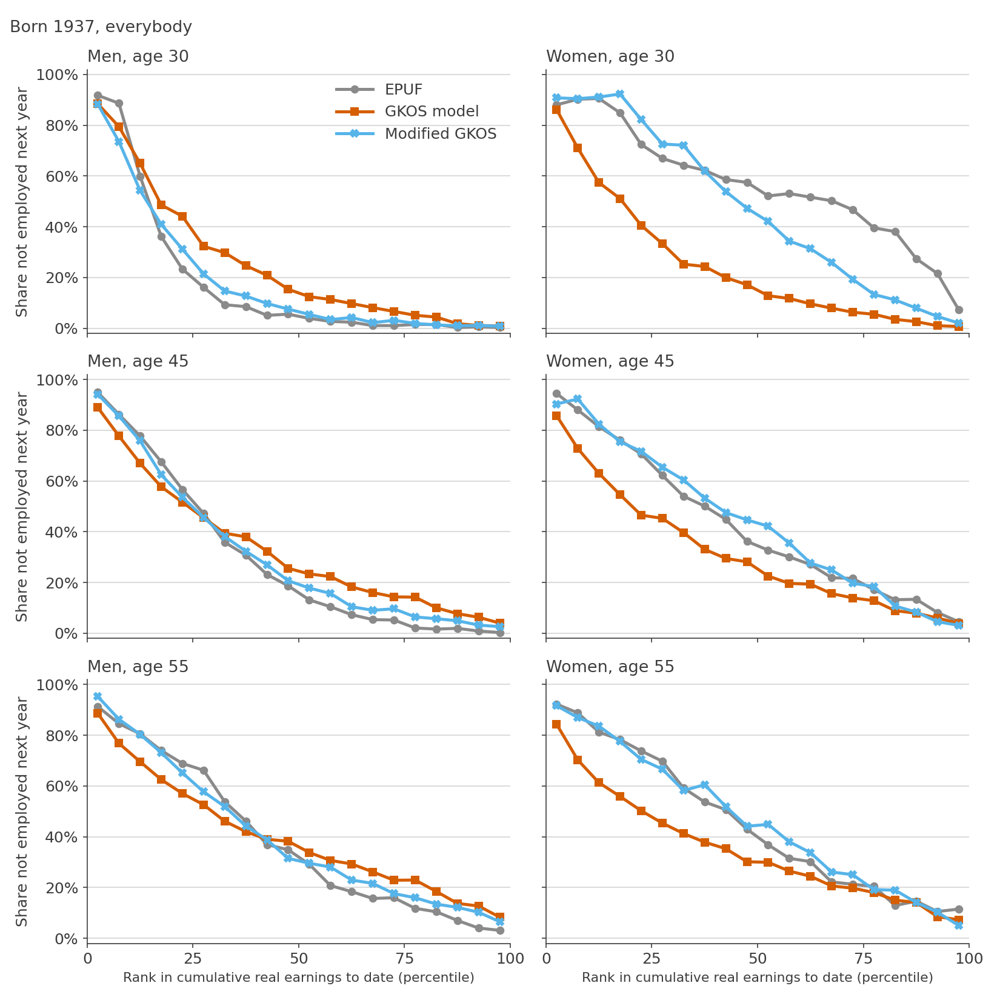
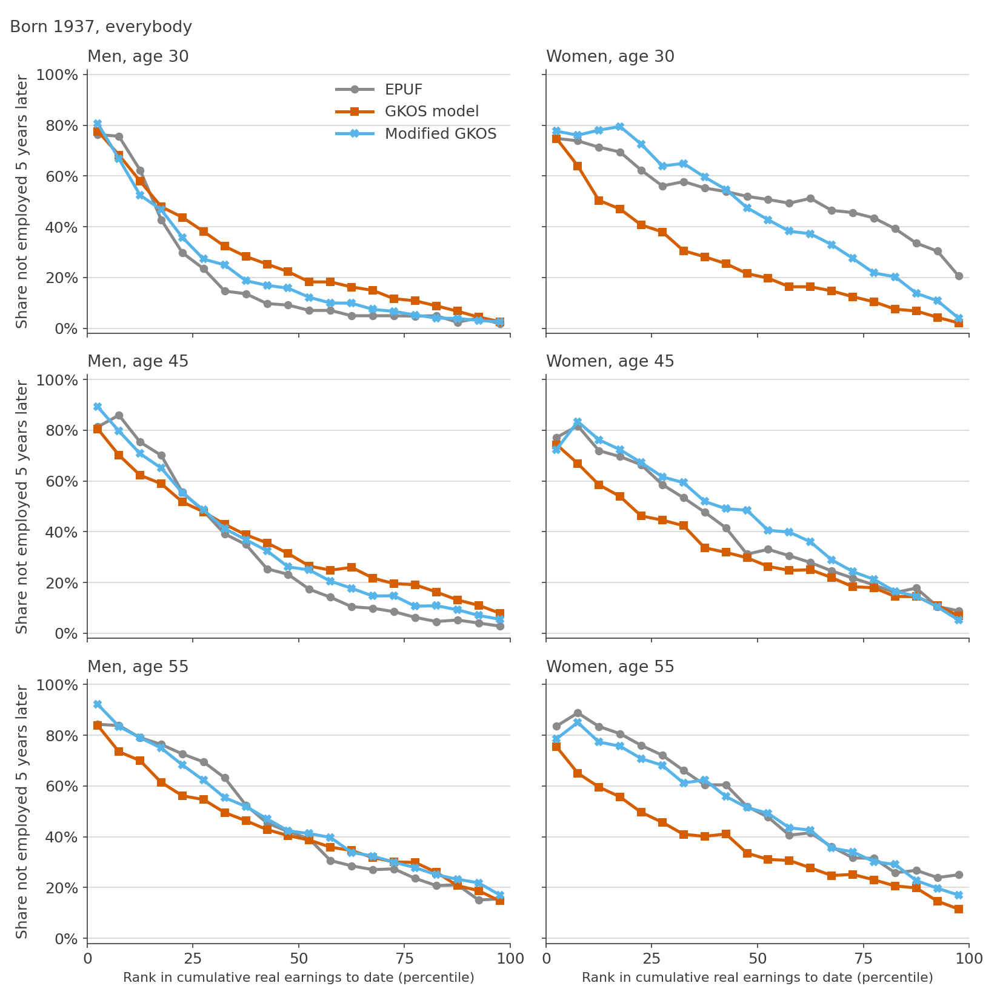

Women, share out one year later, averaged over ranks:

| Women, age | EPUF | GKOS | Modified |
|------------|------|------|----------|
| 30 | 56% | 24% | 47% |
| 45 | 42% | 32% | 44% |
| 55 | 45% | 35% | 46% |

- **Women's level is fixed at 45 and 55 and 9 points short at 30**, all of it in the upper half of cumulative
  earners (top 20% at 30: EPUF 24%, modified 6%, GKOS 2%): women with good early careers who leave at 30 are the
  child-penalty pattern the model cannot time (section 2).
- **The gradient for men is right at 45** (bottom vs top 20%, out a year later: EPUF 82 vs 1%, GKOS 73 vs 7%,
  modified 80 vs 4%), **5 points low at the bottom at 30** (64% vs 69%) and still too flat at the top at 55 (EPUF
  6%, modified 11%, GKOS 13%): men with the highest cumulative earnings retire less abruptly in the model.

### (b) Non-employment dynamics

#### 6. Persistence: the not employed at a, by cumulative-earnings rank

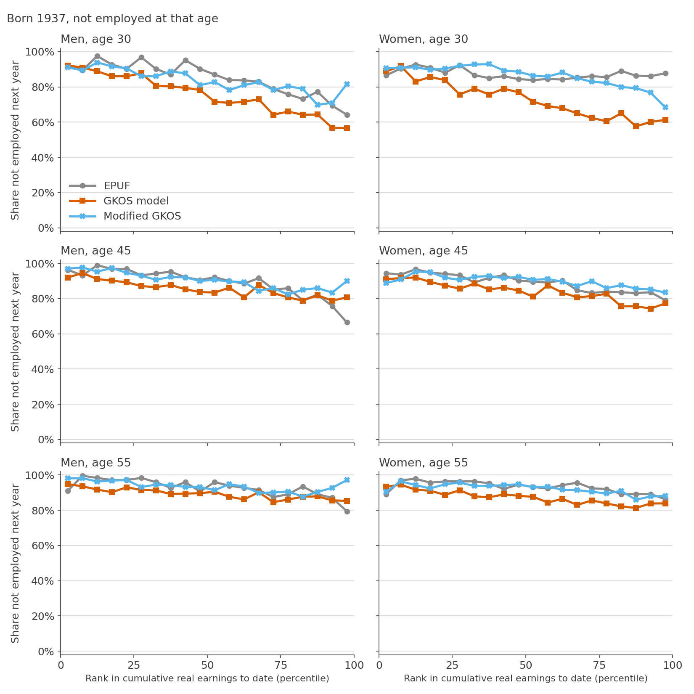
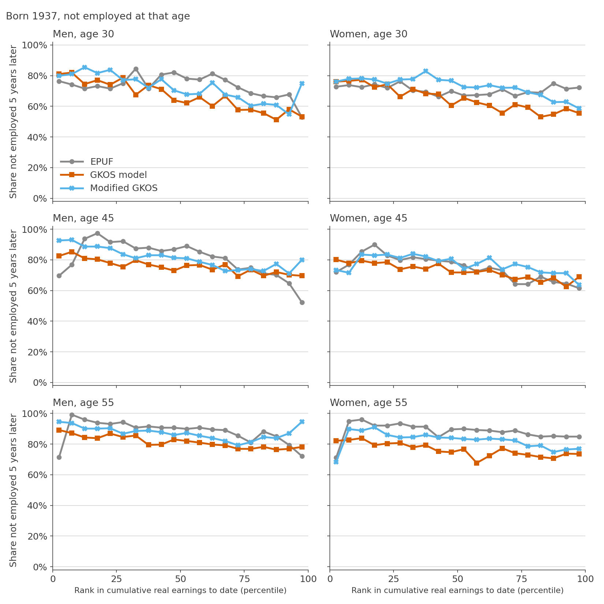

Share of the not employed at a still not employed 1 / 5 years later:

| Sex | Horizon | 30 | 45 | 55 |
|-----|---------|----|----|----|
| Men | 1 year | 85 / 75 / 84 | 89 / 85 / 90 | 93 / 89 / 94 |
|     | 5 years | 73 / 67 / 72 | 81 / 76 / 81 | 88 / 81 / 87 |
| Women | 1 year | 87 / 73 / 86 | 89 / 84 / 90 | 93 / 87 / 92 |
|       | 5 years | 71 / 65 / 73 | 75 / 73 / 77 | 88 / 76 / 82 |

- **5-year persistence is within 2 points of EPUF** except women at 55 (82% vs 88%); men at 45: 81% vs 81%
  (GKOS 76%).
  - Of men not employed at 40–50, the share never employed again by 61 is 55% in the model and 57% in EPUF
    (GKOS 41%; the six-parameter model without the fixed effect 59%); women 43% vs 45% (GKOS 36%).
  - Re-entry odds by years out, men aged 40–55, EPUF / modified: 33 / 24% after 1 year, 19 / 17% after 2,
    14 / 13% after 3, 10 / 10% after 4, 8 / 8% after 5. Only the first year is off: the model's spells are too
    uniform at the start.
- **1-year persistence is within 1 point everywhere.**

#### 7. Earnings changes, arc-percent

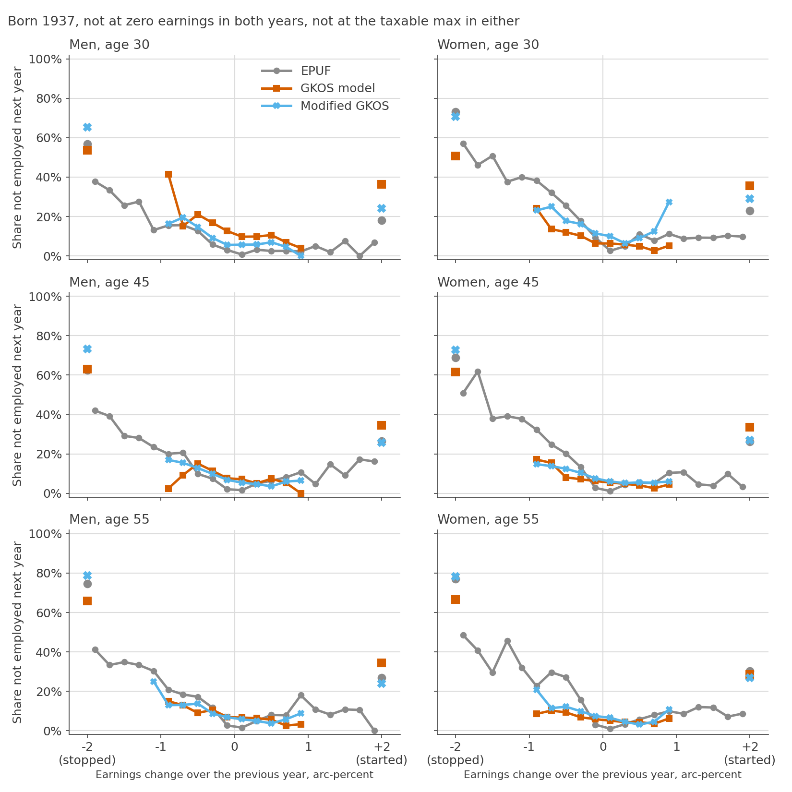
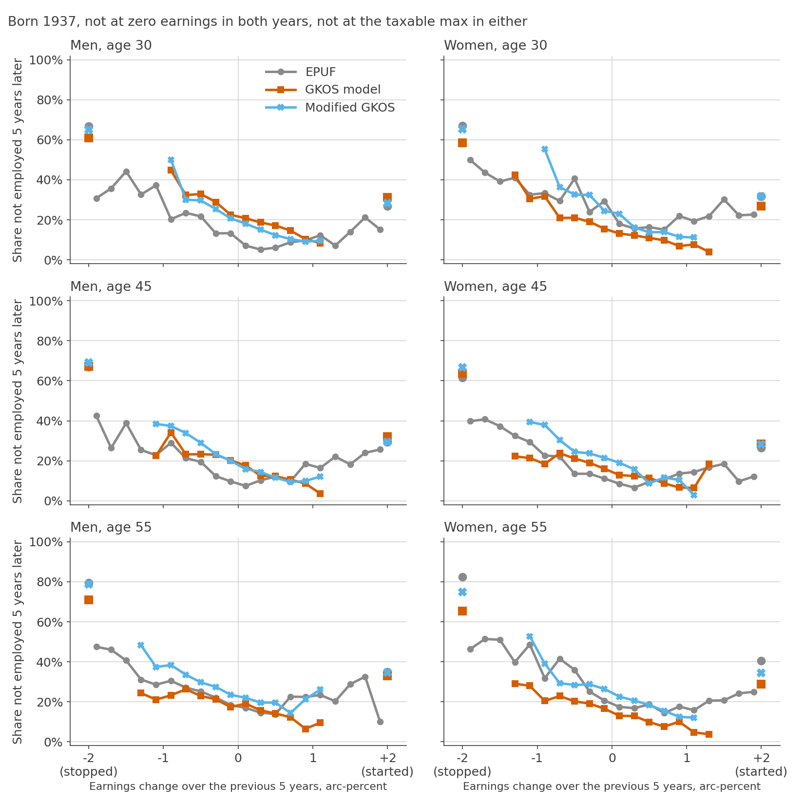

Not targeted in the estimation.

- **Neither model produces large changes.** Share of the one-year sample with an interior change of |arc| > 1:
  EPUF 7–13%, GKOS 0.1–0.3%, modified 0.1–0.4%. The earnings process is untouched, so this cannot move.
- **The stably attached are closer for men, not for women.** Among people with a small change (|arc| < 0.2), share
  out the next year, men at 30 / 45 / 55: EPUF 2 / 2 / 2%, GKOS 11 / 7 / 7%, **modified 6 / 6 / 6%**; women:
  5 / 2 / 2%, 6 / 6 / 5%, **10 / 7 / 7%**. The fixed effect takes exits out of the middle of the change distribution
  for men, not all the way; for women the high intercept puts them back.
- **"Stopped" now stay out at least as much as in EPUF**, men 65 / 73 / 79% at 30 / 45 / 55 vs EPUF 57 / 63 / 75%
  (GKOS 54–66%); women 71 / 73 / 78% vs 73 / 69 / 77%. **"Started" drop out as in EPUF**: men 24–26% vs EPUF
  18–27%, down from GKOS's 34–36%; women 27–29% vs 23–30%.

#### 8. Earnings changes, absolute (real 2013$, symlog axis)

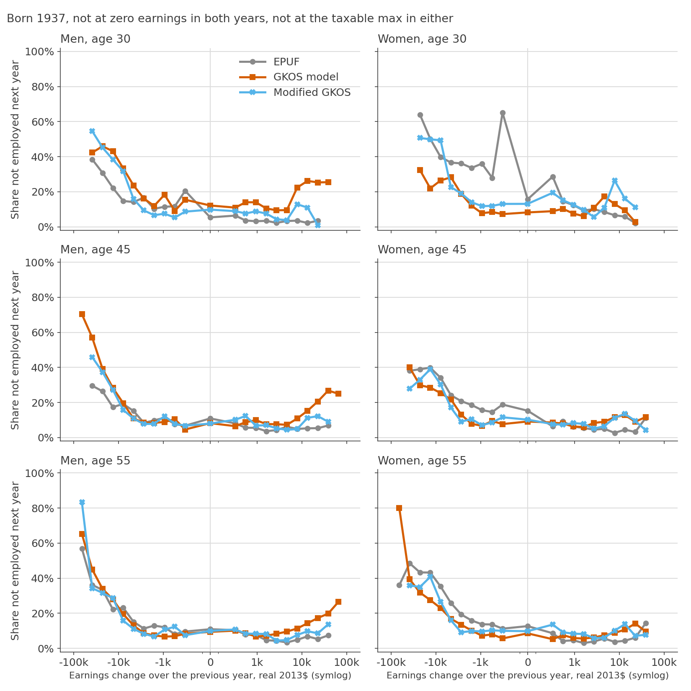
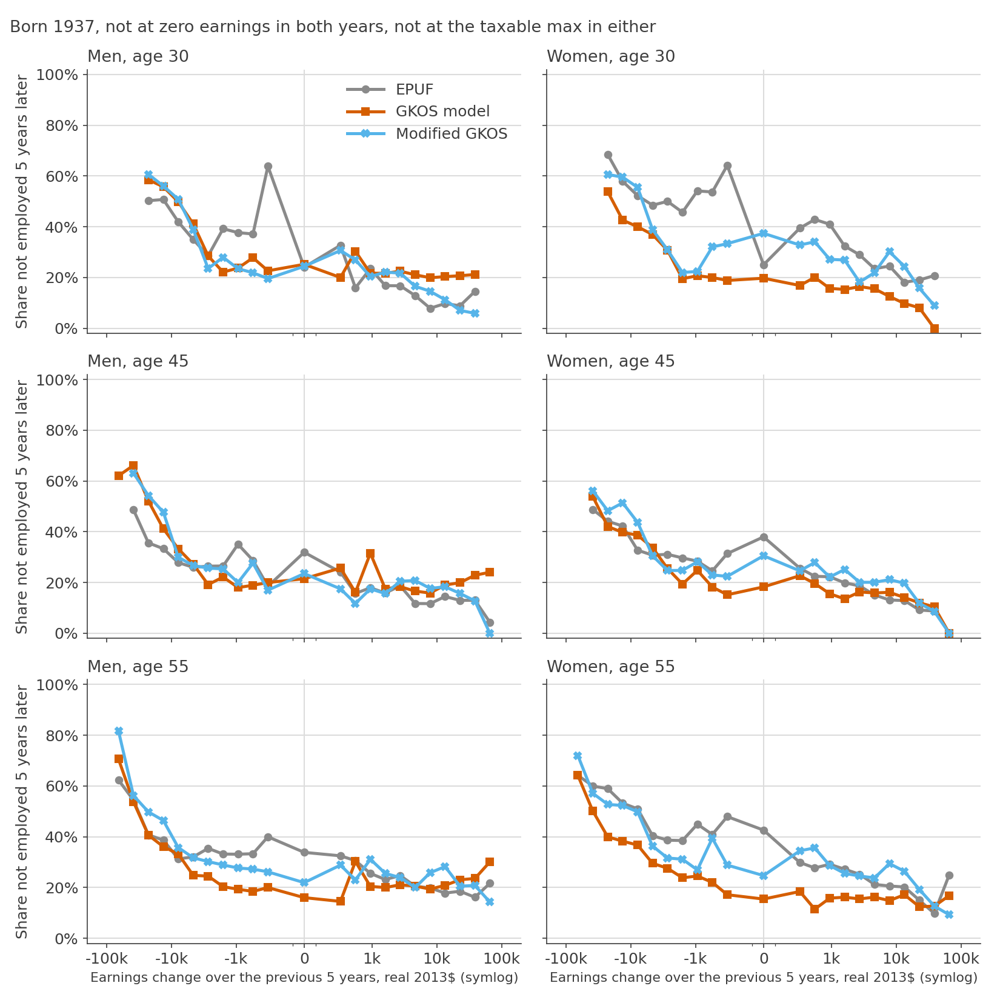

- **The 5-year version at 55 is now centred on EPUF**: the modified model is below EPUF in 12 of 23 bins for men
  (GKOS 16), mean gap +0.3 points (GKOS −4.3); women 15 of 23 (GKOS 21), −2.6 (−12.0). The two absolute-change
  panels remain the largest terms in J (6.0 for the 5-year, 5.1 for the 1-year), because EPUF's curves are jagged
  where the models' are smooth.
- **The centre bin (|Δ| < $250) one year ahead**: men out next year 5 / 12 / 10% at 30, 11 / 8 / 8% at 45,
  11 / 9 / 10% at 55; women 16 / 8 / 13%, 15 / 9 / 10%, 13 / 9 / 10%. EPUF's stable-earnings women leave more than
  either model's at 30 and 45.

#### 9. Large one-year changes: at what age they happen

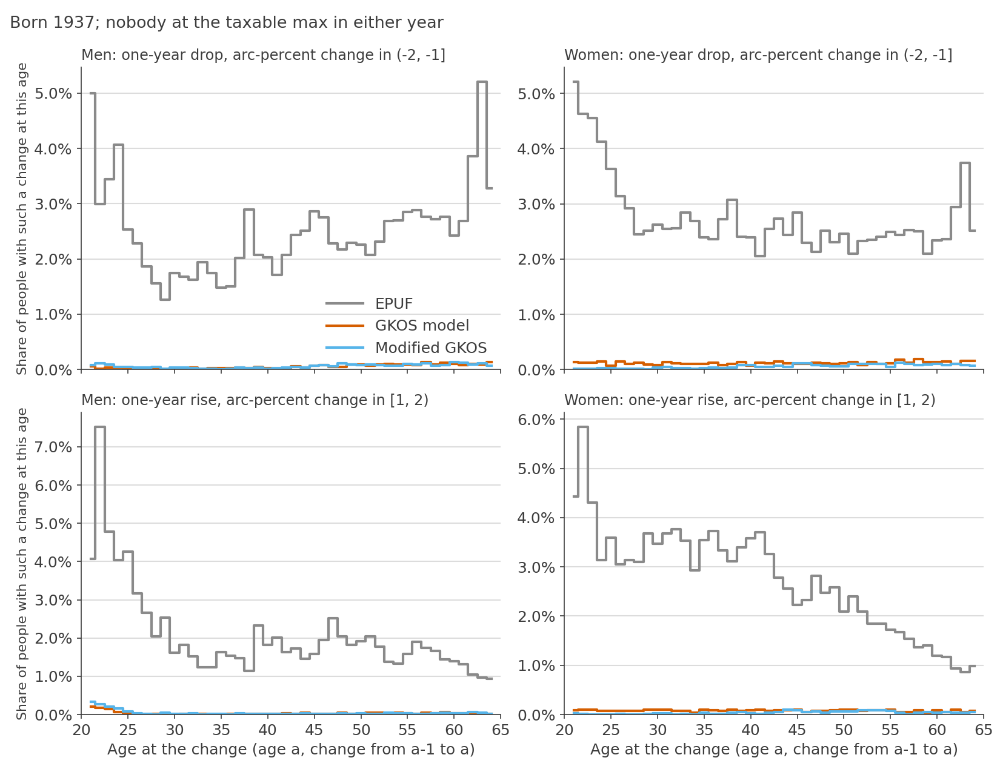

- **Unchanged from GKOS: both models have almost none of these events.** Drops per year, men: EPUF 2.8% at 21–29,
  2.0% at 30–44, 2.4% at 45–54, 2.7% at 55–61, 4.1% at 62–64; GKOS and modified 0.0–0.1% throughout. Rises the
  same. The nonemployment block changes who is at zero, not the size of interior earnings changes.

#### 10. Large one-year changes: what follows

Both models have 30–50 times fewer such events than EPUF (section 9), so their lines rest on a few dozen cases
and are not informative. The EPUF reading is in Part I.

### (c) Non-employment age profile vs. earnings dependence

#### 11. Share not employed by age, within lifetime-earnings quartiles

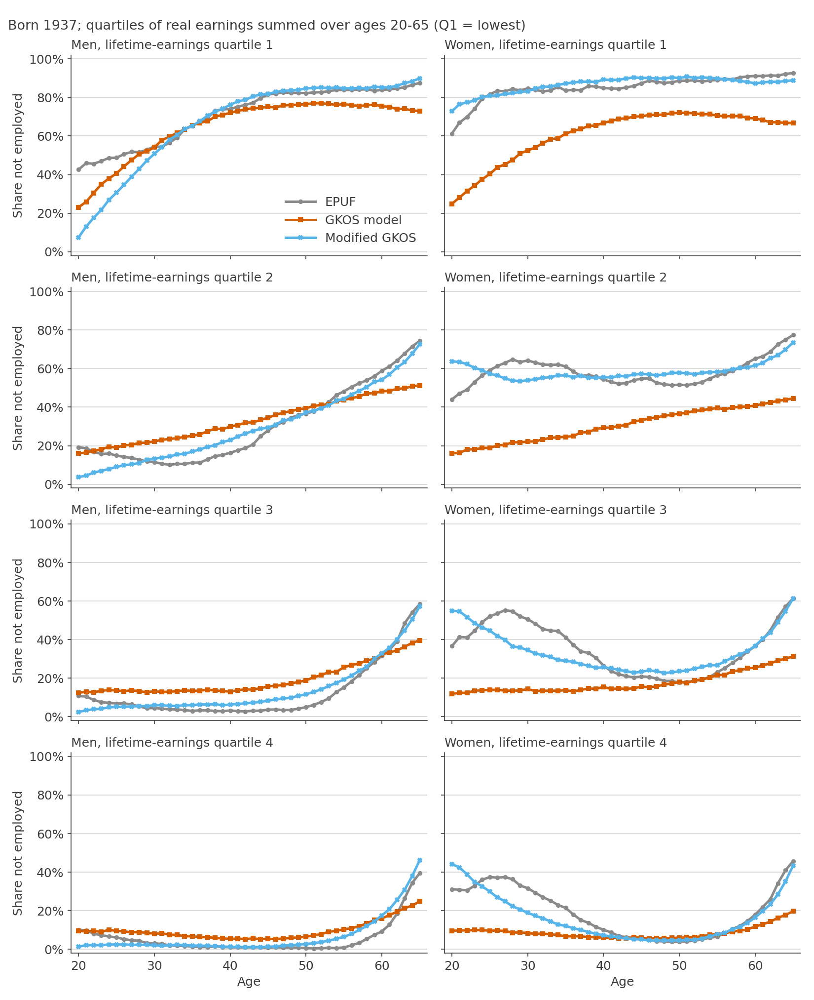

| Sex | Quartile | 25 | 45 | 60 |
|-----|----------|----|----|----|
| Men | Q1 | 49 / 41 / 31 | 82 / 75 / 82 | 84 / 76 / 85 |
|     | Q2 | 15 / 19 / 9 | 28 / 34 / 29 | 59 / 48 / 54 |
|     | Q3 | 7 / 14 / 5 | 4 / 16 / 8 | 32 / 32 / 33 |
|     | Q4 | 6 / 9 / 2 | 1 / 5 / 1 | 9 / 16 / 18 |
| Women | Q1 | 82 / 40 / 81 | 87 / 70 / 90 | 91 / 69 / 87 |
|       | Q2 | 59 / 19 / 57 | 55 / 33 / 57 | 65 / 41 / 62 |
|       | Q3 | 52 / 14 / 45 | 21 / 16 / 23 | 37 / 25 / 37 |
|       | Q4 | 37 / 10 / 30 | 6 / 6 / 5 | 18 / 12 / 16 |

- **Men at 45 are within 4 points of EPUF in every quartile** (Q2 29 vs 28%, Q3 8 vs 4%, Q4 1 vs 1%; GKOS 34, 16
  and 5%): most of the upper half's mid-career gap that GKOS had is closed; Q3 keeps 4 points of it.
- **Men at 60 are on EPUF in Q1–Q3** (85 / 54 / 33% vs 84 / 59 / 32%) and 9 points too high in Q4 (18% vs 9%):
  the exit hazard is flat in earnings, so the late rise lands in every quartile alike where EPUF's is concentrated
  in Q1–Q2.
- **Men at 25 are too low in every quartile** (Q1: 31% vs 49%; Q4: 2% vs 6%), the early-20s problem of section 2.
- **Women: the level in each quartile is right from 35 to 65** (within 4 points; GKOS was 20–40 points low in
  Q1–Q2); the 25–35 hump in Q2–Q4 still comes out as a decline from 20 (Q3 at 20: 55% vs 37%).

#### 12. Share of remaining years not employed, by cumulative earnings to date

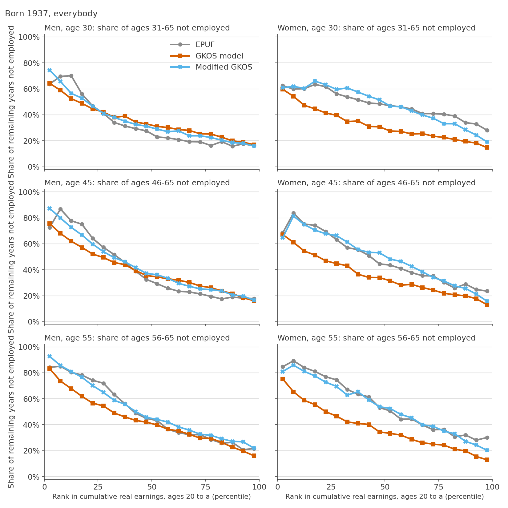

Selected ventiles:

| Group | 1st ventile | 2nd | 5th | Median (10th–11th) | 20th |
|-------|-------------|-----|-----|--------------------|------|
| Men, 30   | 64 / 64 / 74 | 70 / 59 / 66 | 47 / 45 / 47 | 25 / 32 / 30 | 16 / 17 / 16 |
| Men, 45   | 73 / 76 / 87 | 87 / 68 / 80 | 64 / 52 / 60 | 31 / 35 / 37 | 18 / 16 / 17 |
| Men, 55   | 84 / 83 / 93 | 85 / 74 / 86 | 74 / 57 / 70 | 44 / 41 / 45 | 22 / 16 / 22 |
| Women, 30 | 62 / 60 / 61 | 60 / 54 / 62 | 62 / 41 / 63 | 48 / 29 / 49 | 28 / 15 / 19 |
| Women, 45 | 68 / 67 / 65 | 84 / 61 / 81 | 69 / 47 / 68 | 44 / 33 / 51 | 24 / 13 / 16 |
| Women, 55 | 85 / 75 / 81 | 89 / 65 / 86 | 77 / 50 / 73 | 52 / 34 / 53 | 30 / 13 / 20 |

- **The missing exits at the bottom are back**: ventiles 2–5 for men at 45 and 55 are within 7 points of EPUF
  (GKOS was 11–19 short). The lowest ventile now overshoots for men (74–93% vs 64–84%): the fixed effect makes
  the men with the least earnings to date nearly certain never to work again, where EPUF's lowest ventile
  includes late starters.
- **Women's child penalty at 30 is matched in level**: the median is 49% vs 48% (GKOS 29%), the 5th ventile 63%
  vs 62%. The top ventile is still 8–10 points short at every age (19% vs 28% at 30, 16% vs 24% at 45, 20% vs 30%
  at 55).

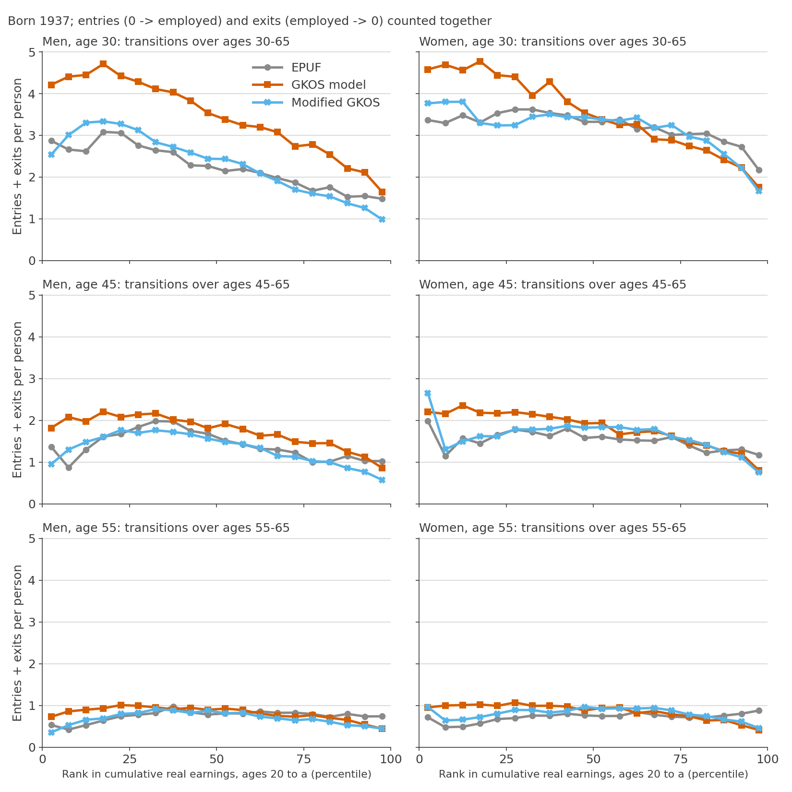

Entries + exits per person over a..65, by rank quintile:

| Group | Bottom 20% | 20–40% | 40–60% | 60–80% | Top 20% |
|-------|------------|--------|--------|--------|---------|
| Men, 30   | 2.8 / 4.4 / 3.0 | 2.8 / 4.2 / 3.0 | 2.2 / 3.5 / 2.4 | 1.9 / 2.9 / 1.8 | 1.6 / 2.1 / 1.3 |
| Men, 45   | 1.3 / 2.0 / 1.3 | 1.9 / 2.1 / 1.7 | 1.6 / 1.9 / 1.5 | 1.2 / 1.6 / 1.2 | 1.1 / 1.2 / 0.8 |
| Men, 55   | 0.5 / 0.9 / 0.6 | 0.8 / 1.0 / 0.9 | 0.8 / 0.9 / 0.8 | 0.8 / 0.8 / 0.7 | 0.7 / 0.6 / 0.5 |
| Women, 30 | 3.4 / 4.7 / 3.7 | 3.6 / 4.3 / 3.4 | 3.4 / 3.5 / 3.4 | 3.1 / 3.0 / 3.2 | 2.7 / 2.3 / 2.3 |
| Women, 45 | 1.5 / 2.2 / 1.8 | 1.7 / 2.2 / 1.7 | 1.6 / 1.9 / 1.8 | 1.5 / 1.6 / 1.7 | 1.2 / 1.2 / 1.1 |
| Women, 55 | 0.6 / 1.0 / 0.7 | 0.7 / 1.0 / 0.9 | 0.8 / 0.9 / 0.9 | 0.8 / 0.8 / 0.9 | 0.8 / 0.6 / 0.6 |

- **Men's churning is within 0.2 of EPUF at every rank and age up to the 80th percentile** (GKOS: 0.5–1.6 too many
  at 30). Low cumulative earners now exit and stay out rather than cycling.
- **The top quintile is short for men at every age** (1.3 vs 1.6 at 30, 0.8 vs 1.1 at 45, 0.5 vs 0.7 at 55) and
  for women at 30 and 55 (2.3 vs 2.7; 0.6 vs 0.8): with the fixed effect, high earners' careers are uninterrupted,
  and the retirement transitions among them are missing.
- **Women's bottom quintile at 30 and 45 still churns a little too much** (3.7 vs 3.4; 1.8 vs 1.5).

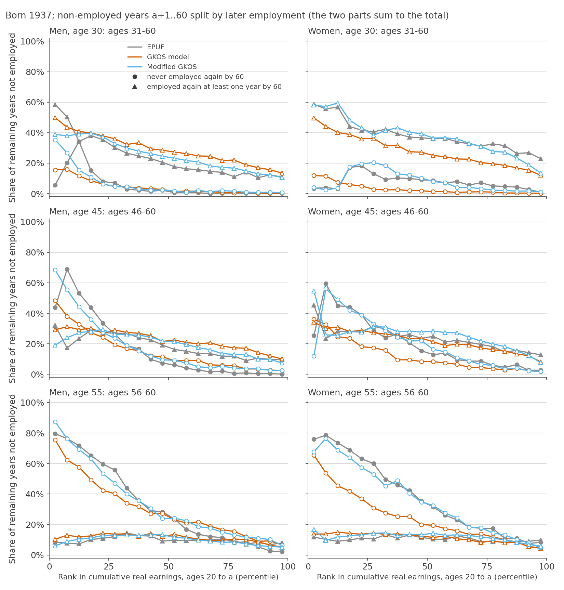

Share of remaining years to 60 not employed, split by never employed again / employed again, means over rank
quintiles:

| Group | Bottom 20%: never again | Bottom 20%: re-entry | 40–60%: never again | 40–60%: re-entry | Top 20%: never again | Top 20%: re-entry |
|-------|------|------|------|------|------|------|
| Men, 30   | 19 / 13 / 22 | 45 / 43 / 39 | 1 / 2 / 2 | 19 / 28 / 24 | 0 / 1 / 1 | 12 / 16 / 13 |
| Men, 45   | 52 / 37 / 51 | 25 / 30 / 25 | 7 / 10 / 10 | 18 / 23 / 22 | 0 / 3 / 3 | 10 / 13 / 10 |
| Men, 55   | 73 / 61 / 74 | 8 / 12 / 9 | 24 / 25 / 25 | 10 / 13 / 12 | 5 / 9 / 10 | 8 / 8 / 6 |
| Women, 30 | 7 / 9 / 7 | 54 / 43 / 56 | 9 / 2 / 9 | 36 / 26 / 38 | 3 / 0 / 2 | 27 / 16 / 21 |
| Women, 45 | 44 / 29 / 40 | 31 / 31 / 34 | 16 / 8 / 19 | 24 / 22 / 28 | 4 / 3 / 3 | 14 / 12 / 13 |
| Women, 55 | 74 / 52 / 69 | 10 / 14 / 13 | 34 / 20 / 34 | 11 / 12 / 14 | 9 / 7 / 9 | 9 / 7 / 8 |

- **The permanent-exit shortfall at the bottom is closed for men** (never again, bottom quintile: 51% vs 52% at
  45, 74% vs 73% at 55; GKOS 37%, 61%) **and mostly for women** (40% vs 44% at 45, 69% vs 74% at 55; GKOS 29%,
  52%).
- **Women at 30 now have the child-penalty re-entry mass** (38% vs 36% in the middle quintile; GKOS 26%) and the
  middle quintile's permanent exits (9% vs 9%; GKOS 2%); the top quintile's re-entry is still short (21% vs 27%).
- **Men's re-entry non-employment above the median is still a little high at 30** (24% vs 19% in the middle
  quintile), down from GKOS's 28%.
- **The top quintile at 55 has too many permanent exits for men** (10% vs 5%): the earnings-blind hazard again.

### (d) Weak labour-force attachment

#### 13. Entries and exits up to 65, by current earnings

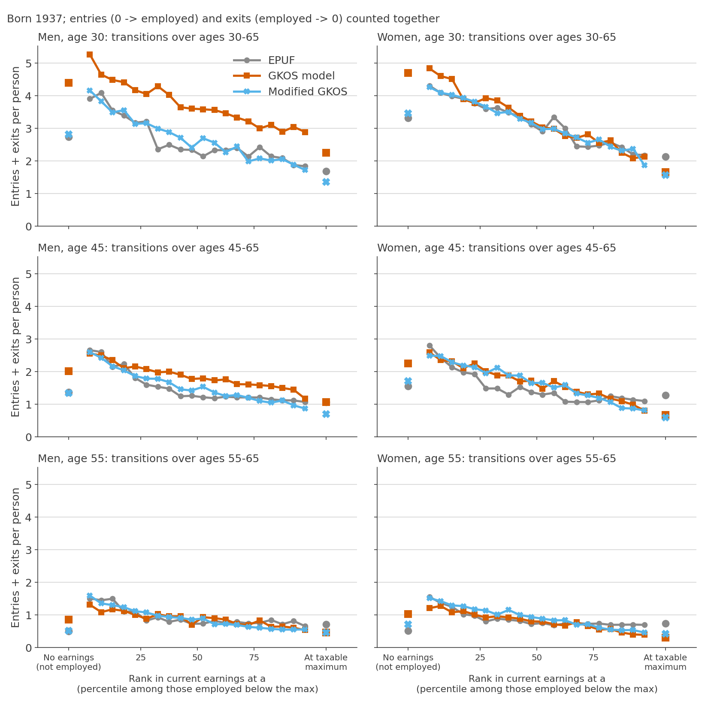

Entries + exits per person over a..65:

| Group | Not employed at a | Bottom 20% of earners | Middle 20% | Top 20% below max | At max |
|-------|-------------------|-----------------------|------------|-------------------|--------|
| Men, 30   | 2.7 / 4.4 / 2.8 | 3.7 / 4.7 / 3.8 | 2.3 / 3.6 / 2.6 | 2.0 / 3.0 / 1.9 | 1.7 / 2.2 / 1.4 |
| Men, 45   | 1.4 / 2.0 / 1.4 | 2.4 / 2.4 / 2.3 | 1.2 / 1.8 / 1.4 | 1.1 / 1.4 / 1.0 | 1.1 / 1.1 / 0.7 |
| Men, 55   | 0.5 / 0.9 / 0.5 | 1.4 / 1.2 / 1.4 | 0.8 / 0.9 / 0.8 | 0.8 / 0.6 / 0.6 | 0.7 / 0.5 / 0.5 |
| Women, 30 | 3.3 / 4.7 / 3.5 | 4.1 / 4.5 / 4.1 | 3.2 / 3.2 / 3.1 | 2.3 / 2.3 / 2.2 | 2.1 / 1.7 / 1.6 |
| Women, 45 | 1.6 / 2.3 / 1.7 | 2.3 / 2.3 / 2.4 | 1.4 / 1.7 / 1.7 | 1.2 / 1.0 / 0.9 | 1.3 / 0.7 / 0.6 |
| Women, 55 | 0.5 / 1.0 / 0.7 | 1.3 / 1.2 / 1.4 | 0.7 / 0.8 / 0.9 | 0.7 / 0.5 / 0.5 | 0.7 / 0.3 / 0.4 |

- **The not employed at a now have EPUF's number of future transitions** (men 2.8 / 1.4 / 0.5 vs EPUF 2.7 / 1.4 /
  0.5; GKOS 4.4 / 2.0 / 0.9): a zero is the start of a long or permanent spell in the model too.
- **Men at 30 are within 0.3 along the whole earnings line** (GKOS 1.0–1.3 too many).
- **Top earners and those at the max at 45–55: both models have too few transitions**, the modified one fewer
  (men at the max at 45: EPUF 1.1, GKOS 1.1, modified 0.7; women 1.3 / 0.7 / 0.6): retirement among high
  earners, the same gap as in sections 5 and 12.

#### 14. Entries and exits over ages 20–65, by lifetime earnings

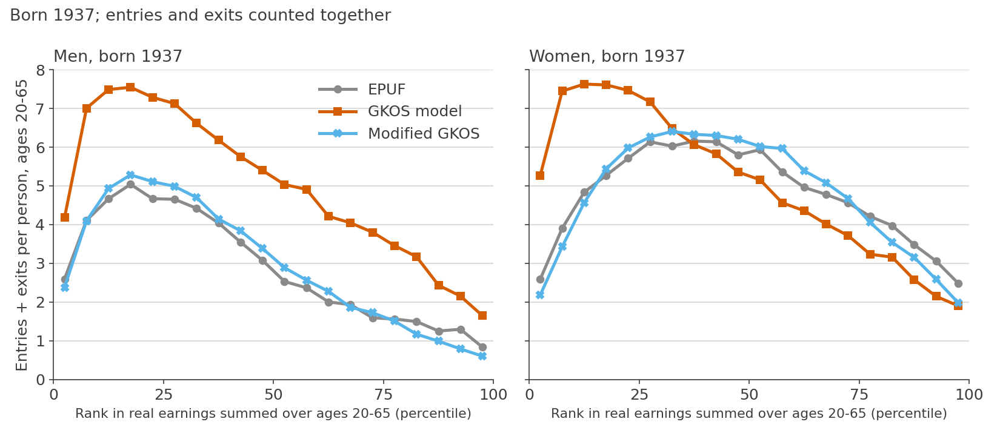

| | Average | Peak | Lowest ventile | Top ventile |
|---|---|---|---|---|
| Men   | 2.9 / 5.0 / 3.0 | 5.0 at the 18th pct / 7.5 at the 18th / 5.3 at the 18th | 2.6 / 4.2 / 2.4 | 0.8 / 1.6 / 0.6 |
| Women | 4.8 / 5.1 / 4.8 | 6.2 at the 38th / 7.6 at the 13th / 6.4 at the 32nd | 2.6 / 5.3 / 2.2 | 2.5 / 1.9 / 2.0 |

- **The shape and the averages are right for both sexes**: the peaks are at EPUF's positions with EPUF's heights,
  where GKOS put both at the 13th–18th percentile and 1.4–2.5 too high.
- **Men are 0.3 too high from the 10th to the 40th percentile and short above the 70th** (top ventile 0.6 vs
  0.8): with the fixed effect, high lifetime earners' careers are uninterrupted.
- **Women churn slightly too little at both ends** (lowest ventile 2.2 vs 2.6, top ventile 2.0 vs 2.5).

#### 15. Future entries and exits by age, within lifetime-earnings quartiles

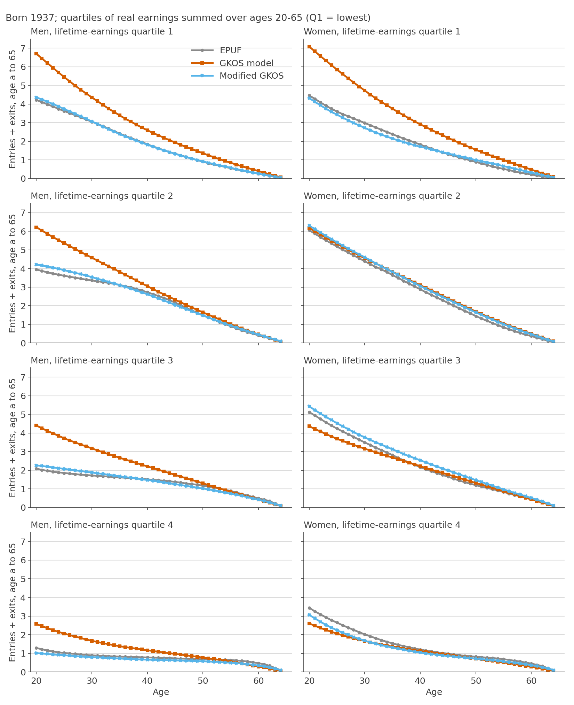

| Sex | Quartile | From 20 | From 30 | From 50 |
|-----|----------|---------|---------|---------|
| Men | Q1 | 4.2 / 6.7 / 4.4 | 3.1 / 4.4 / 3.1 | 0.9 / 1.4 / 0.9 |
|     | Q2 | 3.9 / 6.2 / 4.2 | 3.4 / 4.6 / 3.5 | 1.5 / 1.6 / 1.5 |
|     | Q3 | 2.1 / 4.4 / 2.3 | 1.7 / 3.2 / 1.9 | 1.2 / 1.3 / 1.0 |
|     | Q4 | 1.3 / 2.6 / 1.0 | 0.9 / 1.7 / 0.8 | 0.7 / 0.8 / 0.6 |
| Women | Q1 | 4.5 / 7.1 / 4.3 | 3.0 / 4.7 / 2.7 | 0.9 / 1.6 / 1.0 |
|       | Q2 | 6.1 / 6.2 / 6.3 | 4.4 / 4.6 / 4.6 | 1.5 / 1.7 / 1.6 |
|       | Q3 | 5.1 / 4.4 / 5.4 | 3.5 / 3.2 / 3.8 | 1.2 / 1.3 / 1.5 |
|       | Q4 | 3.4 / 2.6 / 3.1 | 2.0 / 1.7 / 1.7 | 0.8 / 0.7 / 0.7 |

- **Q1–Q3, both sexes: the churning is right from every age** (men Q1 4.4 vs 4.2 from 20, Q3 2.3 vs 2.1; GKOS 6.7
  and 4.4). EPUF's lowest earners have few, long spells, and so do the model's now.
- **Q4 is 0.3 low from 20 for both sexes** (men 1.0 vs 1.3, women 3.1 vs 3.4): the top quartile's careers are
  uninterrupted with the fixed effect, where EPUF's top earners still have one transition more.

### Summary

- **A sex-specific intercept fixes women's level**: lifetime employment, the years-worked distribution and the
  quartile levels at 35–65.
- **Last year's status fixes 1-year persistence and lifetime churning** for both sexes, without changing the level.
- **A permanent exit, flat in earnings, near zero from 30 to 45 and steep after 55, fixes 5-year persistence**
  (men at 45: 81% vs EPUF 81%), the share who never return (55% vs 57% of men out at 40–50), the missing exits at
  the bottom of the cumulative-earnings distribution, and men's employment from 30 to 65 including the rise after
  50.
- **The fixed effect in the logit fixes men's exits across the earnings distribution** (the exit curves at 45 and
  55 sit on EPUF's from the 10th percentile up) **and most of the upper half's mid-career gap** (Q3 and Q4 at 45:
  8% and 1% vs EPUF 4% and 1%, from 16% and 5% in GKOS).
- **What it costs:** men's intercept is −5.8, so the model has almost no non-employment before 25 (4% not employed
  at 20 vs 21%, 12% at 25 vs 19%); the top quartile of men churns too little (1.0 vs 1.3 future transitions from
  20; top ventile 0.6 vs 0.8 over the whole window); the lowest ventile of cumulative earners is too certain never
  to return.
- **Still missing for both sexes:**
  - the step of exits at 62–63 (the level by 65 is right, but the hazard ramps through 60–65 instead of jumping
    at 62), and retirement among the highest earners (too few transitions at the taxable maximum at 45–55, too
    many permanent exits in the top 20% of cumulative earners at 55);
  - men's late rise lands in every quartile alike (Q4 at 60: 18% vs 9%).
- **For women the model misses the timing:** too much non-employment before 25 (59% at 20 vs 43%), from GKOS's
  linear age slope at the women's intercept; the child-penalty level at 30 is right in the lower half but its
  re-entry is not timed and the upper half is short.
- **Untouched by construction:** the size of interior earnings changes (sections 7–10), which is the earnings
  process, not the nonemployment block.

---

## Part IV. GKOS's own targeted moments under the modified block

GKOS estimated every parameter of the process at once, by SMM on seven sets of moments (Appendix D.1; 1,227
moments, each set weighted 1/7, deviations in arc-percent):

| Set | Moments | Count |
|-----|---------|-------|
| i | sd, skewness, kurtosis of **one-year** arc-percent earnings changes, 3 age groups × 13 recent-earnings (RE) groups | 117 |
| ii | the same for **five-year** changes | 117 |
| iii | impulse responses at 1-, 2- and 3-year horizons: E[change t−1 → t+k \| age, RE, change t−1 → t] | 480 |
| iv | the same at 5- and 10-year horizons | 320 |
| v | average dollar earnings at ages 25, 30, …, 60 for 15 lifetime-earnings (LE) groups | 120 |
| vi | the CDF of total years employed over ages 25–60 | 35 |
| vii | within-cohort variance of log earnings by age 25–60 | 36 |

Most of these are moments of earnings *changes*, and the largest changes in any earnings panel are the moves into
and out of employment (an arc-percent change of −2 or +2). GKOS's nonemployment block therefore carries a large
part of their fit, and the other parameters (σ_α, σ_β, ρ, the z and ε mixtures) were chosen jointly with it.
Part II replaced the block and held everything else at GKOS's values. **The worry is how far that pulls down the
fit of the moments the untouched parameters were estimated on.** This part recomputes GKOS's Figure 12
("estimated model versus data: key moments": sets ii, v, vi and vii) for this cohort, with EPUF, the GKOS model
and the modified model on the same panels, men and women separately.

### What is computed

GKOS's definitions (Sections 2.2 and 5, Appendices C.2 and D.1), the same code on EPUF and on both models
(`code/dynamics/gkos_moments.py` → `gkos_fig12_yob1937_absq_alpha.csv`; figure `plots/plot_gkos_fig12.py`):

- **Y_min**: one quarter of full-time work at half the federal minimum wage, 260 × the minimum wage of the year
  (GKSW's minimum-wage matrix, `guv_targets.sel0_threshold`): $299 in 1962, $1,235 in 1997.
- **Recent earnings, GKOS's construction.** A person is in the RE sample at t if earnings were at or above Y_min
  at t−1 and in at least two of t−5…t−2; RE is the mean over t−5…t−1 of max(Y, Y_min) in 2013 dollars, ranked into
  percentiles within the cohort-year cell (one age, so GKOS's age-dummy residualisation within year is moot), with
  a random tie-break because EPUF is capped and random-rounded.
- **(a)–(c)**: the five-year arc-percent change 2(Y_{t+5} − Y_t)/(Y_{t+5} + Y_t) on raw earnings whenever one of the
  two years is positive (employed → out is exactly −2, out → employed +2); sd and the third and fourth
  standardised moments for GKOS's 13 RE groups (1, 2–10, 11–20, …, 81–90, 91–95, 96–99, 100) within each
  five-year age bin (25–29 … 50–54 at t−1), averaged over the six bins.
- **(d)**: the LE sample is everyone at or above Y_min in at least 15 of the ages 25–60; LE is mean earnings over
  25–60, zeros included; 15 groups (1, 2–5, 6–10, 11–20, …, 81–90, 91–95, 96–97, 98–99, 100); the statistic is
  log E[Y_55 | group] − log E[Y_25 | group], zeros included.
- **(e)**: the CDF of the number of ages 25–60 with earnings at or above Y_min, among people with at least one.
- **(f)**: the variance of log earnings at each age among earnings at or above Y_min.
- **Models**: as in Part III (GKOS's process, this project's g(t), TR2023 mortality; GKOS's logit or the estimated
  block), 100,000 people per sex, common random numbers, put through EPUF's disclosure protection year by year
  (cap, random rounding, sub-$100 code) before anything is computed.

**The cap is the main caveat.** EPUF's share of men at the taxable maximum is 27% at 25, 41% at 30, 45% at 35,
32% at 40, 17% at 45 and 11% at 55 (women 1–4%). In the top RE and LE groups all three series are ranked on a
censored measure and their "changes" are the cap's own arithmetic: the top LE group's growth 25 → 55 is the same
number on all three lines because everyone in it is at the cap in both years, and the skewness and kurtosis at the
top of (b)–(c) are a spike at the cap's real growth plus a left tail. The comparison is like for like everywhere,
but only the bottom and middle of each panel speak to the process. GKOS's own figure is for men, 1978–2013,
uncapped W-2 earnings, so the levels are not theirs; the three lines are to be read against each other.

### Figures

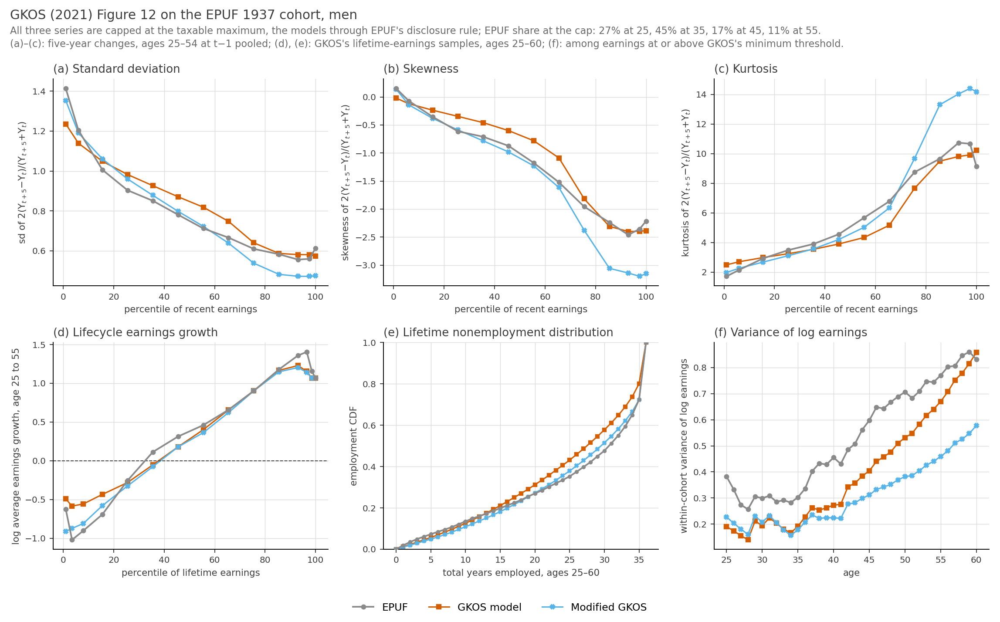

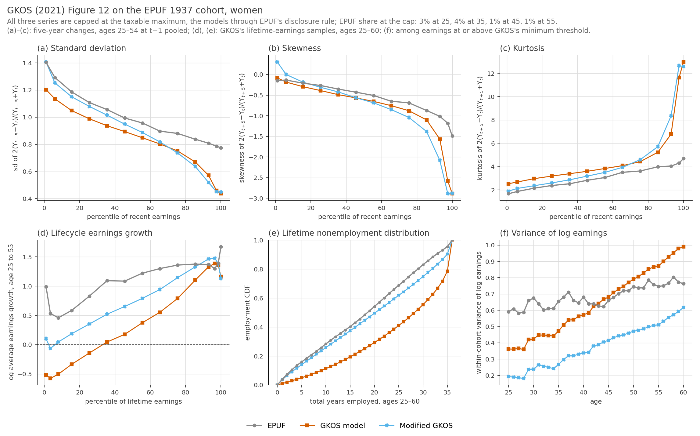

Tables read EPUF / GKOS / modified.

Five-year arc-percent change by RE group:

| RE group | 1 | 2–10 | 21–30 | 41–50 | 61–70 | 81–90 | 91–95 | 100 |
|---|---|---|---|---|---|---|---|---|
| Men, sd | 1.41 / 1.24 / 1.35 | 1.20 / 1.14 / 1.19 | 0.90 / 0.98 / 0.96 | 0.78 / 0.87 / 0.80 | 0.67 / 0.75 / 0.64 | 0.58 / 0.59 / 0.48 | 0.56 / 0.58 / 0.47 | 0.61 / 0.57 / 0.47 |
| Men, skewness | 0.15 / −0.02 / 0.14 | −0.07 / −0.12 / −0.14 | −0.61 / −0.35 / −0.59 | −0.87 / −0.60 / −0.98 | −1.52 / −1.09 / −1.62 | −2.24 / −2.31 / −3.06 | −2.46 / −2.40 / −3.14 | −2.22 / −2.39 / −3.15 |
| Men, kurtosis | 1.71 / 2.49 / 1.97 | 2.15 / 2.70 / 2.26 | 3.48 / 3.24 / 3.11 | 4.56 / 3.90 / 4.20 | 6.78 / 5.16 / 6.33 | 9.65 / 9.49 / 13.30 | 10.74 / 9.81 / 14.04 | 9.13 / 10.23 / 14.18 |
| Women, sd | 1.40 / 1.20 / 1.41 | 1.29 / 1.14 / 1.25 | 1.11 / 0.99 / 1.08 | 0.99 / 0.89 / 0.95 | 0.90 / 0.80 / 0.82 | 0.84 / 0.67 / 0.64 | 0.81 / 0.57 / 0.52 | 0.77 / 0.44 / 0.45 |
| Women, skewness | −0.15 / −0.08 / 0.30 | −0.14 / −0.18 / 0.00 | −0.27 / −0.39 / −0.31 | −0.43 / −0.57 / −0.56 | −0.65 / −0.76 / −0.85 | −0.87 / −1.10 / −1.38 | −1.01 / −1.57 / −2.08 | −1.49 / −2.88 / −2.88 |
| Women, kurtosis | 1.67 / 2.53 / 1.90 | 1.87 / 2.68 / 2.13 | 2.38 / 3.19 / 2.60 | 2.82 / 3.60 / 3.18 | 3.51 / 4.08 / 3.94 | 3.98 / 5.23 / 5.71 | 4.05 / 6.79 / 8.36 | 4.69 / 12.97 / 12.58 |

Log average earnings growth 25 → 55 by LE group:

| LE group | 1 | 2–5 | 11–20 | 31–40 | 51–60 | 71–80 | 91–95 | 98–99 |
|---|---|---|---|---|---|---|---|---|
| Men | −0.62 / −0.49 / −0.91 | −1.02 / −0.59 / −0.87 | −0.69 / −0.43 / −0.58 | 0.11 / −0.05 / −0.08 | 0.46 / 0.40 / 0.36 | 0.90 / 0.90 / 0.90 | 1.36 / 1.23 / 1.20 | 1.16 / 1.07 / 1.07 |
| Women | 0.99 / −0.52 / 0.10 | 0.53 / −0.58 / −0.06 | 0.59 / −0.34 / 0.19 | 1.09 / 0.05 / 0.52 | 1.22 / 0.37 / 0.79 | 1.36 / 0.79 / 1.15 | 1.37 / 1.33 / 1.47 | 1.39 / 1.36 / 1.38 |

Employment CDF, share with at most this many years employed over 25–60:

| Years employed | 1 | 5 | 10 | 18 | 25 | 30 | 35 |
|---|---|---|---|---|---|---|---|
| Men | 0.02 / 0.01 / 0.01 | 0.07 / 0.06 / 0.05 | 0.13 / 0.13 / 0.11 | 0.24 / 0.27 / 0.23 | 0.35 / 0.43 / 0.38 | 0.48 / 0.58 / 0.51 | 0.72 / 0.80 / 0.72 |
| Women | 0.04 / 0.01 / 0.04 | 0.16 / 0.05 / 0.14 | 0.28 / 0.11 / 0.26 | 0.48 / 0.25 / 0.45 | 0.69 / 0.41 / 0.62 | 0.83 / 0.56 / 0.75 | 0.95 / 0.79 / 0.90 |

Variance of log earnings among earnings above Y_min:

| Age | 25 | 30 | 40 | 50 | 55 | 60 |
|---|---|---|---|---|---|---|
| Men | 0.38 / 0.19 / 0.23 | 0.30 / 0.19 / 0.21 | 0.46 / 0.27 / 0.22 | 0.71 / 0.53 / 0.38 | 0.77 / 0.67 / 0.46 | 0.83 / 0.86 / 0.58 |
| Women | 0.59 / 0.36 / 0.19 | 0.67 / 0.42 / 0.24 | 0.68 / 0.57 / 0.34 | 0.74 / 0.79 / 0.47 | 0.75 / 0.87 / 0.51 | 0.76 / 0.99 / 0.62 |

### Reading

- **Where the block itself was the problem, the fit improves.** Men's lowest RE group is dominated by moves in
  and out of work and the modified model sits close to EPUF where GKOS does not (sd 1.35 vs 1.41, GKOS 1.24;
  skewness +0.14 vs +0.15, GKOS −0.02; kurtosis 1.97 vs 1.71, GKOS 2.49); through the middle it is as close or
  closer on all three moments (p41–50: sd 0.80 vs 0.78, GKOS 0.87; kurtosis 4.2 vs 4.6, GKOS 3.9), though the
  agreement in the middle is itself two errors cancelling: at p41–50 both models have too many men out five years
  later (14.6–15.1% vs 10.2%, where the one-year exit rates match: the model's exits are spread over everyone
  with the same index, EPUF's are concentrated on a subset) and too few changes that are either very small or
  very large (36.7% of EPUF's changes are within ±0.2 and 9.0% beyond ±1; the models 26% and 1.3%), with the
  difference parked in moderate changes. The
  years-employed CDF is EPUF's for both sexes (men at 30 years 0.51 vs 0.48, GKOS 0.58; women at 18 years 0.45 vs
  0.48, GKOS 0.25), and the lifecycle decline of low-LE men is reproduced where GKOS is flat (p1: −0.91 vs −0.62,
  p2–5: −0.87 vs −1.02; GKOS −0.49, −0.59). For women the lifecycle growth in (d) moves half-way to EPUF (median
  group 0.79 vs 1.22, from GKOS's 0.37), and the gain is all on the extensive margin: splitting the growth of the
  zeros-included mean into Δ log P(employed) + Δ log E[Y | employed] within the LE group, the median group reads
  +0.49 + 0.73 in EPUF, −0.09 + 0.46 in GKOS and +0.31 + 0.48 in the modified model. In EPUF the share of the
  group employed rises from 53% at 25 to 87% at 55 (re-entry after child-rearing and the secular rise in
  participation); in GKOS it falls (88% to 80%), in the modified model it rises (60% to 81%), because with
  a_women ≈ 0 and GKOS's age terms women's non-employment falls with age (the open issue on the sign of the
  age profile). The right sign for a mechanical reason, but the right sign is what (d) rewards. Conditional on
  working, the two models grow alike (+0.46, +0.48) and both are short of EPUF's +0.73, which is the women's
  g(t) and the missing growth in hours. The LE sample itself (≥ 15 years employed) takes 58% of EPUF's women,
  62% of the modified model's and 81% of GKOS's, so the conditioning is not what moves the panel. That the
  conditional growth comes out alike is two selection channels cancelling (decomposing log E[Y | employed] at 55
  minus at 25 into g, α, β·t, z and ε among the employed at each age, median LE group): the fixed-effect term
  raises the β·t part from −0.03 (GKOS) to +0.15, because with κ > 0 women with low α + β·t are out at older
  ages, fail the 15-year screen and leave the LE sample, so the sample and every group in it carry a higher β
  (the same channel lifts the bottom groups' conditional growth by 0.15–0.25, from a less negative β); and the
  women's intercept at ≈ 0 makes employment at 25 very selective on z (mean z among employed women 0.61 against
  GKOS's 0.29), a selection that relaxes by 55 as the index shifts onto α + β·t, so the z part is −0.13 against
  GKOS's +0.11. With κ set to zero the conditional growth would be 0.37, below both.
- **Where the untouched parameters were co-estimated with GKOS's block, the fit deteriorates.**
  - *Top of the RE distribution, (a)–(c).* From p75 up the modified model has too little dispersion and too heavy
    a left tail (p81–90: sd 0.48 vs 0.58, skewness −3.1 vs −2.2, kurtosis 13.3 vs 9.7; GKOS 0.59 / −2.3 / 9.5).
    **This is not the cap or the tie-break.** The top four RE groups are the same population in all three
    sources, people at the cap in all five RE years (78–100% of EPUF's members, 87–100% of the models'; 86–93% at
    the cap at t), split at random, which is why their values are flat across groups in every source. What
    differs is what those people do next. The five-year change of men's 81–90 group, pooled over ages 25–54
    (the decompositions in this bullet are for men):

    | | EPUF | GKOS | Modified |
    |---|---|---|---|
    | out at t+5 | 5.1% | 6.9% | 4.4% |
    | at the cap at t and still at it at t+5 | 72% | 74% | 74% |
    | at the cap at t, below it but positive at t+5 | 24% | 20% | 22% |
    | arc change among those, mean / 10th percentile | −0.28 / −1.29 | −0.18 / −0.60 | −0.20 / −0.66 |
    | sd / skewness / kurtosis of the group | 0.61 / −2.1 / 7.6 | 0.60 / −2.2 / 8.9 | 0.50 / −2.9 / 11.9 |

    The same group's five-year changes by size (share of the group, EPUF / GKOS / modified): exactly −2, 5.1 /
    6.9 / 4.4%; (−2, −1], 4.0 / 0.3 / 0.5%; (−1, −0.2], 6.1 / 8.6 / 10.3%; (−0.2, 0.5], 83.1 / 83.3 / 84.3%;
    above 0.5, 1.7 / 0.9 / 0.6%. **The modified model has less mass in the left tail than EPUF, not more**: fewer
    exits and almost none of EPUF's employment-to-employment drops beyond −1. Its skewness and kurtosis are
    larger in magnitude because they are standardised by a smaller sd: with the body compressed into (−1, 0.5],
    the exits at −2 sit 4.2 sd below the mean against 3.4 in EPUF, and the fourth moment weights that by the
    fourth power. Among employment-to-employment changes alone the models' sd is 0.36–0.45 against EPUF's 0.64,
    and 12% of EPUF's are below −1 against 1–2% of the models'. The right tail is fatter in EPUF as well (1.7% of
    the group above +0.5 against 0.6% in the modified model: more re-entries from a zero year, 0.3% vs 0.03%,
    and more large employment-to-employment rises), and that runs the same way: a fatter right tail makes the
    data's skewness *less* negative. By contribution to skewness, EPUF's exits give −1.64, its drops beyond −1
    −0.64 and its right tail +0.25 (total −2.07); the modified model's exits give −2.84, its drops −0.06 and its
    right tail +0.12 (total −2.92). The standardised exit is the whole story: 4.0 sd from the mean in the model
    against 3.2 in EPUF.

    So the modified model has EPUF's share of exits at the top and EPUF's share of people who fall below the cap;
    what it lacks is the *size* of the drops. EPUF's high earners who fall below the cap fall a long way (a tenth
    of them by more than −1.3 in arc terms); the models' fall a little (−0.6), because the earnings process does
    not produce large interior changes (Part I, sections 7 and 9). GKOS matches the top's sd and kurtosis anyway
    because it has too many exits among high earners (6.9% vs 5.1%), and the extra −2s stand in for the missing
    big drops: two errors cancelling. The modified block removes the excess exits and exposes the gap in the
    earnings process. At 50–54 a second piece appears: EPUF's top earners leave more (12% out five years later
    vs 9–10% in both models) and those who stay drop further (mean −0.71 vs −0.31 / −0.35), partial and full
    retirement among high earners, the gap of sections 5, 12 and 13.
  - *The variance of log earnings, (f).* Both models are too compressed before 40 even on capped earnings (men at
    25: 0.19–0.23 vs 0.38), which is the earnings process, not the block. From 45 on GKOS rises to EPUF's level
    (0.86 vs 0.83 at 60) while the modified model stays at 0.58; for women it is 0.19–0.62 against EPUF's flat
    0.59–0.76 at every age. **Neither the sample rule nor the cap explains it.** GKOS compute set vii on
    observations above Y_min (Appendix D.1), which is the rule used here; their revolving-panel rule (above Y_min
    at a, at a−1 and in two of a−5…a−2) or a stronger one (above Y_min in all of a−5…a) lowers everyone's
    variance and narrows the gap without closing it. Men at 60, EPUF / GKOS / modified:

    | sample | above Y_min at a | revolving panel | all of a−5…a |
    |---|---|---|---|
    | capped (as in the figure) | 0.83 / 0.86 / 0.58 | 0.70 / 0.82 / 0.53 | 0.62 / 0.79 / 0.50 |
    | models uncapped | — / 1.24 / 0.92 | — / 1.22 / 0.88 | — / 1.21 / 0.87 |

    **The gap is at the bottom of the workers' distribution.** The 10th percentile of log earnings among
    workers, relative to the median, men: at 40 EPUF −1.24, GKOS −1.01, modified −0.88; at 60 EPUF −1.56, GKOS
    −1.40, modified −1.07; the 90th percentile relative to the median is right or too high in both models
    (+0.83 / +1.02 / +0.95 at 60). EPUF has men working at a fifth of the median at every age (part-year and
    part-time earners, who are absent from the GKOS process by construction: its low-earnings state is exactly
    zero); the modified model's workers earn at least a third of the median. Women: EPUF's p10 is −1.4 relative
    to the median at every age, the modified model's −0.55 at 25 to −0.96 at 60.

    **The mechanism is selection on an index that is nearly log earnings.** The employment index of the modified
    block, x = z + κ·(α + β·t), has correlation 0.94–0.95 with log earnings (GKOS's z alone: 0.81 at 40, 0.67 at
    60), and because the slope c + d·t steepens to −15.5 by 60 the logit is close to a step in x. So who works at
    60 is close to "log earnings above a threshold", and the workers are a left-truncated earnings distribution.
    Among men employed at 60 (uncapped), the two components have similar variances in both models (α + β·t: 0.91
    GKOS, 0.81 modified; z: 0.34, 0.43), but selecting on their sum makes them negatively correlated among the
    employed (about −0.3), which takes 0.3 off the variance of log earnings (1.27 vs 0.92). In GKOS the selection
    is on z alone, so α + β·t keeps its full dispersion among workers.

    **Why the gap grows with age, and that it is κ alone.** Men's uncapped variance of log earnings among the
    employed, with the block's pieces switched off one at a time (all other parameters as estimated):

    | | 25 | 40 | 50 | 60 |
    |---|---|---|---|---|
    | GKOS | 0.43 | 0.70 | 0.95 | 1.27 |
    | modified | 0.47 | 0.62 | 0.76 | 0.92 |
    | modified, permanent exit off | 0.47 | 0.62 | 0.76 | 0.92 |
    | modified, lagged status off | 0.49 | 0.65 | 0.78 | 0.94 |
    | modified, κ = 0 | 0.49 | 0.74 | 0.98 | 1.30 |
    | the covariance term 2·cov(α + β·t, z) among the employed, modified | −0.02 | −0.12 | −0.22 | −0.34 |

    The permanent exit is earnings-blind, so removing people through it leaves the distribution of the rest
    unchanged (the row is identical); the lagged status adds 0.02. With κ = 0 the variance is GKOS's. The
    covariance term grows with age for two reasons that multiply: the HIP part's variance rises from 0.10 at 25
    to 0.91 at 60, so κ·(α + β·t) becomes a larger share of the index, and the z-slope steepens from −5.3 to
    −15.5, so the logit turns from a soft gradient into a threshold. At 25 the index is almost all z and the
    induced correlation is −0.06; at 60 it is −0.29. The tension is structural: the exit-by-earnings curves of
    section 4 are matched by making employment depend on the person's whole earnings level, and any block that
    does so truncates the workers' earnings distribution from below as long as "low earnings" and "not employed"
    are the same state.

    **Women: the intercept truncates z when young, κ takes over with age.** Women's uncapped variance among the
    employed at 25 / 40 / 60: GKOS 0.44 / 0.70 / 1.28, modified 0.29 / 0.47 / 0.80. With κ = 0 (intercept as
    estimated) 0.33 / 0.62 / 1.23; with GKOS's intercept (κ as estimated) 0.38 / 0.55 / 0.88; with the permanent
    exit off, unchanged. At 25 the index is nearly all z and the women's intercept near zero puts the margin at
    the median of z, so the women who work are the upper half of the z distribution (var of z among the employed
    0.22 against GKOS's 0.32; mean z 0.56 against 0.23): that is the intercept, worth 0.11 of the 0.15 gap. By 60
    the truncation of z has faded (the threshold drifts down and the index shifts onto α + β·t; var of z among
    the employed 0.38) and the κ covariance has grown to −0.39, which is the whole 0.48 gap. So the variance
    rises less with age in the modified model because the covariance term grows against the HIP fan, not because
    the z range narrows: GKOS's women fan out with men's σ_β (sd 0.60 → 1.00 capped), EPUF's barely do
    (0.77 → 0.87), and the modified model's are held back by the covariance (0.44 → 0.79). GKOS is off for women
    at both ends for the two reasons already named: too narrow at 25–40 for want of the part-time lower half
    (EPUF's p10 is −1.4 relative to the median, GKOS's −0.8), too wide at 55–60 from a HIP fan estimated on men.

    **A wider or skewed initial condition would not fix it.** The model's latent distribution of log earnings
    (everyone alive, before the employment draw) has the right lower half down to the 10th percentile at 25–40:
    men's p25 / p10 / p5 / p1 relative to the median at 25 are −0.53 / −1.00 / −1.29 / −1.82 latent against EPUF's
    workers' −0.52 / −1.13 / −1.53 / −2.29, and the workers' −0.46 / −0.83 / −1.03 / −1.36 are what is left after
    the bottom 12% are drawn out of employment; at 40 the latent p10 is −1.17 (EPUF −1.24), the workers' −0.89.
    The latent distribution is symmetric (skewness 0.0), EPUF's workers are strongly left-skewed (−1.4 at 25,
    −2.1 at 40), and the model's workers are right-skewed once the left tail is cut (+0.3 to +0.5 uncapped).
    Raising σ_z0 or σ_α would widen the upper half, which is already too wide (latent p90 +0.98 at 25, +1.45 at
    60), and extra mass in the lower tail of z or α would be removed by the employment margin, because that is
    the index the logit loads on. The skew EPUF has is in a transitory, low-positive-earnings state (part-year
    work: p1 workers at a tenth of the median) that does not enter attachment; the GKOS process has no such
    state, its transitory mixture is right-skewed (rare component mean +0.27) and its only left skew sits in the
    persistent z innovations.
  - *Women's top RE groups.* EPUF women's five-year changes stay dispersed up the RE distribution (sd 0.84 at
    p81–90 and 0.77 at the top, kurtosis 4.0–4.7); both models collapse (sd 0.45, kurtosis 12.6–13.0 at the top).
    The same decomposition as for men (p81–90, ages 25–54 pooled, EPUF / GKOS / modified): exits 11.4 / 6.6 /
    6.6%; employment-to-employment drops beyond −1, 6.4 / 1.9 / 1.5%; rises beyond +1, 1.5 / 0.2 / 0.1%; changes
    within ±0.2, 48.5 / 31.9 / 35.4%; moderate declines in (−1, −0.2], 10.5 / 26.6 / 25.9%. So for women three
    things are missing at the top, not one: the large moves in both directions (the sd of employment-to-employment
    changes is 0.55 in EPUF against 0.42–0.45, the hours margin), the exits (the modified block changes women's
    *level* of non-employment through the intercept but keeps GKOS's male slope c + d·t, so high-earning women do
    not leave), and the stability of those who stay (EPUF's top women mostly hold their earnings; the models put a
    quarter of them on a moderate decline, z mean-reverting from a high level against a flat women's g(t)). In
    the middle (p41–50) the exits are right (17 / 14 / 19%) and only the large moves are missing (8.3% of EPUF's
    employment-to-employment changes below −1 and 6.2% above +1, against 0.7–1.4% and 1.6–2.2%).

### Cross-sectional moments of log earnings by age

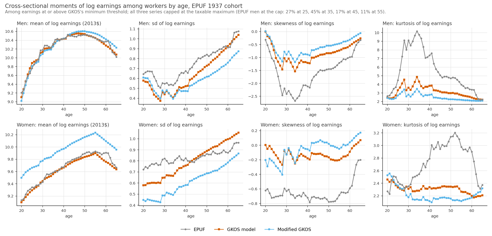

The lifecycle of the mean, sd, skewness and kurtosis of log real earnings among workers (at or above Y_min),
ages 20–65, the capped counterpart of GKSW's cross-sectional moments. EPUF / GKOS / modified:

| | age | Men | Women |
|---|---|---|---|
| sd | 25 | 0.62 / 0.44 / 0.48 | 0.77 / 0.60 / 0.44 |
| | 40 | 0.67 / 0.52 / 0.47 | 0.83 / 0.76 / 0.58 |
| | 60 | 0.91 / 0.93 / 0.76 | 0.87 / 1.00 / 0.79 |
| skewness | 25 | −1.40 / −1.02 / −0.81 | −0.70 / −0.14 / −0.29 |
| | 40 | −2.11 / −1.21 / −0.89 | −0.72 / −0.18 / −0.05 |
| | 60 | −0.98 / −0.54 / −0.31 | −0.59 / −0.09 / +0.04 |
| kurtosis | 25 | 4.5 / 3.3 / 2.7 | 2.4 / 2.3 / 2.4 |
| | 40 | 7.4 / 3.8 / 2.8 | 2.8 / 2.3 / 2.1 |
| | 60 | 3.4 / 2.5 / 2.1 | 2.9 / 2.2 / 2.2 |

- **Men's mean is right in all three** (within 0.1 log points from 25 to 55; the modified model 0.07 high at
  45–55, the selected workers), and the cap governs the higher moments before 45: with 41–45% of men at the
  taxable maximum at 30–35, EPUF's skewness reaches −2.4 and its kurtosis 9, a spike at the cap with a tail
  below it. Both models are capped the same way but have fewer men at the cap there (31–34%) and a shorter tail,
  so their skewness stays near −1 and their kurtosis near 3–4. After 50, where the cap fades, EPUF's workers are
  still more left-skewed and more kurtotic than either model's, and the modified model's are the least so.
- **Women's mean is 0.3 log points too high in the modified model at every age** (9.66 vs EPUF's 9.34 at 25):
  the women it has working are the upper half of the index distribution, so they earn more than EPUF's working
  women. GKOS's mean is right because it has nearly everyone working.
  **The corner in both models' women's mean at 55 is the functional form of g(t)**: GKOS's quadratic plus a
  hinge (t − t₅₅)₊ fitted to EPUF's medians beyond 55 (`--mode smm-p50`), with h_old = −0.47 per decade for
  women of this cohort against −0.06 for men, so the slope of g jumps from +0.010 a year to −0.037 at 55. EPUF's
  own mean among working women bends over 53–62 rather than turning at a point.
- **The models' cross-sections of levels are low-variance and low-kurtosis, not high-kurtosis.** Women's
  kurtosis is 2.1–2.5 in both models against EPUF's 2.3–3.2, men's 2.1–3.8 against 3.4–9.1; the modified model's
  women are not left-skewed at all (+0.04 at 60, EPUF −0.59). A truncated near-normal distribution is platykurtic.
  The excess kurtosis the GKOS process is built to produce is in earnings *changes*, not in the cross-section of
  levels; the cross-section's missing piece is the left tail of low earners, in both models, and more so in the
  modified one.

### What holding the other parameters fixed costs, and what it does not

- **The miss in (f) is the price of making low earnings and non-employment the same state.** It is not a
  sample-rule artefact (tested above) and not the cap. The modified block fits the employment facts of Parts
  II–III by tying non-employment tightly to the person's earnings level through κ and the steep z-slope, and the
  cost is that nobody works at low earnings: everyone who would is out. EPUF has both, people out and people
  working at a fifth of the median, and the variance among workers is carried by the latter. Re-estimating σ_α
  and the innovation variances jointly with the block would push them up to restore the variance (GKOS's own
  Model (1) ran σ_α to 1.18 for a related reason), but that would widen the top, which is already too wide; the
  missing object is a low-positive-earnings state, a part-year or partial-retirement margin, which the GKOS
  process does not have (its low-earnings state is exactly zero) and this block does not add. Until it exists,
  (f) will be too low wherever the block is doing its job.
- **The top of (a)–(c) is a real cost, but of the earnings process, not the block.** Re-estimating with the
  modified block, the innovation mixtures would have to supply the large drops among high recent earners that
  GKOS's excess exits were standing in for; the impulse responses (sets iii–iv), which condition on the same RE
  groups, would move with them.
- **For women the binding constraint is the earnings slope of the logit (c, d), not the level.** The intercept
  fixes the amount of non-employment, (e), but not its gradient in earnings, the top of (a)–(c).
- **Untouched by construction**: the moments of interior earnings changes and the impulse responses were not
  targeted here, and nothing in the block changes the earnings process conditional on working.

---

## Open modelling issues

### Mid-career attachment of men in the upper half

The diagnostics that motivated the fixed effect, EPUF / six-parameter model (no fixed effect) / modified GKOS
(men):

- **Who is ever out at 30–54, by lifetime quartile** (share with at least one year out; years out among them):
  Q2 81 / 79 / 85% (7.2 / 9.2 / 7.7 years); Q3 **36 / 53 / 47%** (3.1 / 5.8 / 4.6); Q4 **11 / 26 / 14%**
  (2.7 / 4.6 / 3.7).
- **Exit rate at 40–50 by consecutive years employed, within current-earnings tercile.** Bottom tercile: 28 / 27 /
  27% after one year, 8.6 / 6.5 / 8.9% after ten or more. Middle: 13 / 23 / 11% after one year, **1.1 / 2.8 /
  1.7%** after ten or more. Top: 16 / 19 / 5% after one year, **0.5 / 1.1 / 0.6%** after ten or more.
- So the long-tenured top tercile is at EPUF's rate and the top quartile's ever-out share is close (14% vs 11%);
  Q3 has moved a third of the way (47% vs 36%, from 53%) and the long-tenured middle tercile is still 1.5 times
  EPUF. What remains is a z-sensitivity the fixed effect does not remove: a Q3 man's current z still moves his
  exit probability by GKOS's full slope. The z-cap of Part II is the natural next term on top of the fixed effect
  if that gap matters. A tenure term is not (Part II, alternatives): the tenure gradient the data show is
  selection on z, which the models already produce, and a term that cannot see earnings cannot lower the top
  tercile's exits without lowering the bottom's, which are already too low.
- **Spell-proneness is not a trait in EPUF** (within a quartile, P(any year out at 45–54 | any out at 25–34) is no
  higher than P(· | none out at 25–34): Q2 65 vs 73%, Q3 27 vs 25%, Q4 7 vs 4%). The six-parameter model makes it
  one (Q3 38 vs 37%, Q4 24 vs 15%) and the fixed effect reverses it (Q2 58 vs 73%, Q3 22 vs 33%, Q4 7 vs 8%): a
  man who was out early and still ranks in his quartile must have a high α to compensate, and the index then keeps
  him in. EPUF shows neither pattern; whether that matters depends on what the model is used for.

### A sex-specific intercept fixes the sign of the age profile

The intercept alone decides whether non-employment rises or falls with age, and that implication should be revisited.
- With GKOS's b, c and d, the age effect on the logit index is b + d·x, which is positive below x = −0.30 and negative
  above it.
- The x-slope c + d·t steepens with age, so low-x people move out and high-x people move in.
- **Men (a ≈ −6):** high-x men sit at the floor (p ≈ 0), so only low-x men's rising non-employment registers.
  Their non-employment rises with age.
- **Women (a ≈ 0):** low-x women sit at the ceiling (p ≈ 1, always out), so only high-x women's falling
  non-employment registers. Their non-employment falls with age: 59% at 20, 44% at 40.
- **Implication:** women's participation can only rise with age until the exit hazard takes over. The model can't
  produce EPUF's women's profile, which peaks near 27 and bottoms out near 50 before rising again after 55.
- **Alternatives to consider:**
  - sex-specific age terms (b, or an age polynomial);
  - sex-specific z-slopes (c, d), which Part IV also points to;
  - a separate attachment type or state (stayers, or duration dependence) instead of moving the level through
    the intercept.

### Low positive earnings versus non-employment

The block maps every low-earnings state to zero: with κ > 0 and GKOS's z-slope, a man whose log earnings would be
in the bottom tenth of workers is out instead, so the variance of log earnings among workers runs 0.25 below
EPUF's at 60 (Part IV, panel (f)) and the models have no part-year earners (Part I, section 7). EPUF's workers
include people at a fifth of the median at every age. A part-year or partial-retirement margin, earnings
positive but low rather than zero, is the missing state; it would also carry the large employment-to-employment
drops of Part IV (a)–(c). Within the present family the attachment fix and the truncation come together: the only
term that makes a high permanent earner attached is a loading on α + β·t, and that is what makes the index nearly
log earnings (the z cap, which does not load on α, neither fixes attachment nor truncates). A gentler earnings
slope of the logit at the bottom (c, d re-estimated rather than GKOS's) would let low-x people work at low
earnings with κ still carrying attachment at the top; that is the cheapest thing to try before a new state.

### Men before 25

With a_men = −5.8 the model has 4% of men not employed at 20 and 12% at 25, against EPUF's 21% and 19%, for a
cohort whose early 20s are covered years. The intercept is set by the middle ages, where the fixed effect and the
permanent exit need very little temporary non-employment among the attached; an entry margin does not fix it
(Part II). A young-age term in the intercept, or a schooling/entry state, is the missing piece.

### Retirement

- EPUF's permanent exits step up at 62–63 for both sexes (section 3) and its highest earners retire more abruptly
  than the model's (sections 5, 12, 13). The estimated hazard now produces the right mass of exits by 65 (men 66.5%
  exited for good vs 65.0%) as a steep ramp (2.2% at 60, 4.2% at 62, 11.6% at 65) rather than a step at 62. A
  retirement term at 62 in the exit hazard, or an earnings term in it at 60+, would address both; the current
  hazard is a smooth polynomial that is blind to earnings.
